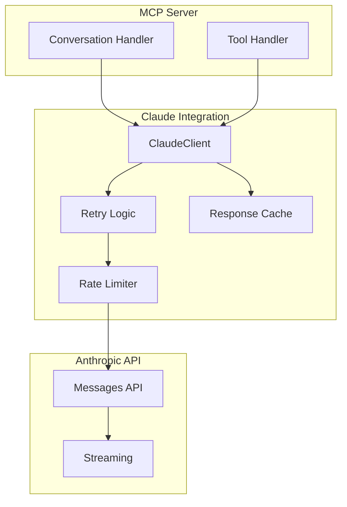

# TelemetryFlow Python MCP - Claude API Integration Specification

## Overview

This specification defines the Claude API integration for the TelemetryFlow Python MCP Server, covering client configuration, message handling, tool integration, and conversation management.

## Architecture



## Configuration

### Claude Config

```python
class ClaudeConfig(BaseSettings):
    """Claude API configuration."""

    model_config = SettingsConfigDict(
        env_prefix="TELEMETRYFLOW_MCP_CLAUDE_"
    )

    api_key: str = Field(
        default="",
        description="Anthropic API key",
        validation_alias="ANTHROPIC_API_KEY",
    )
    default_model: str = Field(
        default="claude-sonnet-4-20250514",
        description="Default Claude model",
    )
    max_tokens: int = Field(
        default=4096,
        description="Maximum tokens per request",
    )
    temperature: float = Field(
        default=1.0,
        ge=0.0,
        le=2.0,
        description="Temperature for responses",
    )
    timeout: float = Field(
        default=120.0,
        description="Request timeout in seconds",
    )
    max_retries: int = Field(
        default=3,
        description="Maximum retry attempts",
    )
    base_url: str | None = Field(
        default=None,
        description="Custom API base URL",
    )
```

### Available Models

| Model ID | Description | Use Case |
|----------|-------------|----------|
| claude-opus-4-20250514 | Claude 4 Opus | Most capable, complex tasks |
| claude-sonnet-4-20250514 | Claude 4 Sonnet | Balanced performance |
| claude-3-5-sonnet-20241022 | Claude 3.5 Sonnet | Fast, reliable |
| claude-3-5-haiku-20241022 | Claude 3.5 Haiku | Fastest, simple tasks |

## Claude Client

### Implementation

```python
class ClaudeClient:
    """Client for Anthropic Claude API."""

    def __init__(self, config: ClaudeConfig) -> None:
        self.config = config
        self._client = anthropic.AsyncAnthropic(
            api_key=config.api_key,
            base_url=config.base_url,
            timeout=config.timeout,
        )

    @property
    def default_model(self) -> str:
        """Get default model."""
        return self.config.default_model

    @property
    def max_tokens(self) -> int:
        """Get max tokens."""
        return self.config.max_tokens

    async def send_message(
        self,
        messages: list[dict[str, Any]],
        model: str | None = None,
        system: str | None = None,
        max_tokens: int | None = None,
    ) -> Message:
        """Send a message to Claude."""
        return await self._send_with_retry(
            messages=messages,
            model=model or self.default_model,
            system=system,
            max_tokens=max_tokens or self.max_tokens,
        )

    async def send_message_with_tools(
        self,
        messages: list[dict[str, Any]],
        tools: list[dict[str, Any]],
        model: str | None = None,
        system: str | None = None,
    ) -> Message:
        """Send a message with tool definitions."""
        return await self._send_with_retry(
            messages=messages,
            tools=tools,
            model=model or self.default_model,
            system=system,
            max_tokens=self.max_tokens,
        )

    @retry(
        stop=stop_after_attempt(3),
        wait=wait_exponential(multiplier=1, min=1, max=60),
        retry=retry_if_exception_type(RateLimitError),
    )
    async def _send_with_retry(self, **kwargs) -> Message:
        """Send with retry logic."""
        try:
            return await self._client.messages.create(**kwargs)
        except anthropic.RateLimitError as e:
            raise RateLimitError(str(e)) from e
        except anthropic.APIError as e:
            raise ClaudeAPIError(str(e)) from e
```

### Message Format

```python
# User message
{
    "role": "user",
    "content": "Hello, Claude!"
}

# User message with image
{
    "role": "user",
    "content": [
        {"type": "text", "text": "What's in this image?"},
        {
            "type": "image",
            "source": {
                "type": "base64",
                "media_type": "image/png",
                "data": "<base64_data>",
            },
        },
    ],
}

# Assistant message
{
    "role": "assistant",
    "content": "Hello! How can I help you today?"
}

# Assistant message with tool use
{
    "role": "assistant",
    "content": [
        {"type": "text", "text": "I'll check that for you."},
        {
            "type": "tool_use",
            "id": "tool_123",
            "name": "read_file",
            "input": {"path": "/tmp/test.txt"},
        },
    ],
}

# Tool result message
{
    "role": "user",
    "content": [
        {
            "type": "tool_result",
            "tool_use_id": "tool_123",
            "content": "File contents here",
        },
    ],
}
```

## Tool Integration

### Converting MCP Tools to Claude Format

```python
def mcp_tool_to_claude(tool: Tool) -> dict[str, Any]:
    """Convert MCP tool to Claude API format."""
    return {
        "name": str(tool.name),
        "description": tool.description,
        "input_schema": tool.input_schema.to_dict(),
    }


def mcp_tools_to_claude(tools: list[Tool]) -> list[dict[str, Any]]:
    """Convert list of MCP tools to Claude format."""
    return [mcp_tool_to_claude(t) for t in tools if t.enabled]
```

### Tool Use Handling

```python
async def handle_tool_use(
    response: Message,
    session: Session,
    tool_handler: ToolHandler,
) -> list[dict[str, Any]]:
    """Handle tool use from Claude response."""
    tool_results = []

    for block in response.content:
        if block["type"] != "tool_use":
            continue

        tool_use_id = block["id"]
        tool_name = block["name"]
        tool_input = block["input"]

        try:
            result = await tool_handler.execute(
                session,
                ExecuteToolCommand(
                    session_id=str(session.id),
                    tool_name=tool_name,
                    arguments=tool_input,
                ),
            )

            tool_results.append({
                "type": "tool_result",
                "tool_use_id": tool_use_id,
                "content": result.content[0]["text"],
                "is_error": result.is_error,
            })
        except Exception as e:
            tool_results.append({
                "type": "tool_result",
                "tool_use_id": tool_use_id,
                "content": str(e),
                "is_error": True,
            })

    return tool_results
```

### Multi-Turn Tool Loop

```python
async def execute_with_tools(
    client: ClaudeClient,
    session: Session,
    tool_handler: ToolHandler,
    messages: list[dict[str, Any]],
    max_iterations: int = 10,
) -> Message:
    """Execute conversation with automatic tool handling."""
    tools = mcp_tools_to_claude(session.list_tools())

    for _ in range(max_iterations):
        response = await client.send_message_with_tools(
            messages=messages,
            tools=tools,
        )

        if response.stop_reason != "tool_use":
            return response

        # Handle tool uses
        messages.append({
            "role": "assistant",
            "content": response.content,
        })

        tool_results = await handle_tool_use(
            response,
            session,
            tool_handler,
        )

        messages.append({
            "role": "user",
            "content": tool_results,
        })

    raise MaxIterationsError("Tool loop exceeded max iterations")
```

## Conversation Management

### Conversation Entity

```python
@dataclass
class Conversation:
    """Conversation aggregate."""

    id: ConversationID
    session_id: SessionID
    messages: list[Message]
    system_prompt: SystemPrompt | None
    model: Model
    settings: ConversationSettings
    status: ConversationStatus

    def add_message(self, message: Message) -> None:
        """Add a message to conversation."""
        self.messages.append(message)

    def to_api_messages(self) -> list[dict[str, Any]]:
        """Convert to Claude API message format."""
        return [m.to_api_format() for m in self.messages]
```

### Conversation Handler

```python
class ConversationHandler:
    """Handler for conversation operations."""

    def __init__(
        self,
        claude_client: ClaudeClient,
        conversation_repo: ConversationRepository,
    ) -> None:
        self.claude_client = claude_client
        self.repo = conversation_repo

    async def send_message(
        self,
        conversation: Conversation,
        user_message: str,
    ) -> Message:
        """Send a user message and get response."""
        # Add user message
        user_msg = Message.user(user_message)
        conversation.add_message(user_msg)

        # Send to Claude
        response = await self.claude_client.send_message(
            messages=conversation.to_api_messages(),
            model=conversation.model.value,
            system=str(conversation.system_prompt) if conversation.system_prompt else None,
        )

        # Add assistant response
        assistant_msg = Message.from_api_response(response)
        conversation.add_message(assistant_msg)

        # Save conversation
        await self.repo.save(conversation)

        return assistant_msg
```

## Streaming Support

### Stream Event Types

```python
class StreamEventType(Enum):
    """Claude stream event types."""

    MESSAGE_START = "message_start"
    CONTENT_BLOCK_START = "content_block_start"
    CONTENT_BLOCK_DELTA = "content_block_delta"
    CONTENT_BLOCK_STOP = "content_block_stop"
    MESSAGE_DELTA = "message_delta"
    MESSAGE_STOP = "message_stop"
```

### Streaming Implementation

```python
async def stream_message(
    client: ClaudeClient,
    messages: list[dict[str, Any]],
    on_text: Callable[[str], Awaitable[None]],
    on_tool_use: Callable[[dict[str, Any]], Awaitable[None]] | None = None,
) -> Message:
    """Stream a message response."""
    full_response = None
    current_text = ""

    async with client._client.messages.stream(
        messages=messages,
        model=client.default_model,
        max_tokens=client.max_tokens,
    ) as stream:
        async for event in stream:
            if event.type == "content_block_delta":
                if event.delta.type == "text_delta":
                    current_text += event.delta.text
                    await on_text(event.delta.text)

            elif event.type == "message_stop":
                full_response = await stream.get_final_message()

    return full_response
```

## Error Handling

### Error Types

```python
class ClaudeError(Exception):
    """Base Claude error."""
    pass


class ClaudeAPIError(ClaudeError):
    """API error from Claude."""
    pass


class RateLimitError(ClaudeError):
    """Rate limit exceeded."""
    pass


class AuthenticationError(ClaudeError):
    """Authentication failed."""
    pass


class ContextOverflowError(ClaudeError):
    """Context length exceeded."""
    pass
```

### Error Mapping

```python
def map_claude_error(error: Exception) -> MCPError:
    """Map Claude error to MCP error."""
    if isinstance(error, RateLimitError):
        return MCPError(
            code=MCPErrorCode.INTERNAL_ERROR,
            message="Rate limit exceeded, please retry later",
        )
    elif isinstance(error, AuthenticationError):
        return MCPError(
            code=MCPErrorCode.INTERNAL_ERROR,
            message="Claude API authentication failed",
        )
    elif isinstance(error, ContextOverflowError):
        return MCPError(
            code=MCPErrorCode.INVALID_PARAMS,
            message="Message context too long",
        )
    else:
        return MCPError(
            code=MCPErrorCode.INTERNAL_ERROR,
            message=str(error),
        )
```

## Rate Limiting

### Rate Limiter

```python
class RateLimiter:
    """Rate limiter for Claude API."""

    def __init__(
        self,
        requests_per_minute: int = 50,
        tokens_per_minute: int = 100000,
    ) -> None:
        self.rpm = requests_per_minute
        self.tpm = tokens_per_minute
        self._request_times: list[float] = []
        self._token_counts: list[tuple[float, int]] = []

    async def acquire(self, estimated_tokens: int = 0) -> None:
        """Acquire rate limit permit."""
        now = time.time()

        # Clean old entries
        self._request_times = [
            t for t in self._request_times
            if now - t < 60
        ]
        self._token_counts = [
            (t, c) for t, c in self._token_counts
            if now - t < 60
        ]

        # Check limits
        if len(self._request_times) >= self.rpm:
            wait_time = 60 - (now - self._request_times[0])
            await asyncio.sleep(wait_time)

        total_tokens = sum(c for _, c in self._token_counts)
        if total_tokens + estimated_tokens > self.tpm:
            wait_time = 60 - (now - self._token_counts[0][0])
            await asyncio.sleep(wait_time)

        self._request_times.append(now)
        if estimated_tokens:
            self._token_counts.append((now, estimated_tokens))
```

## Testing

### Unit Tests

```python
class TestClaudeClient:
    """Unit tests for Claude client."""

    @pytest.fixture
    def config(self):
        return ClaudeConfig(
            api_key="test-key",
            default_model="claude-sonnet-4-20250514",
        )

    @pytest.fixture
    def client(self, config):
        return ClaudeClient(config)

    def test_default_model(self, client):
        assert client.default_model == "claude-sonnet-4-20250514"

    def test_max_tokens(self, client):
        assert client.max_tokens == 4096
```

### Integration Tests

```python
@pytest.mark.skipif(
    not os.environ.get("ANTHROPIC_API_KEY"),
    reason="ANTHROPIC_API_KEY not set",
)
class TestClaudeIntegration:
    """Integration tests requiring API key."""

    @pytest.fixture
    def client(self):
        return ClaudeClient(ClaudeConfig(
            api_key=os.environ["ANTHROPIC_API_KEY"],
            default_model="claude-3-5-haiku-20241022",
            max_tokens=100,
        ))

    @pytest.mark.asyncio
    async def test_simple_message(self, client):
        response = await client.send_message([
            {"role": "user", "content": "Say hi"}
        ])
        assert len(response.content) > 0
```

## Metrics

### Metrics Collection

```python
class ClaudeMetrics:
    """Metrics for Claude API usage."""

    def __init__(self) -> None:
        self.requests_total = Counter("claude_requests_total")
        self.tokens_input = Counter("claude_tokens_input_total")
        self.tokens_output = Counter("claude_tokens_output_total")
        self.errors_total = Counter("claude_errors_total")
        self.latency = Histogram("claude_request_latency_seconds")

    def record_request(
        self,
        model: str,
        input_tokens: int,
        output_tokens: int,
        latency: float,
    ) -> None:
        """Record a successful request."""
        self.requests_total.inc(labels={"model": model})
        self.tokens_input.inc(input_tokens, labels={"model": model})
        self.tokens_output.inc(output_tokens, labels={"model": model})
        self.latency.observe(latency, labels={"model": model})

    def record_error(self, error_type: str) -> None:
        """Record an error."""
        self.errors_total.inc(labels={"type": error_type})
```
