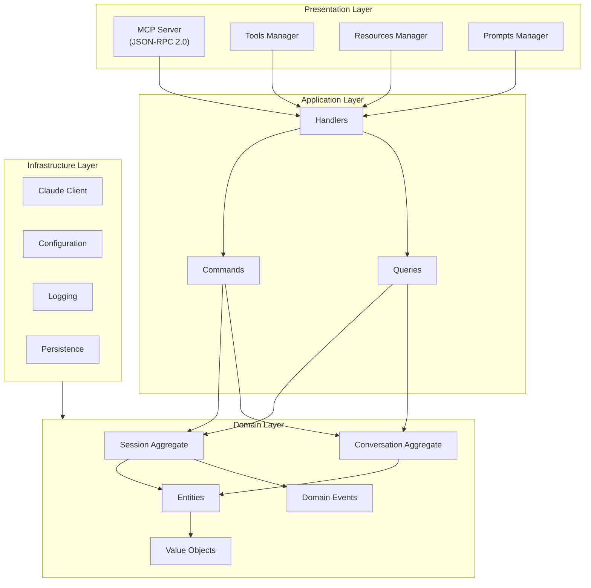
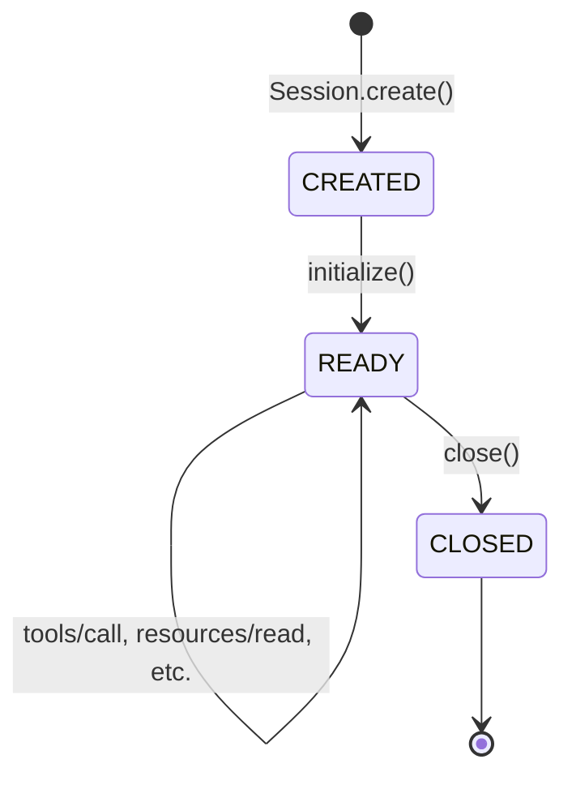

# TelemetryFlow Python MCP - Server Core Specification

## Overview

This specification defines the foundational MCP protocol server implementation for the TelemetryFlow Python MCP Server, following Domain-Driven Design (DDD) and CQRS patterns.

## Architecture



## MCP Protocol Compliance

### Protocol Version

- **Version**: 2024-11-05
- **Transport**: stdio (JSON-RPC 2.0)
- **Message Format**: JSON-RPC 2.0

### Supported Methods

| Category | Method | Type |
|----------|--------|------|
| Lifecycle | initialize | Request |
| Lifecycle | notifications/initialized | Notification |
| Lifecycle | ping | Request |
| Lifecycle | shutdown | Request |
| Tools | tools/list | Request |
| Tools | tools/call | Request |
| Resources | resources/list | Request |
| Resources | resources/read | Request |
| Resources | resources/templates/list | Request |
| Prompts | prompts/list | Request |
| Prompts | prompts/get | Request |
| Logging | logging/setLevel | Request |

## Domain Layer

### Session Aggregate

```python
class SessionState(Enum):
    """Session state machine."""
    CREATED = "created"
    INITIALIZING = "initializing"
    READY = "ready"
    CLOSING = "closing"
    CLOSED = "closed"


@dataclass
class Session:
    """Session aggregate root."""

    id: SessionID
    state: SessionState
    server_name: str
    server_version: str
    capabilities: SessionCapabilities
    client_info: ClientInfo | None
    tools: dict[str, Tool]
    resources: dict[str, Resource]
    prompts: dict[str, Prompt]
    conversations: list[ConversationID]
    events: list[DomainEvent]
    created_at: datetime
    initialized_at: datetime | None

    @classmethod
    def create(
        cls,
        server_name: str = "TelemetryFlow-MCP",
        server_version: str = "1.1.2",
        capabilities: SessionCapabilities | None = None,
    ) -> "Session":
        """Create a new session."""
        session = cls(
            id=SessionID.generate(),
            state=SessionState.CREATED,
            server_name=server_name,
            server_version=server_version,
            capabilities=capabilities or SessionCapabilities(),
            client_info=None,
            tools={},
            resources={},
            prompts={},
            conversations=[],
            events=[],
            created_at=datetime.utcnow(),
            initialized_at=None,
        )
        session._emit(SessionCreatedEvent(session_id=str(session.id)))
        return session

    def initialize(self, client_info: ClientInfo) -> dict[str, Any]:
        """Initialize the session."""
        if self.state != SessionState.CREATED:
            raise ValueError("Session already initialized")

        self.state = SessionState.READY
        self.client_info = client_info
        self.initialized_at = datetime.utcnow()

        self._emit(SessionInitializedEvent(
            session_id=str(self.id),
            client_name=client_info.name,
            client_version=client_info.version,
            protocol_version="2024-11-05",
        ))

        return {
            "protocolVersion": "2024-11-05",
            "serverInfo": {
                "name": self.server_name,
                "version": self.server_version,
            },
            "capabilities": self.capabilities.to_dict(),
        }

    def close(self) -> None:
        """Close the session."""
        self.state = SessionState.CLOSED
        self._emit(SessionClosedEvent(
            session_id=str(self.id),
            reason="shutdown",
        ))

    @property
    def is_ready(self) -> bool:
        """Check if session is ready."""
        return self.state == SessionState.READY
```

### Session Capabilities

```python
@dataclass
class SessionCapabilities:
    """Server capabilities."""

    tools: bool = True
    resources: bool = True
    prompts: bool = True
    logging: bool = True
    sampling: bool = False

    def to_dict(self) -> dict[str, Any]:
        """Convert to MCP capabilities format."""
        caps = {}
        if self.tools:
            caps["tools"] = {"listChanged": True}
        if self.resources:
            caps["resources"] = {"subscribe": True, "listChanged": True}
        if self.prompts:
            caps["prompts"] = {"listChanged": True}
        if self.logging:
            caps["logging"] = {}
        if self.sampling:
            caps["sampling"] = {}
        return caps
```

### Conversation Aggregate

```python
class ConversationStatus(Enum):
    """Conversation status."""
    ACTIVE = "active"
    ARCHIVED = "archived"
    CLOSED = "closed"


@dataclass
class Conversation:
    """Conversation aggregate root."""

    id: ConversationID
    session_id: SessionID
    messages: list[Message]
    system_prompt: SystemPrompt | None
    model: Model
    settings: ConversationSettings
    status: ConversationStatus
    created_at: datetime
    events: list[DomainEvent]

    @classmethod
    def create(
        cls,
        session_id: SessionID | None = None,
        system_prompt: str | None = None,
        model: Model | None = None,
    ) -> "Conversation":
        """Create a new conversation."""
        conv = cls(
            id=ConversationID.generate(),
            session_id=session_id or SessionID.generate(),
            messages=[],
            system_prompt=SystemPrompt(value=system_prompt) if system_prompt else None,
            model=model or Model.default(),
            settings=ConversationSettings(),
            status=ConversationStatus.ACTIVE,
            created_at=datetime.utcnow(),
            events=[],
        )
        conv._emit(ConversationCreatedEvent(
            conversation_id=str(conv.id),
            session_id=str(conv.session_id),
        ))
        return conv

    def add_message(self, message: Message) -> None:
        """Add a message to the conversation."""
        self.messages.append(message)
        self._emit(MessageAddedEvent(
            conversation_id=str(self.id),
            message_id=str(message.id),
            role=message.role.value,
            content_length=len(message.text or ""),
        ))

    @property
    def message_count(self) -> int:
        """Get message count."""
        return len(self.messages)

    @property
    def last_message(self) -> Message | None:
        """Get last message."""
        return self.messages[-1] if self.messages else None
```

## Application Layer (CQRS)

### Commands

```python
@dataclass
class InitializeSessionCommand:
    """Initialize a session."""
    protocol_version: str
    client_info: ClientInfo
    capabilities: dict[str, Any] | None = None


@dataclass
class ExecuteToolCommand:
    """Execute a tool."""
    session_id: str
    tool_name: str
    arguments: dict[str, Any]


@dataclass
class ReadResourceCommand:
    """Read a resource."""
    session_id: str
    uri: str


@dataclass
class GetPromptCommand:
    """Get a prompt."""
    session_id: str
    name: str
    arguments: dict[str, str]


@dataclass
class SendMessageCommand:
    """Send a message in a conversation."""
    conversation_id: str
    content: str
```

### Queries

```python
@dataclass
class ListToolsQuery:
    """List available tools."""
    session_id: str
    cursor: str | None = None


@dataclass
class ListResourcesQuery:
    """List available resources."""
    session_id: str
    cursor: str | None = None


@dataclass
class ListPromptsQuery:
    """List available prompts."""
    session_id: str
    cursor: str | None = None


@dataclass
class GetSessionQuery:
    """Get session information."""
    session_id: str
```

### Handlers

```python
class SessionHandler:
    """Handler for session operations."""

    def __init__(
        self,
        session_repo: SessionRepository,
    ) -> None:
        self.session_repo = session_repo

    async def initialize(
        self,
        session: Session,
        command: InitializeSessionCommand,
    ) -> dict[str, Any]:
        """Initialize session."""
        result = session.initialize(command.client_info)
        await self.session_repo.save(session)
        return result


class ToolHandler:
    """Handler for tool operations."""

    async def execute(
        self,
        session: Session,
        command: ExecuteToolCommand,
    ) -> ToolResult:
        """Execute a tool."""
        tool = session.get_tool(command.tool_name)
        if not tool:
            raise ToolNotFoundError(command.tool_name)

        return await tool.handler(command.arguments)

    def list(self, session: Session) -> list[dict[str, Any]]:
        """List tools."""
        return [t.to_mcp_format() for t in session.list_tools()]
```

## Presentation Layer

### MCP Server

```python
class MCPServer:
    """MCP JSON-RPC server."""

    def __init__(
        self,
        config: Config,
        stdin: TextIO = sys.stdin,
        stdout: TextIO = sys.stdout,
    ) -> None:
        self.config = config
        self.stdin = stdin
        self.stdout = stdout
        self.session: Session | None = None
        self.logger = get_logger(__name__)

        # Initialize handlers
        self.session_handler = SessionHandler(...)
        self.tool_handler = ToolHandler(...)

    async def run(self) -> None:
        """Run the server."""
        self.logger.info("Starting MCP server")

        async for line in self._read_lines():
            try:
                request = json.loads(line)
                response = await self._handle_request(request)
                if response:
                    await self._write_response(response)
            except json.JSONDecodeError:
                await self._write_error(
                    None,
                    MCPErrorCode.PARSE_ERROR,
                    "Invalid JSON",
                )

    async def _handle_request(
        self,
        request: dict[str, Any],
    ) -> dict[str, Any] | None:
        """Handle a JSON-RPC request."""
        request_id = request.get("id")
        method = request.get("method", "")
        params = request.get("params", {})

        # Route to handler
        handler = self._get_handler(method)
        if not handler:
            return self._make_error(
                request_id,
                MCPErrorCode.METHOD_NOT_FOUND,
                f"Method not found: {method}",
            )

        try:
            result = await handler(params)
            if request_id is None:  # Notification
                return None
            return self._make_response(request_id, result=result)
        except Exception as e:
            return self._make_error(
                request_id,
                MCPErrorCode.INTERNAL_ERROR,
                str(e),
            )
```

### Request Routing

```python
def _get_handler(self, method: str) -> Callable | None:
    """Get handler for method."""
    handlers = {
        "initialize": self._handle_initialize,
        "notifications/initialized": self._handle_initialized,
        "ping": self._handle_ping,
        "tools/list": self._handle_tools_list,
        "tools/call": self._handle_tools_call,
        "resources/list": self._handle_resources_list,
        "resources/read": self._handle_resources_read,
        "resources/templates/list": self._handle_resource_templates_list,
        "prompts/list": self._handle_prompts_list,
        "prompts/get": self._handle_prompts_get,
        "logging/setLevel": self._handle_logging_set_level,
    }
    return handlers.get(method)
```

## Infrastructure Layer

### Repository Pattern

```python
class SessionRepository(Protocol):
    """Session repository interface."""

    async def save(self, session: Session) -> None:
        """Save a session."""
        ...

    async def find_by_id(self, session_id: SessionID) -> Session | None:
        """Find session by ID."""
        ...

    async def delete(self, session_id: SessionID) -> bool:
        """Delete a session."""
        ...

    async def list_all(self) -> list[Session]:
        """List all sessions."""
        ...


class InMemorySessionRepository(SessionRepository):
    """In-memory session repository."""

    def __init__(self) -> None:
        self._sessions: dict[str, Session] = {}

    async def save(self, session: Session) -> None:
        self._sessions[str(session.id)] = session

    async def find_by_id(self, session_id: SessionID) -> Session | None:
        return self._sessions.get(str(session_id))

    async def delete(self, session_id: SessionID) -> bool:
        if str(session_id) in self._sessions:
            del self._sessions[str(session_id)]
            return True
        return False

    async def list_all(self) -> list[Session]:
        return list(self._sessions.values())
```

### Configuration

```python
class Config(BaseSettings):
    """Application configuration."""

    model_config = SettingsConfigDict(
        env_prefix="TELEMETRYFLOW_MCP_",
        env_nested_delimiter="__",
    )

    server: ServerConfig = Field(default_factory=ServerConfig)
    claude: ClaudeConfig = Field(default_factory=ClaudeConfig)
    mcp: MCPConfig = Field(default_factory=MCPConfig)
    logging: LoggingConfig = Field(default_factory=LoggingConfig)
    telemetry: TelemetryConfig = Field(default_factory=TelemetryConfig)

    @classmethod
    def from_yaml(cls, path: str) -> "Config":
        """Load config from YAML file."""
        with open(path) as f:
            data = yaml.safe_load(f)
        return cls(**data)
```

## Error Handling

### Error Codes

| Code | Name | Description |
|------|------|-------------|
| -32700 | Parse error | Invalid JSON |
| -32600 | Invalid Request | Not valid JSON-RPC |
| -32601 | Method not found | Unknown method |
| -32602 | Invalid params | Invalid parameters |
| -32603 | Internal error | Server error |
| -32001 | Tool not found | MCP specific |
| -32002 | Resource not found | MCP specific |
| -32003 | Prompt not found | MCP specific |

### Error Response Format

```python
def _make_error(
    self,
    request_id: Any,
    code: MCPErrorCode,
    message: str,
    data: Any = None,
) -> dict[str, Any]:
    """Create error response."""
    error = {
        "code": code.value,
        "message": message,
    }
    if data:
        error["data"] = data

    return {
        "jsonrpc": "2.0",
        "id": request_id,
        "error": error,
    }
```

## Session Lifecycle



## Testing Requirements

### Coverage Targets

- Unit Tests: ≥85%
- Integration Tests: ≥70%
- Overall: ≥80%

### Test Categories

```
tests/
├── unit/           # Fast, isolated tests
│   ├── test_domain.py
│   ├── test_entities.py
│   ├── test_valueobjects.py
│   ├── test_events.py
│   ├── test_tools.py
│   ├── test_resources.py
│   ├── test_prompts.py
│   ├── test_config.py
│   ├── test_claude.py
│   └── test_persistence.py
├── integration/    # Medium speed, real dependencies
│   ├── test_server.py
│   ├── test_session.py
│   ├── test_claude.py
│   └── test_persistence.py
└── e2e/           # Full system tests
    └── test_mcp.py
```

## Deployment

### Docker

```dockerfile
FROM python:3.11-slim

WORKDIR /app
COPY . .

RUN pip install --no-cache-dir -e .

ENTRYPOINT ["tfo-mcp"]
CMD ["serve"]
```

### Environment Variables

| Variable | Description | Default |
|----------|-------------|---------|
| ANTHROPIC_API_KEY | Claude API key | (required) |
| TELEMETRYFLOW_MCP_SERVER_NAME | Server name | TelemetryFlow-MCP |
| TELEMETRYFLOW_MCP_LOG_LEVEL | Log level | info |
| TELEMETRYFLOW_MCP_SERVER_DEBUG | Debug mode | false |
