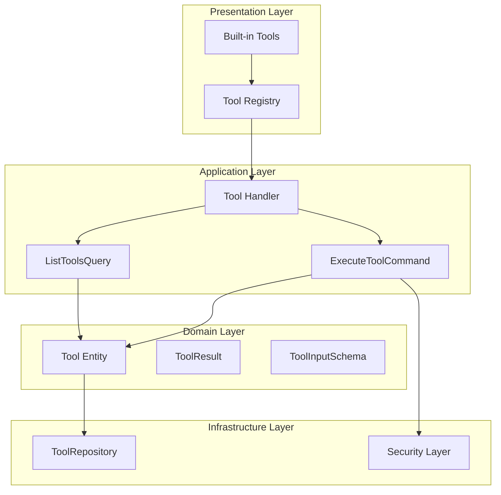

# TelemetryFlow Python MCP - Tool System Specification

## Overview

This specification defines the complete tool system architecture for the TelemetryFlow Python MCP Server, covering dynamic tool registration, execution, and management.

## Architecture



## Domain Layer

### Tool Entity

```python
@dataclass
class Tool:
    """Tool entity representing an MCP tool."""

    name: ToolName
    description: str
    input_schema: ToolInputSchema
    category: str | None = None
    tags: list[str] = field(default_factory=list)
    enabled: bool = True
    handler: ToolHandler | None = None

    @classmethod
    def create(
        cls,
        name: str,
        description: str,
        input_schema: dict[str, Any],
        handler: ToolHandler | None = None,
        category: str | None = None,
        tags: list[str] | None = None,
    ) -> "Tool":
        """Factory method for creating tools."""
        pass

    def to_mcp_format(self) -> dict[str, Any]:
        """Convert to MCP protocol format."""
        pass

    def enable(self) -> None:
        """Enable the tool."""
        pass

    def disable(self) -> None:
        """Disable the tool."""
        pass
```

### Tool Result

```python
@dataclass
class ToolResult:
    """Result of tool execution."""

    content: list[dict[str, Any]]
    is_error: bool = False

    @classmethod
    def text(cls, text: str) -> "ToolResult":
        """Create text result."""
        pass

    @classmethod
    def json(cls, data: Any) -> "ToolResult":
        """Create JSON result."""
        pass

    @classmethod
    def error(cls, message: str) -> "ToolResult":
        """Create error result."""
        pass

    @classmethod
    def empty(cls) -> "ToolResult":
        """Create empty result."""
        pass
```

### Tool Input Schema

```python
@dataclass
class ToolInputSchema:
    """JSON Schema for tool input validation."""

    properties: dict[str, dict[str, Any]]
    required: list[str] = field(default_factory=list)

    def to_dict(self) -> dict[str, Any]:
        """Convert to JSON Schema format."""
        return {
            "type": "object",
            "properties": self.properties,
            "required": self.required,
        }
```

## Built-in Tools

### Tool Categories

| Category | Tools |
|----------|-------|
| utility | echo |
| file | read_file, write_file, list_directory, search_files |
| system | execute_command, system_info |
| ai | claude_conversation |

### Echo Tool

```python
async def _echo_handler(input_data: dict[str, Any]) -> ToolResult:
    """Echo a message back."""
    message = input_data.get("message", "")
    return ToolResult.text(f"Echo: {message}")
```

**Input Schema:**
```json
{
    "type": "object",
    "properties": {
        "message": {
            "type": "string",
            "description": "Message to echo"
        }
    }
}
```

### Read File Tool

```python
async def _read_file_handler(input_data: dict[str, Any]) -> ToolResult:
    """Read contents of a file."""
    path = input_data.get("path")
    encoding = input_data.get("encoding", "utf-8")

    if not path:
        return ToolResult.error("path is required")

    try:
        async with aiofiles.open(path, encoding=encoding) as f:
            content = await f.read()
        return ToolResult.text(content)
    except Exception as e:
        return ToolResult.error(str(e))
```

**Input Schema:**
```json
{
    "type": "object",
    "properties": {
        "path": {
            "type": "string",
            "description": "Path to file"
        },
        "encoding": {
            "type": "string",
            "description": "File encoding",
            "default": "utf-8"
        }
    },
    "required": ["path"]
}
```

### Write File Tool

```python
async def _write_file_handler(input_data: dict[str, Any]) -> ToolResult:
    """Write content to a file."""
    path = input_data.get("path")
    content = input_data.get("content", "")
    create_dirs = input_data.get("create_dirs", False)

    if not path:
        return ToolResult.error("path is required")

    try:
        file_path = Path(path)
        if create_dirs:
            file_path.parent.mkdir(parents=True, exist_ok=True)

        async with aiofiles.open(path, "w") as f:
            await f.write(content)
        return ToolResult.text(f"Written to {path}")
    except Exception as e:
        return ToolResult.error(str(e))
```

### List Directory Tool

```python
async def _list_directory_handler(input_data: dict[str, Any]) -> ToolResult:
    """List directory contents."""
    path = input_data.get("path", ".")
    recursive = input_data.get("recursive", False)

    try:
        dir_path = Path(path)
        if not dir_path.is_dir():
            return ToolResult.error(f"Not a directory: {path}")

        entries = []
        iterator = dir_path.rglob("*") if recursive else dir_path.iterdir()

        for entry in iterator:
            entries.append({
                "name": entry.name,
                "path": str(entry),
                "type": "directory" if entry.is_dir() else "file",
                "size": entry.stat().st_size if entry.is_file() else None,
            })

        return ToolResult.json(entries)
    except Exception as e:
        return ToolResult.error(str(e))
```

### Search Files Tool

```python
async def _search_files_handler(input_data: dict[str, Any]) -> ToolResult:
    """Search files by pattern."""
    path = input_data.get("path", ".")
    pattern = input_data.get("pattern", "*")

    try:
        matches = list(Path(path).rglob(pattern))
        return ToolResult.json([str(m) for m in matches])
    except Exception as e:
        return ToolResult.error(str(e))
```

### Execute Command Tool

```python
async def _execute_command_handler(input_data: dict[str, Any]) -> ToolResult:
    """Execute a shell command."""
    command = input_data.get("command")
    timeout = input_data.get("timeout", 30)

    if not command:
        return ToolResult.error("command is required")

    try:
        process = await asyncio.create_subprocess_shell(
            command,
            stdout=asyncio.subprocess.PIPE,
            stderr=asyncio.subprocess.PIPE,
        )

        stdout, stderr = await asyncio.wait_for(
            process.communicate(),
            timeout=timeout,
        )

        return ToolResult.json({
            "exit_code": process.returncode,
            "stdout": stdout.decode(),
            "stderr": stderr.decode(),
        })
    except asyncio.TimeoutError:
        return ToolResult.error(f"Command timed out after {timeout}s")
    except Exception as e:
        return ToolResult.error(str(e))
```

### System Info Tool

```python
async def _system_info_handler(input_data: dict[str, Any]) -> ToolResult:
    """Get system information."""
    import platform
    import os

    info = {
        "platform": platform.platform(),
        "system": platform.system(),
        "release": platform.release(),
        "version": platform.version(),
        "machine": platform.machine(),
        "processor": platform.processor(),
        "python_version": platform.python_version(),
        "cwd": os.getcwd(),
        "user": os.getenv("USER", os.getenv("USERNAME", "unknown")),
    }

    return ToolResult.json(info)
```

### Claude Conversation Tool

```python
async def _claude_conversation_handler(
    input_data: dict[str, Any],
    claude_client: ClaudeClient,
) -> ToolResult:
    """Chat with Claude AI."""
    message = input_data.get("message")
    model = input_data.get("model")
    system = input_data.get("system_prompt")

    if not message:
        return ToolResult.error("message is required")

    try:
        messages = [{"role": "user", "content": message}]
        response = await claude_client.send_message(
            messages,
            model=model,
            system=system,
        )
        return ToolResult.text(response.content[0]["text"])
    except Exception as e:
        return ToolResult.error(str(e))
```

## Tool Registry

```python
class ToolRegistry:
    """Registry for managing tools."""

    def __init__(self) -> None:
        self._tools: dict[str, Tool] = {}

    def register(self, tool: Tool) -> None:
        """Register a tool."""
        self._tools[str(tool.name)] = tool

    def unregister(self, name: str) -> bool:
        """Unregister a tool."""
        if name in self._tools:
            del self._tools[name]
            return True
        return False

    def get(self, name: str) -> Tool | None:
        """Get a tool by name."""
        return self._tools.get(name)

    def list(self, category: str | None = None) -> list[Tool]:
        """List all tools, optionally filtered by category."""
        tools = list(self._tools.values())
        if category:
            tools = [t for t in tools if t.category == category]
        return tools

    def list_enabled(self) -> list[Tool]:
        """List enabled tools."""
        return [t for t in self._tools.values() if t.enabled]
```

## Application Layer

### Execute Tool Command

```python
@dataclass
class ExecuteToolCommand:
    """Command to execute a tool."""

    session_id: str
    tool_name: str
    arguments: dict[str, Any]
```

### List Tools Query

```python
@dataclass
class ListToolsQuery:
    """Query to list available tools."""

    session_id: str
    category: str | None = None
    cursor: str | None = None
```

### Tool Handler

```python
class ToolHandler:
    """Handler for tool operations."""

    async def execute(
        self,
        session: Session,
        command: ExecuteToolCommand,
    ) -> ToolResult:
        """Execute a tool."""
        tool = session.get_tool(command.tool_name)
        if not tool:
            raise ToolNotFoundError(command.tool_name)

        if not tool.enabled:
            raise ToolDisabledError(command.tool_name)

        # Validate input against schema
        self._validate_input(tool.input_schema, command.arguments)

        # Execute tool handler
        return await tool.handler(command.arguments)

    def list(
        self,
        session: Session,
        query: ListToolsQuery,
    ) -> list[dict[str, Any]]:
        """List available tools."""
        tools = session.list_tools()
        if query.category:
            tools = [t for t in tools if t.category == query.category]
        return [t.to_mcp_format() for t in tools]
```

## Security

### Tool Execution Sandbox

```python
class ToolSandbox:
    """Sandbox for secure tool execution."""

    def __init__(self, config: SandboxConfig) -> None:
        self.config = config

    async def execute(
        self,
        handler: ToolHandler,
        input_data: dict[str, Any],
    ) -> ToolResult:
        """Execute tool in sandbox."""
        try:
            # Apply timeout
            result = await asyncio.wait_for(
                handler(input_data),
                timeout=self.config.timeout,
            )
            return result
        except asyncio.TimeoutError:
            return ToolResult.error("Tool execution timed out")
        except Exception as e:
            return ToolResult.error(f"Tool execution failed: {e}")
```

### Permission Configuration

```yaml
tools:
  execute_command:
    allowed_commands:
      - ls
      - cat
      - grep
      - find
    denied_commands:
      - rm
      - sudo
      - chmod
    timeout: 30

  write_file:
    allowed_paths:
      - /tmp
      - ./output
    denied_paths:
      - /etc
      - /usr
```

## Testing

### Unit Test Example

```python
class TestEchoTool:
    """Tests for echo tool."""

    @pytest.mark.asyncio
    async def test_echo_message(self):
        result = await _echo_handler({"message": "Hello"})
        assert not result.is_error
        assert "Hello" in result.content[0]["text"]

    @pytest.mark.asyncio
    async def test_echo_empty(self):
        result = await _echo_handler({})
        assert not result.is_error
```

### Integration Test Example

```python
class TestToolExecution:
    """Integration tests for tool execution."""

    @pytest.fixture
    def session(self):
        session = Session.create()
        session.initialize(ClientInfo(name="test", version="1.0"))
        register_builtin_tools(session)
        return session

    @pytest.mark.asyncio
    async def test_execute_tool(self, session):
        handler = ToolHandler()
        command = ExecuteToolCommand(
            session_id=str(session.id),
            tool_name="echo",
            arguments={"message": "test"},
        )
        result = await handler.execute(session, command)
        assert not result.is_error
```

## Error Handling

### Error Types

| Error | Code | Description |
|-------|------|-------------|
| ToolNotFoundError | -32001 | Tool does not exist |
| ToolDisabledError | -32004 | Tool is disabled |
| ToolExecutionError | -32005 | Tool execution failed |
| ToolValidationError | -32602 | Invalid tool arguments |
| ToolTimeoutError | -32006 | Tool execution timed out |

### Error Conversion

```python
def convert_tool_error(error: Exception) -> MCPError:
    """Convert tool error to MCP error."""
    if isinstance(error, ToolNotFoundError):
        return MCPError(
            code=MCPErrorCode.TOOL_NOT_FOUND,
            message=str(error),
        )
    elif isinstance(error, ToolValidationError):
        return MCPError(
            code=MCPErrorCode.INVALID_PARAMS,
            message=str(error),
        )
    else:
        return MCPError(
            code=MCPErrorCode.INTERNAL_ERROR,
            message=str(error),
        )
```
