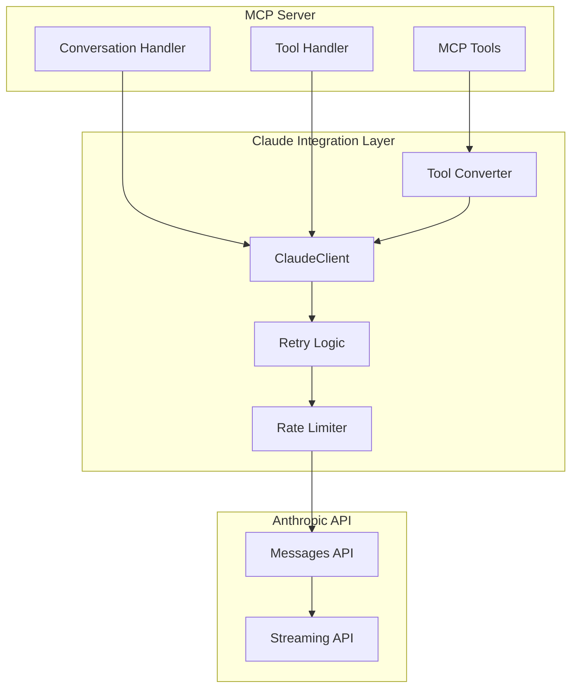
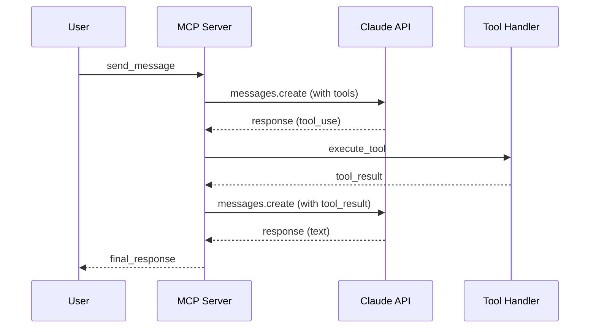

# TFO-Python-MCP Claude Integration Standards

## Overview

The TelemetryFlow Python MCP Server integrates with Claude API via the Anthropic SDK, providing message handling, tool integration, and conversation management.

## Architecture



## Configuration

### Claude Configuration

```python
from pydantic_settings import BaseSettings, SettingsConfigDict
from pydantic import Field


class ClaudeConfig(BaseSettings):
    """Claude API configuration."""

    model_config = SettingsConfigDict(
        env_prefix="TELEMETRYFLOW_MCP_CLAUDE_"
    )

    api_key: str = Field(
        default="",
        description="Anthropic API key",
        validation_alias="ANTHROPIC_API_KEY",
    )
    default_model: str = Field(
        default="claude-sonnet-4-20250514",
        description="Default Claude model",
    )
    max_tokens: int = Field(
        default=4096,
        ge=1,
        le=100000,
        description="Maximum tokens per request",
    )
    temperature: float = Field(
        default=1.0,
        ge=0.0,
        le=2.0,
        description="Temperature for responses",
    )
    timeout: float = Field(
        default=120.0,
        ge=1.0,
        description="Request timeout in seconds",
    )
    max_retries: int = Field(
        default=3,
        ge=0,
        le=10,
        description="Maximum retry attempts",
    )
    base_url: str | None = Field(
        default=None,
        description="Custom API base URL",
    )
```

### Available Models

| Model ID | Description | Best For |
|----------|-------------|----------|
| claude-opus-4-20250514 | Claude 4 Opus | Complex reasoning, analysis |
| claude-sonnet-4-20250514 | Claude 4 Sonnet | Balanced performance |
| claude-3-5-sonnet-20241022 | Claude 3.5 Sonnet | Fast, reliable |
| claude-3-5-haiku-20241022 | Claude 3.5 Haiku | Simple, quick tasks |

## Claude Client Implementation

### Client Structure

```python
import anthropic
from tenacity import (
    retry,
    stop_after_attempt,
    wait_exponential,
    retry_if_exception_type,
)


class ClaudeClient:
    """Anthropic Claude API client."""

    def __init__(self, config: ClaudeConfig) -> None:
        self.config = config
        self._client = anthropic.AsyncAnthropic(
            api_key=config.api_key,
            base_url=config.base_url,
            timeout=config.timeout,
        )

    @property
    def default_model(self) -> str:
        """Get default model."""
        return self.config.default_model

    @property
    def max_tokens(self) -> int:
        """Get max tokens."""
        return self.config.max_tokens

    async def send_message(
        self,
        messages: list[dict[str, Any]],
        model: str | None = None,
        system: str | None = None,
        max_tokens: int | None = None,
        temperature: float | None = None,
    ) -> anthropic.types.Message:
        """Send a message to Claude."""
        return await self._send_with_retry(
            messages=messages,
            model=model or self.default_model,
            system=system,
            max_tokens=max_tokens or self.max_tokens,
            temperature=temperature or self.config.temperature,
        )

    async def send_message_with_tools(
        self,
        messages: list[dict[str, Any]],
        tools: list[dict[str, Any]],
        model: str | None = None,
        system: str | None = None,
    ) -> anthropic.types.Message:
        """Send a message with tool definitions."""
        return await self._send_with_retry(
            messages=messages,
            tools=tools,
            model=model or self.default_model,
            system=system,
            max_tokens=self.max_tokens,
        )

    @retry(
        stop=stop_after_attempt(3),
        wait=wait_exponential(multiplier=1, min=1, max=60),
        retry=retry_if_exception_type(anthropic.RateLimitError),
    )
    async def _send_with_retry(self, **kwargs) -> anthropic.types.Message:
        """Send with retry logic."""
        try:
            return await self._client.messages.create(**kwargs)
        except anthropic.RateLimitError:
            raise
        except anthropic.APIError as e:
            raise ClaudeAPIError(str(e)) from e
```

## Message Format

### User Message

```python
# Simple text message
user_message = {
    "role": "user",
    "content": "Hello, Claude!"
}

# Message with image
user_message_with_image = {
    "role": "user",
    "content": [
        {"type": "text", "text": "What's in this image?"},
        {
            "type": "image",
            "source": {
                "type": "base64",
                "media_type": "image/png",
                "data": "<base64_data>",
            },
        },
    ],
}
```

### Assistant Message

```python
# Text response
assistant_message = {
    "role": "assistant",
    "content": "Hello! How can I help you today?"
}

# Response with tool use
assistant_tool_use = {
    "role": "assistant",
    "content": [
        {"type": "text", "text": "I'll check that for you."},
        {
            "type": "tool_use",
            "id": "tool_123",
            "name": "read_file",
            "input": {"path": "/tmp/test.txt"},
        },
    ],
}
```

### Tool Result Message

```python
tool_result = {
    "role": "user",
    "content": [
        {
            "type": "tool_result",
            "tool_use_id": "tool_123",
            "content": "File contents here",
        },
    ],
}
```

## Tool Integration

### MCP to Claude Tool Conversion

```python
from dataclasses import dataclass
from typing import Any


def mcp_tool_to_claude(tool: Tool) -> dict[str, Any]:
    """Convert MCP tool to Claude API format."""
    return {
        "name": str(tool.name),
        "description": tool.description,
        "input_schema": tool.input_schema.to_dict(),
    }


def mcp_tools_to_claude(tools: list[Tool]) -> list[dict[str, Any]]:
    """Convert list of MCP tools to Claude format."""
    return [
        mcp_tool_to_claude(t)
        for t in tools
        if t.enabled
    ]
```

### Tool Use Handling

```python
async def handle_tool_use(
    response: anthropic.types.Message,
    session: Session,
    tool_handler: ToolHandler,
) -> list[dict[str, Any]]:
    """Handle tool use requests from Claude response."""
    tool_results = []

    for block in response.content:
        if not hasattr(block, "type") or block.type != "tool_use":
            continue

        tool_use_id = block.id
        tool_name = block.name
        tool_input = block.input

        try:
            result = await tool_handler.execute(
                session,
                ExecuteToolCommand(
                    session_id=str(session.id),
                    tool_name=tool_name,
                    arguments=tool_input,
                ),
            )

            tool_results.append({
                "type": "tool_result",
                "tool_use_id": tool_use_id,
                "content": result.content[0]["text"],
                "is_error": result.is_error,
            })
        except Exception as e:
            tool_results.append({
                "type": "tool_result",
                "tool_use_id": tool_use_id,
                "content": str(e),
                "is_error": True,
            })

    return tool_results
```

### Multi-Turn Tool Loop



```python
async def execute_with_tools(
    client: ClaudeClient,
    session: Session,
    tool_handler: ToolHandler,
    messages: list[dict[str, Any]],
    max_iterations: int = 10,
) -> anthropic.types.Message:
    """Execute conversation with automatic tool handling."""
    tools = mcp_tools_to_claude(session.list_tools())

    for iteration in range(max_iterations):
        response = await client.send_message_with_tools(
            messages=messages,
            tools=tools,
        )

        # Check if done (no more tool use)
        if response.stop_reason != "tool_use":
            return response

        # Append assistant response to messages
        messages.append({
            "role": "assistant",
            "content": [
                block.model_dump() for block in response.content
            ],
        })

        # Handle tool uses
        tool_results = await handle_tool_use(
            response,
            session,
            tool_handler,
        )

        # Append tool results
        messages.append({
            "role": "user",
            "content": tool_results,
        })

    raise MaxIterationsError(
        f"Tool loop exceeded {max_iterations} iterations"
    )
```

## Conversation Management

### Conversation Entity

```python
from dataclasses import dataclass, field
from datetime import datetime
from enum import Enum


class ConversationStatus(Enum):
    """Conversation status."""

    ACTIVE = "active"
    ARCHIVED = "archived"
    CLOSED = "closed"


@dataclass
class Conversation:
    """Conversation aggregate."""

    id: ConversationID
    session_id: SessionID
    messages: list[Message] = field(default_factory=list)
    system_prompt: str | None = None
    model: str = "claude-sonnet-4-20250514"
    status: ConversationStatus = ConversationStatus.ACTIVE
    created_at: datetime = field(default_factory=datetime.utcnow)

    def add_message(self, message: Message) -> None:
        """Add a message to conversation."""
        self.messages.append(message)

    def to_api_messages(self) -> list[dict[str, Any]]:
        """Convert to Claude API message format."""
        return [m.to_api_format() for m in self.messages]

    @property
    def message_count(self) -> int:
        """Get message count."""
        return len(self.messages)
```

### Conversation Handler

```python
class ConversationHandler:
    """Handler for conversation operations."""

    def __init__(
        self,
        claude_client: ClaudeClient,
        conversation_repo: ConversationRepository,
    ) -> None:
        self.claude_client = claude_client
        self.repo = conversation_repo

    async def send_message(
        self,
        conversation: Conversation,
        user_content: str,
    ) -> Message:
        """Send a user message and get response."""
        # Add user message
        user_msg = Message.user(user_content)
        conversation.add_message(user_msg)

        # Send to Claude
        response = await self.claude_client.send_message(
            messages=conversation.to_api_messages(),
            model=conversation.model,
            system=conversation.system_prompt,
        )

        # Add assistant response
        assistant_msg = Message.from_api_response(response)
        conversation.add_message(assistant_msg)

        # Save conversation
        await self.repo.save(conversation)

        return assistant_msg

    async def send_message_with_tools(
        self,
        conversation: Conversation,
        session: Session,
        tool_handler: ToolHandler,
        user_content: str,
    ) -> Message:
        """Send message with tool support."""
        # Add user message
        user_msg = Message.user(user_content)
        conversation.add_message(user_msg)

        # Execute with tools
        response = await execute_with_tools(
            self.claude_client,
            session,
            tool_handler,
            conversation.to_api_messages(),
        )

        # Add final assistant response
        assistant_msg = Message.from_api_response(response)
        conversation.add_message(assistant_msg)

        # Save conversation
        await self.repo.save(conversation)

        return assistant_msg
```

## Streaming Support

### Stream Event Types

```python
from enum import Enum


class StreamEventType(Enum):
    """Claude stream event types."""

    MESSAGE_START = "message_start"
    CONTENT_BLOCK_START = "content_block_start"
    CONTENT_BLOCK_DELTA = "content_block_delta"
    CONTENT_BLOCK_STOP = "content_block_stop"
    MESSAGE_DELTA = "message_delta"
    MESSAGE_STOP = "message_stop"
```

### Streaming Implementation

```python
from typing import AsyncIterator, Callable, Awaitable


async def stream_message(
    client: ClaudeClient,
    messages: list[dict[str, Any]],
    on_text: Callable[[str], Awaitable[None]],
    on_tool_use: Callable[[dict[str, Any]], Awaitable[None]] | None = None,
    model: str | None = None,
    system: str | None = None,
) -> anthropic.types.Message:
    """Stream a message response."""
    kwargs = {
        "messages": messages,
        "model": model or client.default_model,
        "max_tokens": client.max_tokens,
    }
    if system:
        kwargs["system"] = system

    async with client._client.messages.stream(**kwargs) as stream:
        async for event in stream:
            if event.type == "content_block_delta":
                if hasattr(event.delta, "text"):
                    await on_text(event.delta.text)

        return await stream.get_final_message()


async def stream_tokens(
    client: ClaudeClient,
    messages: list[dict[str, Any]],
) -> AsyncIterator[str]:
    """Yield text tokens as they arrive."""
    kwargs = {
        "messages": messages,
        "model": client.default_model,
        "max_tokens": client.max_tokens,
    }

    async with client._client.messages.stream(**kwargs) as stream:
        async for text in stream.text_stream:
            yield text
```

## Error Handling

### Error Types

```python
class ClaudeError(Exception):
    """Base Claude error."""
    pass


class ClaudeAPIError(ClaudeError):
    """API error from Claude."""
    pass


class RateLimitError(ClaudeError):
    """Rate limit exceeded."""
    pass


class AuthenticationError(ClaudeError):
    """Authentication failed."""
    pass


class ContextOverflowError(ClaudeError):
    """Context length exceeded."""
    pass


class MaxIterationsError(ClaudeError):
    """Tool loop exceeded max iterations."""
    pass
```

### Error Mapping

```python
def map_claude_error_to_mcp(error: Exception) -> MCPError:
    """Map Claude error to MCP error."""
    if isinstance(error, RateLimitError):
        return MCPError(
            code=MCPErrorCode.INTERNAL_ERROR,
            message="Rate limit exceeded, please retry later",
        )
    elif isinstance(error, AuthenticationError):
        return MCPError(
            code=MCPErrorCode.INTERNAL_ERROR,
            message="Claude API authentication failed",
        )
    elif isinstance(error, ContextOverflowError):
        return MCPError(
            code=MCPErrorCode.INVALID_PARAMS,
            message="Message context too long",
        )
    elif isinstance(error, MaxIterationsError):
        return MCPError(
            code=MCPErrorCode.INTERNAL_ERROR,
            message=str(error),
        )
    else:
        return MCPError(
            code=MCPErrorCode.INTERNAL_ERROR,
            message=str(error),
        )
```

## Rate Limiting

### Rate Limiter

```python
import asyncio
import time
from dataclasses import dataclass, field


@dataclass
class RateLimiter:
    """Rate limiter for Claude API."""

    requests_per_minute: int = 50
    tokens_per_minute: int = 100000
    _request_times: list[float] = field(default_factory=list)
    _token_counts: list[tuple[float, int]] = field(default_factory=list)

    async def acquire(self, estimated_tokens: int = 0) -> None:
        """Acquire rate limit permit."""
        now = time.time()

        # Clean old entries (older than 60 seconds)
        self._request_times = [
            t for t in self._request_times
            if now - t < 60
        ]
        self._token_counts = [
            (t, c) for t, c in self._token_counts
            if now - t < 60
        ]

        # Check request limit
        if len(self._request_times) >= self.requests_per_minute:
            wait_time = 60 - (now - self._request_times[0])
            await asyncio.sleep(wait_time)
            now = time.time()

        # Check token limit
        total_tokens = sum(c for _, c in self._token_counts)
        if total_tokens + estimated_tokens > self.tokens_per_minute:
            wait_time = 60 - (now - self._token_counts[0][0])
            await asyncio.sleep(wait_time)

        # Record this request
        self._request_times.append(now)
        if estimated_tokens:
            self._token_counts.append((now, estimated_tokens))
```

## Best Practices

### Context Management

```python
# Estimate tokens before sending
def estimate_tokens(messages: list[dict[str, Any]]) -> int:
    """Rough token estimation."""
    text = ""
    for msg in messages:
        content = msg.get("content", "")
        if isinstance(content, str):
            text += content
        elif isinstance(content, list):
            for block in content:
                if isinstance(block, dict) and block.get("type") == "text":
                    text += block.get("text", "")
    # Rough estimate: 4 characters per token
    return len(text) // 4


# Truncate old messages if context too long
def truncate_messages(
    messages: list[dict[str, Any]],
    max_tokens: int,
) -> list[dict[str, Any]]:
    """Truncate messages to fit context window."""
    while estimate_tokens(messages) > max_tokens and len(messages) > 1:
        # Keep first (system context) and remove oldest user/assistant
        messages.pop(1)
    return messages
```

### Retry Configuration

```python
# Recommended retry configuration
RETRY_CONFIG = {
    "max_attempts": 3,
    "initial_wait": 1,
    "max_wait": 60,
    "exponential_base": 2,
    "retryable_errors": [
        anthropic.RateLimitError,
        anthropic.APIConnectionError,
    ],
}
```

## Environment Variables

| Variable | Description | Default |
|----------|-------------|---------|
| ANTHROPIC_API_KEY | Claude API key | (required) |
| TELEMETRYFLOW_MCP_CLAUDE_DEFAULT_MODEL | Default model | claude-sonnet-4-20250514 |
| TELEMETRYFLOW_MCP_CLAUDE_MAX_TOKENS | Max tokens | 4096 |
| TELEMETRYFLOW_MCP_CLAUDE_TIMEOUT | Timeout seconds | 120 |
| TELEMETRYFLOW_MCP_CLAUDE_MAX_RETRIES | Max retries | 3 |
