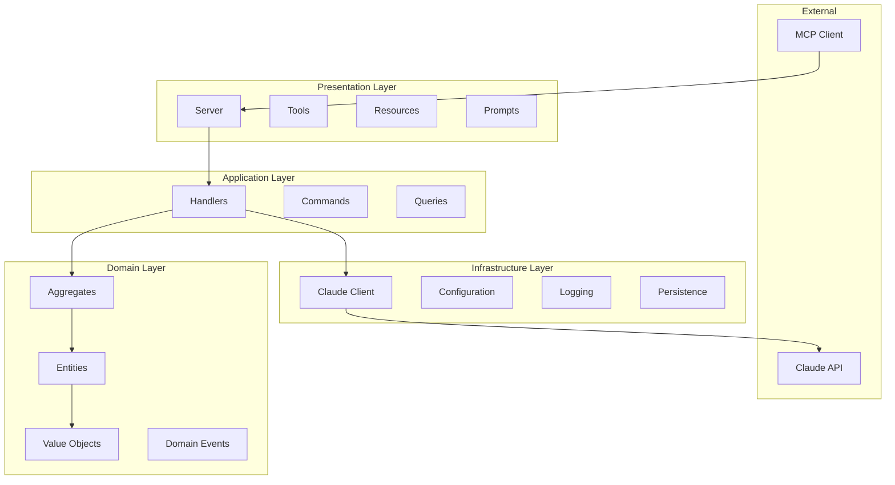

# TelemetryFlow Python MCP - Development Patterns

## Overview

This document defines the coding standards and architectural patterns for the TelemetryFlow Python MCP Server, following the LEGO Builder methodology for maintainable, modular code.

## LEGO Builder Methodology

### Core Principles

1. **Modular Structure**: Code organized in self-contained, reusable blocks
2. **Clear Interfaces**: Well-defined boundaries between components
3. **Layer Separation**: Strict adherence to architectural layers
4. **Dependency Direction**: Dependencies flow inward toward domain

### Layer Architecture



## Domain-Driven Design

### Aggregates

```python
# Good: Aggregate with clear boundaries
@dataclass
class Session:
    """Session aggregate root."""

    id: SessionID
    state: SessionState
    tools: dict[str, Tool]
    _events: list[DomainEvent] = field(default_factory=list)

    def register_tool(self, tool: Tool) -> None:
        """Register a tool (protects invariants)."""
        if self.state != SessionState.READY:
            raise ValueError("Session must be ready")
        self.tools[str(tool.name)] = tool
        self._emit(ToolRegisteredEvent(...))

    def _emit(self, event: DomainEvent) -> None:
        """Emit a domain event."""
        self._events.append(event)
```

### Value Objects

```python
# Good: Immutable value object with validation
@dataclass(frozen=True)
class ToolName:
    """Tool name value object."""

    value: str

    def __post_init__(self) -> None:
        if not self.value:
            raise ValueError("Tool name cannot be empty")
        if not re.match(r"^[a-z][a-z0-9_]*$", self.value):
            raise ValueError("Tool name must be lowercase with underscores")

    def __str__(self) -> str:
        return self.value
```

### Entities

```python
# Good: Entity with identity and behavior
@dataclass
class Tool:
    """Tool entity."""

    name: ToolName
    description: str
    input_schema: ToolInputSchema
    handler: ToolHandler | None
    enabled: bool = True

    def enable(self) -> None:
        self.enabled = True

    def disable(self) -> None:
        self.enabled = False

    def to_mcp_format(self) -> dict[str, Any]:
        """Convert to MCP protocol format."""
        return {
            "name": str(self.name),
            "description": self.description,
            "inputSchema": self.input_schema.to_dict(),
        }
```

### Domain Events

```python
# Good: Domain event with timestamp
@dataclass
class SessionCreatedEvent(DomainEvent):
    """Emitted when a session is created."""

    session_id: str

    @property
    def event_type(self) -> str:
        return "session.created"


@dataclass
class ToolExecutedEvent(DomainEvent):
    """Emitted when a tool is executed."""

    session_id: str
    tool_name: str
    execution_time_ms: float
    success: bool
    error_message: str | None = None

    @property
    def event_type(self) -> str:
        return "tool.executed"
```

## CQRS Patterns

### Commands (Write Operations)

```python
# Good: Command with all required data
@dataclass
class ExecuteToolCommand:
    """Command to execute a tool."""

    session_id: str
    tool_name: str
    arguments: dict[str, Any]


# Good: Command handler
class ToolCommandHandler:
    """Handler for tool commands."""

    async def execute(
        self,
        session: Session,
        command: ExecuteToolCommand,
    ) -> ToolResult:
        """Execute a tool."""
        tool = session.get_tool(command.tool_name)
        if not tool:
            raise ToolNotFoundError(command.tool_name)

        return await tool.handler(command.arguments)
```

### Queries (Read Operations)

```python
# Good: Query with optional filters
@dataclass
class ListToolsQuery:
    """Query to list tools."""

    session_id: str
    category: str | None = None
    cursor: str | None = None


# Good: Query handler (no side effects)
class ToolQueryHandler:
    """Handler for tool queries."""

    def list(
        self,
        session: Session,
        query: ListToolsQuery,
    ) -> list[dict[str, Any]]:
        """List tools (read-only)."""
        tools = session.list_tools()
        if query.category:
            tools = [t for t in tools if t.category == query.category]
        return [t.to_mcp_format() for t in tools]
```

## Repository Pattern

### Interface Definition

```python
# Good: Protocol for repository interface
class SessionRepository(Protocol):
    """Session repository interface."""

    async def save(self, session: Session) -> None:
        """Save a session."""
        ...

    async def find_by_id(self, session_id: SessionID) -> Session | None:
        """Find session by ID."""
        ...

    async def delete(self, session_id: SessionID) -> bool:
        """Delete a session."""
        ...
```

### Implementation

```python
# Good: In-memory implementation
class InMemorySessionRepository:
    """In-memory session repository."""

    def __init__(self) -> None:
        self._sessions: dict[str, Session] = {}

    async def save(self, session: Session) -> None:
        self._sessions[str(session.id)] = session

    async def find_by_id(self, session_id: SessionID) -> Session | None:
        return self._sessions.get(str(session_id))
```

## Error Handling

### Domain Errors

```python
# Good: Domain-specific errors
class DomainError(Exception):
    """Base domain error."""
    pass


class ToolNotFoundError(DomainError):
    """Tool not found."""

    def __init__(self, tool_name: str) -> None:
        self.tool_name = tool_name
        super().__init__(f"Tool not found: {tool_name}")


class SessionNotReadyError(DomainError):
    """Session not ready for operation."""
    pass
```

### MCP Error Conversion

```python
# Good: Convert domain errors to MCP errors
def convert_to_mcp_error(error: Exception) -> MCPError:
    """Convert error to MCP error format."""
    if isinstance(error, ToolNotFoundError):
        return MCPError(
            code=MCPErrorCode.TOOL_NOT_FOUND,
            message=str(error),
        )
    elif isinstance(error, ValidationError):
        return MCPError(
            code=MCPErrorCode.INVALID_PARAMS,
            message=str(error),
        )
    else:
        return MCPError(
            code=MCPErrorCode.INTERNAL_ERROR,
            message=str(error),
        )
```

## Naming Conventions

### Value Objects

```python
# PascalCase for value object classes
SessionID     # ID value object
ToolName      # Name value object
ResourceURI   # URI value object
```

### Commands

```python
# {Action}{Entity}Command pattern
InitializeSessionCommand
ExecuteToolCommand
ReadResourceCommand
GetPromptCommand
```

### Queries

```python
# {Action}{Entity}Query or List{Entity}Query pattern
ListToolsQuery
GetSessionQuery
ListResourcesQuery
```

### Handlers

```python
# {Entity}Handler pattern
SessionHandler
ToolHandler
ConversationHandler
```

### Events

```python
# {Entity}{Action}Event pattern
SessionCreatedEvent
SessionInitializedEvent
ToolExecutedEvent
MessageAddedEvent
```

### Repositories

```python
# {Entity}Repository pattern
SessionRepository
ConversationRepository
ToolRepository
```

## File Organization

```
src/tfo_mcp/
├── domain/
│   ├── __init__.py
│   ├── aggregates/
│   │   ├── __init__.py
│   │   ├── session.py
│   │   └── conversation.py
│   ├── entities/
│   │   ├── __init__.py
│   │   ├── message.py
│   │   ├── tool.py
│   │   ├── resource.py
│   │   └── prompt.py
│   ├── valueobjects/
│   │   ├── __init__.py
│   │   ├── identifiers.py
│   │   ├── mcp.py
│   │   └── content.py
│   ├── events/
│   │   ├── __init__.py
│   │   └── events.py
│   ├── repositories/
│   │   ├── __init__.py
│   │   └── repositories.py
│   └── services/
│       ├── __init__.py
│       └── services.py
├── application/
│   ├── __init__.py
│   ├── commands/
│   │   ├── __init__.py
│   │   └── commands.py
│   ├── queries/
│   │   ├── __init__.py
│   │   └── queries.py
│   └── handlers/
│       ├── __init__.py
│       ├── session_handler.py
│       ├── tool_handler.py
│       └── conversation_handler.py
├── infrastructure/
│   ├── __init__.py
│   ├── claude/
│   │   ├── __init__.py
│   │   └── client.py
│   ├── config/
│   │   ├── __init__.py
│   │   └── config.py
│   ├── logging/
│   │   ├── __init__.py
│   │   └── logger.py
│   └── persistence/
│       ├── __init__.py
│       └── memory_repositories.py
└── presentation/
    ├── __init__.py
    ├── server/
    │   ├── __init__.py
    │   └── server.py
    ├── tools/
    │   ├── __init__.py
    │   └── builtin_tools.py
    ├── resources/
    │   ├── __init__.py
    │   └── builtin_resources.py
    └── prompts/
        ├── __init__.py
        └── builtin_prompts.py
```

## Code Style

### Type Hints

```python
# Good: Complete type hints
async def send_message(
    self,
    messages: list[dict[str, Any]],
    model: str | None = None,
    system: str | None = None,
) -> Message:
    """Send a message to Claude."""
    ...

# Good: Type alias for complex types
ToolHandler = Callable[[dict[str, Any]], Awaitable[ToolResult]]
```

### Docstrings

```python
# Good: Docstring for public API
class Session:
    """
    Session aggregate root for MCP protocol.

    The Session manages the lifecycle of an MCP connection,
    including tools, resources, prompts, and conversations.

    Attributes:
        id: Unique session identifier
        state: Current session state
        tools: Registered tools
    """

    def initialize(self, client_info: ClientInfo) -> dict[str, Any]:
        """
        Initialize the session.

        Args:
            client_info: Client information from initialize request

        Returns:
            Initialize response with server info and capabilities

        Raises:
            ValueError: If session is already initialized
        """
        ...
```

### Async Patterns

```python
# Good: Async context manager
async with client.stream_message(messages) as stream:
    async for chunk in stream:
        yield chunk

# Good: Concurrent operations
results = await asyncio.gather(
    repo1.save(entity1),
    repo2.save(entity2),
)

# Good: Timeout handling
try:
    result = await asyncio.wait_for(
        handler(input_data),
        timeout=30.0,
    )
except asyncio.TimeoutError:
    return ToolResult.error("Timeout")
```

## Testing Patterns

### Table-Driven Tests

```python
# Good: Parameterized tests
@pytest.mark.parametrize("name,expected_valid", [
    ("read_file", True),
    ("write_file", True),
    ("ReadFile", False),  # Invalid: uppercase
    ("read-file", False),  # Invalid: hyphen
    ("", False),  # Invalid: empty
])
def test_tool_name_validation(name: str, expected_valid: bool):
    if expected_valid:
        ToolName(value=name)
    else:
        with pytest.raises(ValueError):
            ToolName(value=name)
```

### Fixtures

```python
# Good: Reusable fixtures
@pytest.fixture
def session():
    """Create a test session."""
    return Session.create()


@pytest.fixture
def initialized_session(session):
    """Create an initialized session."""
    session.initialize(ClientInfo(name="test", version="1.0"))
    return session


@pytest.fixture
def session_with_tools(initialized_session):
    """Create session with tools."""
    register_builtin_tools(initialized_session)
    return initialized_session
```

### Mocking

```python
# Good: Mock for external service
class MockClaudeClient:
    """Mock Claude client for testing."""

    def __init__(self, response: Message | None = None):
        self.response = response or mock_response()
        self.calls: list[dict] = []

    async def send_message(self, messages, **kwargs):
        self.calls.append({"messages": messages, **kwargs})
        return self.response
```
