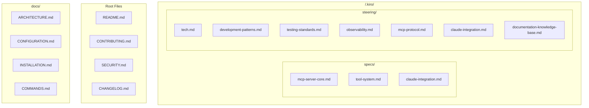

# TelemetryFlow Python MCP Documentation Knowledge Base

## Overview

This steering file provides comprehensive references to the TelemetryFlow Python MCP Server documentation and implementation patterns. Use these references to understand the complete system architecture, development processes, and operational procedures.

## Documentation Structure



## Specification Documents

### #[[file:.kiro/specs/mcp-server-core.md]]

Core MCP server specification including:

- Session lifecycle management
- CQRS command and query patterns
- Domain aggregates (Session, Conversation)
- MCP protocol compliance (2024-11-05)
- JSON-RPC 2.0 handling
- Error codes and responses

### #[[file:.kiro/specs/tool-system.md]]

Tool system architecture covering:

- Tool entity and result structures
- Built-in tools (echo, read_file, write_file, etc.)
- Tool registry and management
- Input schema validation
- Security sandboxing
- Tool execution patterns

### #[[file:.kiro/specs/claude-integration.md]]

Claude API integration specification:

- Client configuration and models
- Message formats and tool use
- Streaming support
- Rate limiting
- Error handling and retries
- Conversation management

## Steering Documents

### #[[file:.kiro/steering/tech.md]]

Technology stack summary:

- Python 3.11+ runtime
- Core dependencies (anthropic, pydantic, structlog)
- Development tools (pytest, mypy, ruff)
- Optional dependencies (redis, nats, postgres)
- Docker and deployment

### #[[file:.kiro/steering/development-patterns.md]]

Development standards and patterns:

- LEGO Builder methodology
- Domain-Driven Design implementation
- CQRS patterns
- Repository pattern
- Naming conventions
- File organization
- Code style and type hints

### #[[file:.kiro/steering/testing-standards.md]]

Testing framework and standards:

- Testing pyramid (unit, integration, e2e)
- Coverage requirements (≥80%)
- pytest configuration
- Async test patterns
- Mock implementations
- CI integration

### #[[file:.kiro/steering/observability.md]]

Observability standards:

- OpenTelemetry integration
- Distributed tracing
- Metrics collection
- Structured logging with structlog
- Health checks
- Performance monitoring

### #[[file:.kiro/steering/mcp-protocol.md]]

MCP protocol standards:

- Protocol version 2024-11-05
- Transport layer (stdio, JSON-RPC 2.0)
- Capabilities (tools, resources, prompts)
- Message patterns
- Error handling
- Security considerations

### #[[file:.kiro/steering/claude-integration.md]]

Claude integration standards:

- Configuration patterns
- Client implementation
- Tool conversion
- Conversation handling
- Streaming support
- Rate limiting

## Implementation Guidelines

### When to Reference Documentation

1. **Architecture Decisions**: Reference `.kiro/specs/mcp-server-core.md` for architectural patterns and session management.

2. **Tool Development**: Consult `.kiro/specs/tool-system.md` when creating new tools or modifying tool behavior.

3. **Claude Integration**: Use `.kiro/specs/claude-integration.md` and `.kiro/steering/claude-integration.md` for API integration patterns.

4. **Development Standards**: Follow `.kiro/steering/development-patterns.md` for coding conventions.

5. **Testing**: Reference `.kiro/steering/testing-standards.md` for test structure and coverage requirements.

6. **Observability**: Use `.kiro/steering/observability.md` for logging, tracing, and metrics.

7. **Protocol Compliance**: Consult `.kiro/steering/mcp-protocol.md` for MCP specification compliance.

### Documentation Integration Patterns

#### Architecture Alignment

```python
# Always align implementations with documented architecture
# Reference: .kiro/specs/mcp-server-core.md - Session Aggregate
@dataclass
class Session:
    """Session aggregate root following documented patterns."""

    id: SessionID
    state: SessionState
    tools: dict[str, Tool]
    resources: dict[str, Resource]
    prompts: dict[str, Prompt]
    # Implementation follows documented aggregate patterns
```

#### Configuration Consistency

```yaml
# Follow documented configuration patterns
# Reference: .kiro/steering/tech.md - Configuration
server:
  name: TelemetryFlow-MCP
  version: "1.1.2"
  protocol_version: "2024-11-05"
  # Configuration structure matches documentation
```

#### Command Implementation

```python
# Implement commands according to documented specifications
# Reference: .kiro/specs/mcp-server-core.md - CQRS Commands
@dataclass
class ExecuteToolCommand:
    """Command following documented CQRS pattern."""

    session_id: str
    tool_name: str
    arguments: dict[str, Any]
```

## Development Workflow Integration

### Pre-Development Checklist

1. Review relevant sections in `.kiro/specs/mcp-server-core.md`
2. Check `.kiro/steering/development-patterns.md` for coding standards
3. Understand tool patterns from `.kiro/specs/tool-system.md`
4. Review Claude integration in `.kiro/specs/claude-integration.md`
5. Check testing requirements in `.kiro/steering/testing-standards.md`

### Implementation Phase

1. Follow patterns documented in `.kiro/steering/development-patterns.md`
2. Implement tools according to `.kiro/specs/tool-system.md`
3. Ensure MCP compliance with `.kiro/steering/mcp-protocol.md`
4. Add observability per `.kiro/steering/observability.md`

### Testing and Validation

1. Write tests following `.kiro/steering/testing-standards.md`
2. Verify protocol compliance with `.kiro/steering/mcp-protocol.md`
3. Test Claude integration per `.kiro/specs/claude-integration.md`
4. Validate against architecture in `.kiro/specs/mcp-server-core.md`

### Code Review

1. Verify alignment with `.kiro/steering/development-patterns.md`
2. Check test coverage against `.kiro/steering/testing-standards.md`
3. Validate observability implementation
4. Ensure documentation is updated

## Quality Assurance

### Documentation Compliance

- All implementations MUST align with documented architecture patterns
- Configuration changes MUST be compatible with documented schemas
- Tool implementations MUST follow documented specifications
- Error handling MUST follow documented patterns

### Consistency Checks

- Verify architectural decisions against `.kiro/specs/mcp-server-core.md`
- Validate tool implementations against `.kiro/specs/tool-system.md`
- Check Claude integration against `.kiro/specs/claude-integration.md`
- Ensure configuration consistency with `.kiro/steering/tech.md`

## Cross-Reference Map

| Topic | Primary Reference | Related Documents |
|-------|-------------------|-------------------|
| Session Management | specs/mcp-server-core.md | steering/mcp-protocol.md |
| Tool Development | specs/tool-system.md | steering/development-patterns.md |
| Claude Integration | specs/claude-integration.md | steering/claude-integration.md |
| Testing | steering/testing-standards.md | steering/development-patterns.md |
| Observability | steering/observability.md | steering/tech.md |
| Configuration | steering/tech.md | specs/mcp-server-core.md |

## Best Practices

### Documentation-Driven Development

1. **Read First**: Always read relevant documentation before implementing
2. **Reference Explicitly**: Include documentation references in code comments
3. **Validate Continuously**: Regularly check implementation against documentation
4. **Update Together**: Update both code and documentation when making changes

### Implementation Patterns

```python
# Example: Documentation-referenced implementation
# Reference: .kiro/specs/mcp-server-core.md - Session Lifecycle
# Reference: .kiro/steering/development-patterns.md - CQRS Pattern
class SessionHandler:
    """Session handler following documented patterns."""

    async def initialize(
        self,
        session: Session,
        command: InitializeSessionCommand,
    ) -> dict[str, Any]:
        """
        Initialize session.

        Implementation follows:
        - .kiro/specs/mcp-server-core.md - Initialize sequence
        - .kiro/steering/mcp-protocol.md - Protocol compliance
        """
        if session.state != SessionState.CREATED:
            raise ValueError("Session already initialized")

        result = session.initialize(command.client_info)
        await self.repo.save(session)

        return result
```

### Configuration Management

```python
# Reference: .kiro/steering/tech.md - Configuration Management
# Ensure all configuration follows documented structure
from pydantic_settings import BaseSettings


class Config(BaseSettings):
    """
    Application configuration.

    Structure follows: .kiro/steering/tech.md
    """

    model_config = SettingsConfigDict(
        env_prefix="TELEMETRYFLOW_MCP_",
        env_nested_delimiter="__",
    )

    server: ServerConfig = Field(default_factory=ServerConfig)
    claude: ClaudeConfig = Field(default_factory=ClaudeConfig)
```

## Maintenance and Updates

### Documentation Synchronization

- Keep implementations synchronized with documentation updates
- Update code when documentation patterns change
- Maintain consistency between code and documented architecture
- Review documentation regularly for updates and changes

### Knowledge Transfer

- Use documentation as primary source for onboarding
- Reference specific documentation sections in code comments
- Maintain traceability between implementation and documentation
- Ensure team understanding of documented patterns and procedures

## File References

### Specification Files

| File | Description |
|------|-------------|
| `.kiro/specs/mcp-server-core.md` | Core server architecture |
| `.kiro/specs/tool-system.md` | Tool system specification |
| `.kiro/specs/claude-integration.md` | Claude API integration |

### Steering Files

| File | Description |
|------|-------------|
| `.kiro/steering/tech.md` | Technology stack |
| `.kiro/steering/development-patterns.md` | Development standards |
| `.kiro/steering/testing-standards.md` | Testing framework |
| `.kiro/steering/observability.md` | Observability standards |
| `.kiro/steering/mcp-protocol.md` | MCP protocol standards |
| `.kiro/steering/claude-integration.md` | Claude integration |
| `.kiro/steering/documentation-knowledge-base.md` | This file |

### Root Documentation

| File | Description |
|------|-------------|
| `README.md` | Project overview |
| `CONTRIBUTING.md` | Contribution guidelines |
| `SECURITY.md` | Security policy |
| `CHANGELOG.md` | Version history |

This knowledge base ensures that all development work is grounded in comprehensive documentation, maintaining consistency and quality across the TelemetryFlow Python MCP Server implementation.
