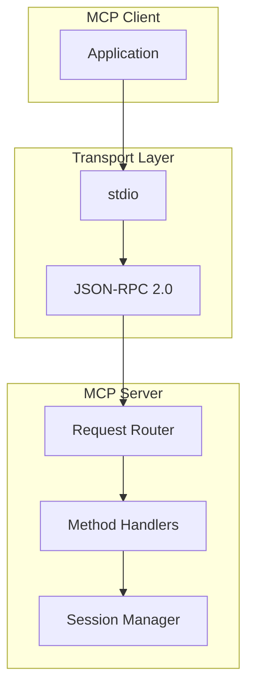
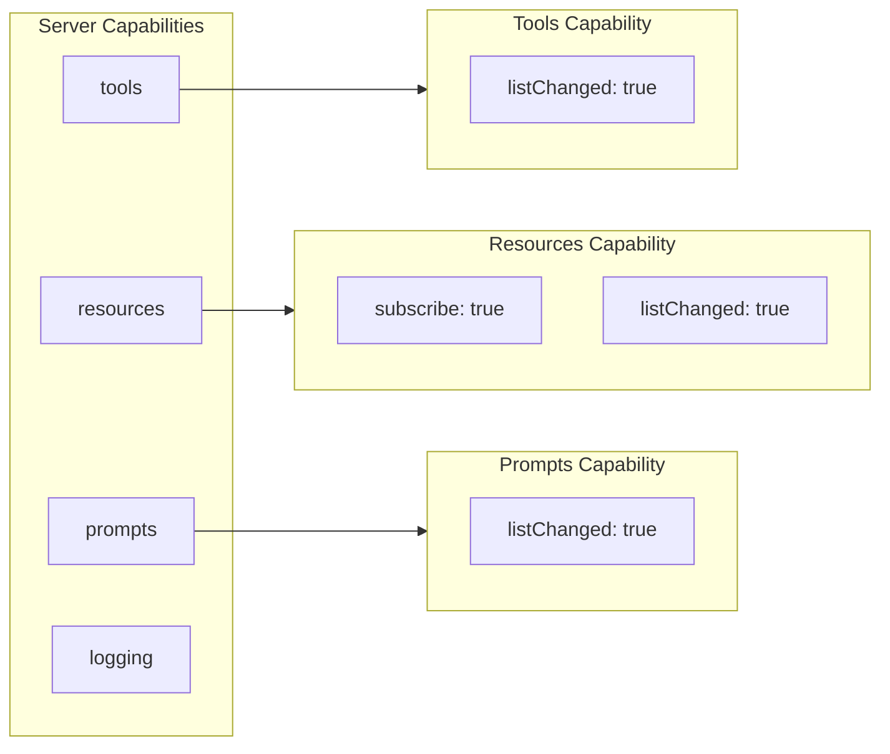
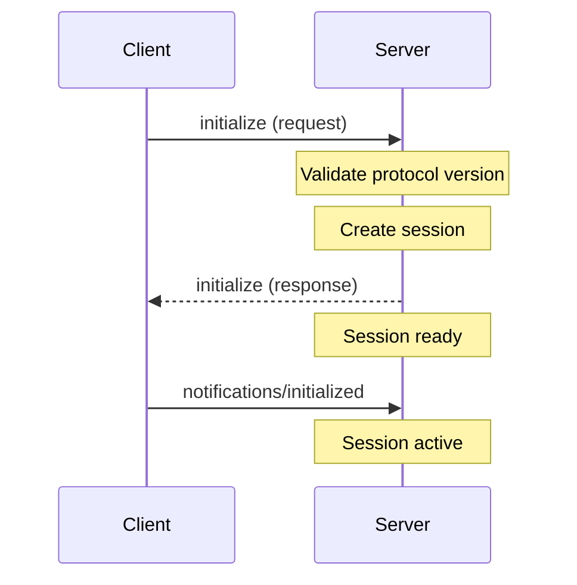

# TFO-MCP Protocol Standards

## Overview

The TelemetryFlow Python MCP Server strictly follows the Model Context Protocol (MCP) specification version 2024-11-05.

## Protocol Architecture



## Protocol Fundamentals

### Protocol Version

```python
# MCP Protocol Version
MCP_PROTOCOL_VERSION = "2024-11-05"
```

### Transport Layer

```python
from typing import Protocol, Any
import json


class MCPTransport(Protocol):
    """MCP transport interface."""

    async def send(self, message: dict[str, Any]) -> None:
        """Send a message."""
        ...

    async def receive(self) -> dict[str, Any]:
        """Receive a message."""
        ...

    async def close(self) -> None:
        """Close the transport."""
        ...


class StdioTransport:
    """stdio transport implementation."""

    def __init__(
        self,
        stdin: TextIO,
        stdout: TextIO,
    ) -> None:
        self.stdin = stdin
        self.stdout = stdout

    async def send(self, message: dict[str, Any]) -> None:
        """Send JSON-RPC message to stdout."""
        line = json.dumps(message) + "\n"
        self.stdout.write(line)
        self.stdout.flush()

    async def receive(self) -> dict[str, Any]:
        """Receive JSON-RPC message from stdin."""
        line = self.stdin.readline()
        if not line:
            raise EOFError("Connection closed")
        return json.loads(line)
```

## Core MCP Capabilities

### Capabilities Structure



### Tools Capability

```python
from dataclasses import dataclass, field
from typing import Any


@dataclass
class ToolsCapability:
    """Tools capability configuration."""

    list_changed: bool = True

    def to_dict(self) -> dict[str, Any]:
        """Convert to MCP format."""
        return {"listChanged": self.list_changed}


@dataclass
class Tool:
    """MCP Tool definition."""

    name: str
    description: str
    input_schema: dict[str, Any]

    def to_mcp_format(self) -> dict[str, Any]:
        """Convert to MCP protocol format."""
        return {
            "name": self.name,
            "description": self.description,
            "inputSchema": self.input_schema,
        }
```

### Resources Capability

```python
@dataclass
class ResourcesCapability:
    """Resources capability configuration."""

    subscribe: bool = True
    list_changed: bool = True

    def to_dict(self) -> dict[str, Any]:
        """Convert to MCP format."""
        return {
            "subscribe": self.subscribe,
            "listChanged": self.list_changed,
        }


@dataclass
class Resource:
    """MCP Resource definition."""

    uri: str
    name: str
    description: str | None = None
    mime_type: str | None = None

    def to_mcp_format(self) -> dict[str, Any]:
        """Convert to MCP protocol format."""
        result = {
            "uri": self.uri,
            "name": self.name,
        }
        if self.description:
            result["description"] = self.description
        if self.mime_type:
            result["mimeType"] = self.mime_type
        return result
```

### Prompts Capability

```python
@dataclass
class PromptsCapability:
    """Prompts capability configuration."""

    list_changed: bool = True

    def to_dict(self) -> dict[str, Any]:
        """Convert to MCP format."""
        return {"listChanged": self.list_changed}


@dataclass
class PromptArgument:
    """Prompt argument definition."""

    name: str
    description: str | None = None
    required: bool = False

    def to_mcp_format(self) -> dict[str, Any]:
        """Convert to MCP format."""
        result = {"name": self.name}
        if self.description:
            result["description"] = self.description
        if self.required:
            result["required"] = self.required
        return result


@dataclass
class Prompt:
    """MCP Prompt definition."""

    name: str
    description: str | None = None
    arguments: list[PromptArgument] = field(default_factory=list)

    def to_mcp_format(self) -> dict[str, Any]:
        """Convert to MCP protocol format."""
        result = {"name": self.name}
        if self.description:
            result["description"] = self.description
        if self.arguments:
            result["arguments"] = [
                arg.to_mcp_format() for arg in self.arguments
            ]
        return result
```

## Message Patterns

### Request/Response Pattern

```python
from dataclasses import dataclass
from typing import Any


@dataclass
class MCPRequest:
    """MCP JSON-RPC request."""

    jsonrpc: str = "2.0"
    id: str | int | None = None
    method: str = ""
    params: dict[str, Any] | None = None

    def to_dict(self) -> dict[str, Any]:
        """Convert to dictionary."""
        result = {
            "jsonrpc": self.jsonrpc,
            "method": self.method,
        }
        if self.id is not None:
            result["id"] = self.id
        if self.params is not None:
            result["params"] = self.params
        return result


@dataclass
class MCPResponse:
    """MCP JSON-RPC response."""

    jsonrpc: str = "2.0"
    id: str | int | None = None
    result: Any | None = None
    error: "MCPError | None" = None

    def to_dict(self) -> dict[str, Any]:
        """Convert to dictionary."""
        response = {
            "jsonrpc": self.jsonrpc,
            "id": self.id,
        }
        if self.error:
            response["error"] = self.error.to_dict()
        else:
            response["result"] = self.result
        return response
```

### Notification Pattern

```python
@dataclass
class MCPNotification:
    """MCP notification (no response expected)."""

    jsonrpc: str = "2.0"
    method: str = ""
    params: dict[str, Any] | None = None

    def to_dict(self) -> dict[str, Any]:
        """Convert to dictionary."""
        result = {
            "jsonrpc": self.jsonrpc,
            "method": self.method,
        }
        if self.params is not None:
            result["params"] = self.params
        return result
```

## Error Handling

### MCP Error Codes

```python
from enum import IntEnum


class MCPErrorCode(IntEnum):
    """MCP error codes."""

    # Standard JSON-RPC errors
    PARSE_ERROR = -32700
    INVALID_REQUEST = -32600
    METHOD_NOT_FOUND = -32601
    INVALID_PARAMS = -32602
    INTERNAL_ERROR = -32603

    # MCP-specific errors
    TOOL_NOT_FOUND = -32001
    RESOURCE_NOT_FOUND = -32002
    PROMPT_NOT_FOUND = -32003
    TOOL_DISABLED = -32004
    TOOL_EXECUTION_ERROR = -32005
    TOOL_TIMEOUT = -32006


@dataclass
class MCPError:
    """MCP error structure."""

    code: int
    message: str
    data: Any | None = None

    def to_dict(self) -> dict[str, Any]:
        """Convert to dictionary."""
        result = {
            "code": self.code,
            "message": self.message,
        }
        if self.data is not None:
            result["data"] = self.data
        return result
```

### Error Mapping

```python
def map_exception_to_mcp_error(error: Exception) -> MCPError:
    """Map Python exception to MCP error."""
    if isinstance(error, ToolNotFoundError):
        return MCPError(
            code=MCPErrorCode.TOOL_NOT_FOUND,
            message=str(error),
        )
    elif isinstance(error, ResourceNotFoundError):
        return MCPError(
            code=MCPErrorCode.RESOURCE_NOT_FOUND,
            message=str(error),
        )
    elif isinstance(error, PromptNotFoundError):
        return MCPError(
            code=MCPErrorCode.PROMPT_NOT_FOUND,
            message=str(error),
        )
    elif isinstance(error, ValidationError):
        return MCPError(
            code=MCPErrorCode.INVALID_PARAMS,
            message=str(error),
        )
    else:
        return MCPError(
            code=MCPErrorCode.INTERNAL_ERROR,
            message=str(error),
        )
```

## Session Management

### Initialization Sequence



### Initialize Request/Response

```python
@dataclass
class ClientInfo:
    """Client information."""

    name: str
    version: str


@dataclass
class ServerInfo:
    """Server information."""

    name: str
    version: str


@dataclass
class InitializeRequest:
    """Initialize request parameters."""

    protocol_version: str
    client_info: ClientInfo
    capabilities: dict[str, Any] | None = None


@dataclass
class InitializeResponse:
    """Initialize response."""

    protocol_version: str
    server_info: ServerInfo
    capabilities: dict[str, Any]

    def to_dict(self) -> dict[str, Any]:
        """Convert to dictionary."""
        return {
            "protocolVersion": self.protocol_version,
            "serverInfo": {
                "name": self.server_info.name,
                "version": self.server_info.version,
            },
            "capabilities": self.capabilities,
        }
```

## Content Types

### Text Content

```python
@dataclass
class TextContent:
    """Text content block."""

    type: str = "text"
    text: str = ""

    def to_dict(self) -> dict[str, Any]:
        """Convert to dictionary."""
        return {
            "type": self.type,
            "text": self.text,
        }
```

### Image Content

```python
@dataclass
class ImageContent:
    """Image content block."""

    type: str = "image"
    data: str = ""  # base64 encoded
    mime_type: str = "image/png"

    def to_dict(self) -> dict[str, Any]:
        """Convert to dictionary."""
        return {
            "type": self.type,
            "data": self.data,
            "mimeType": self.mime_type,
        }
```

### Resource Content

```python
@dataclass
class ResourceContent:
    """Resource content block."""

    type: str = "resource"
    uri: str = ""
    text: str | None = None
    blob: str | None = None  # base64 encoded
    mime_type: str | None = None

    def to_dict(self) -> dict[str, Any]:
        """Convert to dictionary."""
        resource = {"uri": self.uri}
        if self.text:
            resource["text"] = self.text
        if self.blob:
            resource["blob"] = self.blob
        if self.mime_type:
            resource["mimeType"] = self.mime_type
        return {
            "type": self.type,
            "resource": resource,
        }
```

## Validation Rules

### Request Validation

```python
def validate_request(request: dict[str, Any]) -> None:
    """Validate MCP request structure."""
    # Check JSON-RPC version
    if request.get("jsonrpc") != "2.0":
        raise InvalidRequestError("jsonrpc must be '2.0'")

    # Check method
    if "method" not in request:
        raise InvalidRequestError("method is required")

    method = request["method"]
    if not isinstance(method, str):
        raise InvalidRequestError("method must be a string")

    # Check ID for requests (not notifications)
    if "id" in request:
        id_value = request["id"]
        if id_value is not None and not isinstance(id_value, (str, int)):
            raise InvalidRequestError("id must be string, number, or null")
```

### Response Validation

```python
def validate_response(response: dict[str, Any], request_id: Any) -> None:
    """Validate MCP response structure."""
    # Check JSON-RPC version
    if response.get("jsonrpc") != "2.0":
        raise InvalidResponseError("jsonrpc must be '2.0'")

    # Check ID matches
    if response.get("id") != request_id:
        raise InvalidResponseError("Response ID must match request ID")

    # Check result/error exclusivity
    has_result = "result" in response
    has_error = "error" in response

    if has_result and has_error:
        raise InvalidResponseError("Cannot have both result and error")
    if not has_result and not has_error:
        raise InvalidResponseError("Must have either result or error")
```

## Implementation Guidelines

### Handler Registration

```python
from typing import Callable, Awaitable

MCPHandler = Callable[
    [dict[str, Any]],
    Awaitable[dict[str, Any] | None]
]


class MCPServer:
    """MCP server with handler registration."""

    def __init__(self) -> None:
        self._handlers: dict[str, MCPHandler] = {}

    def register_handler(
        self,
        method: str,
        handler: MCPHandler,
    ) -> None:
        """Register a handler for a method."""
        self._handlers[method] = handler

    async def handle_request(
        self,
        request: dict[str, Any],
    ) -> dict[str, Any] | None:
        """Handle an incoming request."""
        method = request.get("method", "")
        handler = self._handlers.get(method)

        if handler is None:
            return self._make_error_response(
                request.get("id"),
                MCPErrorCode.METHOD_NOT_FOUND,
                f"Method not found: {method}",
            )

        try:
            result = await handler(request.get("params", {}))
            if request.get("id") is None:
                return None  # Notification, no response
            return self._make_success_response(request["id"], result)
        except Exception as e:
            error = map_exception_to_mcp_error(e)
            return self._make_error_response(
                request.get("id"),
                error.code,
                error.message,
                error.data,
            )
```

### Middleware Pattern

```python
from functools import wraps


def logging_middleware(handler: MCPHandler) -> MCPHandler:
    """Add logging to handler."""
    @wraps(handler)
    async def wrapper(params: dict[str, Any]) -> dict[str, Any] | None:
        logger.info("Handling request", params=params)
        try:
            result = await handler(params)
            logger.info("Request succeeded")
            return result
        except Exception as e:
            logger.error("Request failed", error=str(e))
            raise
    return wrapper


def validation_middleware(
    schema: dict[str, Any],
) -> Callable[[MCPHandler], MCPHandler]:
    """Add validation to handler."""
    def decorator(handler: MCPHandler) -> MCPHandler:
        @wraps(handler)
        async def wrapper(params: dict[str, Any]) -> dict[str, Any] | None:
            validate_params(params, schema)
            return await handler(params)
        return wrapper
    return decorator
```

## Supported Methods

| Method | Type | Description |
|--------|------|-------------|
| initialize | Request | Initialize session |
| notifications/initialized | Notification | Confirm initialization |
| ping | Request | Health check |
| tools/list | Request | List available tools |
| tools/call | Request | Execute a tool |
| resources/list | Request | List resources |
| resources/read | Request | Read a resource |
| resources/templates/list | Request | List resource templates |
| prompts/list | Request | List prompts |
| prompts/get | Request | Get prompt messages |
| logging/setLevel | Request | Set log level |

## Security Considerations

### Input Sanitization

- All string inputs MUST be validated
- File paths MUST be sandboxed
- Resource URIs MUST be validated per RFC 3986

### Rate Limiting

```python
from dataclasses import dataclass
import time


@dataclass
class RateLimitConfig:
    """Rate limit configuration."""

    requests_per_minute: int = 60
    burst_size: int = 10


class RateLimiter:
    """Simple rate limiter."""

    def __init__(self, config: RateLimitConfig) -> None:
        self.config = config
        self._requests: list[float] = []

    async def acquire(self) -> None:
        """Acquire rate limit permit."""
        now = time.time()

        # Clean old entries
        self._requests = [
            t for t in self._requests
            if now - t < 60
        ]

        # Check limit
        if len(self._requests) >= self.config.requests_per_minute:
            wait_time = 60 - (now - self._requests[0])
            await asyncio.sleep(wait_time)

        self._requests.append(now)
```

### Authentication

```python
class APIKeyAuthenticator:
    """API key authentication."""

    def __init__(self, valid_keys: set[str]) -> None:
        self._valid_keys = valid_keys

    def authenticate(self, api_key: str | None) -> bool:
        """Authenticate API key."""
        if api_key is None:
            return False
        return api_key in self._valid_keys
```
