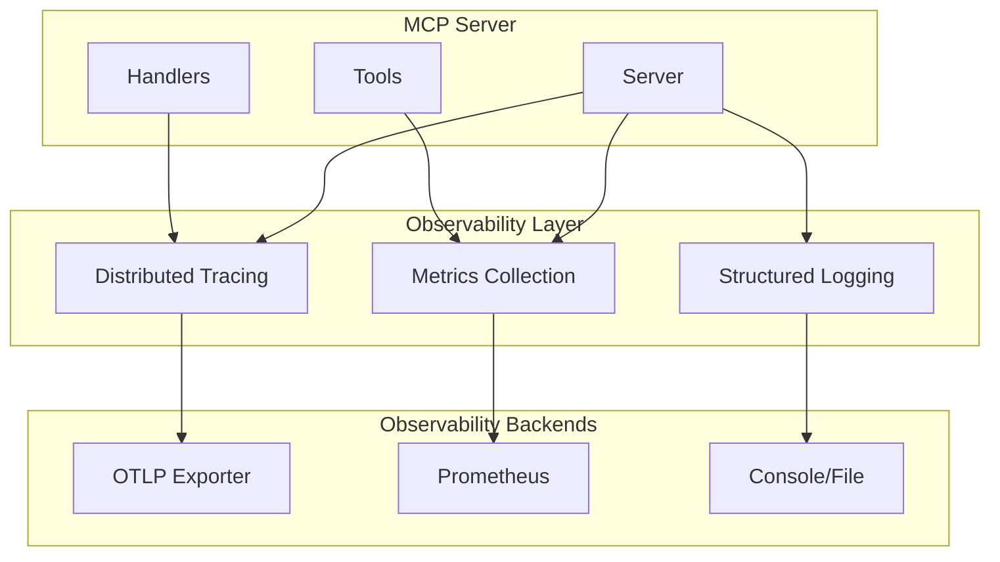

# TFO-MCP Observability Standards

## Overview

The TelemetryFlow Python MCP Server implements comprehensive observability using OpenTelemetry SDK with structured logging via structlog.

## Architecture



## Telemetry Configuration

```python
from pydantic_settings import BaseSettings, SettingsConfigDict
from pydantic import Field


class TelemetryConfig(BaseSettings):
    """Telemetry configuration."""

    model_config = SettingsConfigDict(
        env_prefix="TELEMETRYFLOW_MCP_TELEMETRY_"
    )

    enabled: bool = Field(
        default=True,
        description="Enable telemetry collection",
    )
    service_name: str = Field(
        default="telemetryflow-mcp",
        description="Service name for telemetry",
    )
    service_version: str = Field(
        default="1.1.2",
        description="Service version",
    )
    environment: str = Field(
        default="development",
        description="Deployment environment",
    )
    tracing: TracingConfig = Field(default_factory=TracingConfig)
    metrics: MetricsConfig = Field(default_factory=MetricsConfig)
    logging: LoggingConfig = Field(default_factory=LoggingConfig)


class TracingConfig(BaseSettings):
    """Tracing configuration."""

    enabled: bool = Field(default=True)
    sample_rate: float = Field(default=1.0, ge=0.0, le=1.0)
    exporter: str = Field(default="otlp")  # otlp, console, none
    otlp_endpoint: str = Field(default="http://localhost:4317")


class MetricsConfig(BaseSettings):
    """Metrics configuration."""

    enabled: bool = Field(default=True)
    exporter: str = Field(default="prometheus")  # prometheus, otlp, console
    port: int = Field(default=9090)
    interval_seconds: int = Field(default=60)


class LoggingConfig(BaseSettings):
    """Logging configuration."""

    level: str = Field(default="INFO")
    format: str = Field(default="json")  # json, console
    output: str = Field(default="stdout")  # stdout, stderr, file path
```

## Distributed Tracing

### Trace Context Keys

```python
from dataclasses import dataclass


@dataclass(frozen=True)
class TraceKeys:
    """Trace context keys for MCP operations."""

    SESSION_ID = "mcp.session.id"
    CONVERSATION_ID = "mcp.conversation.id"
    TOOL_NAME = "mcp.tool.name"
    RESOURCE_URI = "mcp.resource.uri"
    PROMPT_NAME = "mcp.prompt.name"
    CLAUDE_MODEL = "claude.model"
    REQUEST_ID = "mcp.request.id"
```

### Span Creation Patterns

```python
from opentelemetry import trace
from opentelemetry.trace import Status, StatusCode
from contextlib import asynccontextmanager
from typing import Any


tracer = trace.get_tracer("telemetryflow-mcp")


@asynccontextmanager
async def mcp_span(
    operation_name: str,
    attributes: dict[str, Any] | None = None,
):
    """Create an MCP operation span."""
    attrs = {
        "mcp.protocol.version": "2024-11-05",
        "service.name": "telemetryflow-mcp",
    }
    if attributes:
        attrs.update(attributes)

    with tracer.start_as_current_span(
        operation_name,
        attributes=attrs,
    ) as span:
        try:
            yield span
            span.set_status(Status(StatusCode.OK))
        except Exception as e:
            span.record_exception(e)
            span.set_status(Status(StatusCode.ERROR, str(e)))
            raise
```

### MCP Operation Tracing

```python
class SessionHandler:
    """Handler for session operations with tracing."""

    async def initialize(
        self,
        session: Session,
        command: InitializeSessionCommand,
    ) -> dict[str, Any]:
        """Initialize session with tracing."""
        async with mcp_span(
            "mcp.session.initialize",
            attributes={
                "mcp.client.name": command.client_info.name,
                "mcp.client.version": command.client_info.version,
                "mcp.protocol.version": command.protocol_version,
            },
        ) as span:
            span.add_event("session.validation.start")

            result = session.initialize(command.client_info)

            span.add_event(
                "session.created",
                attributes={TraceKeys.SESSION_ID: str(session.id)},
            )

            return result


class ToolHandler:
    """Handler for tool operations with tracing."""

    async def execute(
        self,
        session: Session,
        command: ExecuteToolCommand,
    ) -> ToolResult:
        """Execute tool with tracing."""
        async with mcp_span(
            "mcp.tool.call",
            attributes={
                TraceKeys.TOOL_NAME: command.tool_name,
                TraceKeys.SESSION_ID: command.session_id,
                "mcp.tool.input.size": len(command.arguments),
            },
        ) as span:
            tool = session.get_tool(command.tool_name)
            if not tool:
                raise ToolNotFoundError(command.tool_name)

            result = await tool.handler(command.arguments)

            span.set_attributes({
                "mcp.tool.result.size": len(result.content),
                "mcp.tool.result.success": not result.is_error,
            })

            return result
```

### Claude API Tracing

```python
class ClaudeClient:
    """Claude client with tracing."""

    async def send_message(
        self,
        messages: list[dict[str, Any]],
        model: str | None = None,
        **kwargs,
    ) -> Message:
        """Send message with tracing."""
        async with mcp_span(
            "claude.message.send",
            attributes={
                TraceKeys.CLAUDE_MODEL: model or self.default_model,
                "claude.message.count": len(messages),
                "claude.max_tokens": self.max_tokens,
            },
        ) as span:
            span.add_event(
                "claude.request.start",
                attributes={
                    "claude.tools.count": len(kwargs.get("tools", [])),
                },
            )

            start = time.time()
            response = await self._send_with_retry(
                messages=messages,
                model=model,
                **kwargs,
            )
            duration = time.time() - start

            span.set_attributes({
                "claude.request.duration_ms": int(duration * 1000),
            })

            if hasattr(response, "usage") and response.usage:
                span.set_attributes({
                    "claude.tokens.input": response.usage.input_tokens,
                    "claude.tokens.output": response.usage.output_tokens,
                    "claude.tokens.total": (
                        response.usage.input_tokens +
                        response.usage.output_tokens
                    ),
                })

            span.add_event("claude.response.received")
            return response
```

## Metrics Collection

### MCP Metrics

```python
from dataclasses import dataclass, field
from prometheus_client import Counter, Gauge, Histogram


@dataclass
class MCPMetrics:
    """Metrics for MCP server operations."""

    # Session metrics
    sessions_active: Gauge = field(
        default_factory=lambda: Gauge(
            "mcp_sessions_active",
            "Number of active MCP sessions",
        )
    )
    sessions_total: Counter = field(
        default_factory=lambda: Counter(
            "mcp_sessions_total",
            "Total number of MCP sessions created",
        )
    )
    session_duration: Histogram = field(
        default_factory=lambda: Histogram(
            "mcp_session_duration_seconds",
            "Duration of MCP sessions",
            buckets=[1, 5, 10, 30, 60, 300, 600, 1800, 3600],
        )
    )

    # Tool metrics
    tool_calls_total: Counter = field(
        default_factory=lambda: Counter(
            "mcp_tool_calls_total",
            "Total number of tool calls",
            ["tool_name", "status"],
        )
    )
    tool_call_duration: Histogram = field(
        default_factory=lambda: Histogram(
            "mcp_tool_call_duration_seconds",
            "Duration of tool calls",
            ["tool_name"],
            buckets=[0.01, 0.05, 0.1, 0.5, 1, 5, 10, 30],
        )
    )

    # Claude API metrics
    claude_requests_total: Counter = field(
        default_factory=lambda: Counter(
            "claude_requests_total",
            "Total number of Claude API requests",
            ["model", "status"],
        )
    )
    claude_request_duration: Histogram = field(
        default_factory=lambda: Histogram(
            "claude_request_duration_seconds",
            "Duration of Claude API requests",
            ["model"],
            buckets=[0.1, 0.5, 1, 2, 5, 10, 30, 60],
        )
    )
    claude_tokens_total: Counter = field(
        default_factory=lambda: Counter(
            "claude_tokens_total",
            "Total Claude API tokens used",
            ["model", "type"],  # type: input, output
        )
    )

    # MCP Protocol metrics
    mcp_messages_total: Counter = field(
        default_factory=lambda: Counter(
            "mcp_messages_total",
            "Total MCP messages processed",
            ["method", "status"],
        )
    )
    mcp_message_size: Histogram = field(
        default_factory=lambda: Histogram(
            "mcp_message_size_bytes",
            "Size of MCP messages",
            ["direction"],  # request, response
        )
    )
```

### Metrics Recording

```python
class MetricsRecorder:
    """Helper for recording metrics."""

    def __init__(self, metrics: MCPMetrics) -> None:
        self.metrics = metrics

    def record_session_created(self) -> None:
        """Record session creation."""
        self.metrics.sessions_total.inc()
        self.metrics.sessions_active.inc()

    def record_session_closed(self, duration_seconds: float) -> None:
        """Record session closure."""
        self.metrics.sessions_active.dec()
        self.metrics.session_duration.observe(duration_seconds)

    def record_tool_call(
        self,
        tool_name: str,
        duration_seconds: float,
        error: Exception | None = None,
    ) -> None:
        """Record tool call."""
        status = "error" if error else "success"
        self.metrics.tool_calls_total.labels(
            tool_name=tool_name,
            status=status,
        ).inc()
        self.metrics.tool_call_duration.labels(
            tool_name=tool_name,
        ).observe(duration_seconds)

    def record_claude_request(
        self,
        model: str,
        duration_seconds: float,
        input_tokens: int,
        output_tokens: int,
        error: Exception | None = None,
    ) -> None:
        """Record Claude API request."""
        status = "error" if error else "success"
        self.metrics.claude_requests_total.labels(
            model=model,
            status=status,
        ).inc()
        self.metrics.claude_request_duration.labels(
            model=model,
        ).observe(duration_seconds)
        self.metrics.claude_tokens_total.labels(
            model=model,
            type="input",
        ).inc(input_tokens)
        self.metrics.claude_tokens_total.labels(
            model=model,
            type="output",
        ).inc(output_tokens)
```

## Structured Logging

### Logger Configuration

```python
import structlog
from structlog.processors import JSONRenderer, TimeStamper, add_log_level
from structlog.stdlib import filter_by_level


def configure_logging(config: LoggingConfig) -> None:
    """Configure structured logging."""
    processors = [
        filter_by_level,
        add_log_level,
        TimeStamper(fmt="iso"),
        structlog.processors.StackInfoRenderer(),
        structlog.processors.format_exc_info,
    ]

    if config.format == "json":
        processors.append(JSONRenderer())
    else:
        processors.append(structlog.dev.ConsoleRenderer())

    structlog.configure(
        processors=processors,
        wrapper_class=structlog.make_filtering_bound_logger(
            getattr(logging, config.level.upper(), logging.INFO)
        ),
        context_class=dict,
        logger_factory=structlog.PrintLoggerFactory(),
        cache_logger_on_first_use=True,
    )


def get_logger(name: str) -> structlog.BoundLogger:
    """Get a structured logger."""
    return structlog.get_logger(name)
```

### Contextual Logging

```python
class MCPLogger:
    """MCP-aware structured logger."""

    def __init__(self, name: str) -> None:
        self._logger = get_logger(name)

    def with_mcp_context(
        self,
        session_id: str | None = None,
        conversation_id: str | None = None,
        request_id: str | None = None,
    ) -> structlog.BoundLogger:
        """Create logger with MCP context."""
        context = {}
        if session_id:
            context["session_id"] = session_id
        if conversation_id:
            context["conversation_id"] = conversation_id
        if request_id:
            context["request_id"] = request_id
        return self._logger.bind(**context)

    def log_mcp_request(
        self,
        method: str,
        params: dict[str, Any] | None = None,
    ) -> None:
        """Log MCP request."""
        self._logger.info(
            "MCP request received",
            mcp_method=method,
            mcp_params=params,
        )

    def log_mcp_response(
        self,
        method: str,
        duration_ms: float,
        error: Exception | None = None,
    ) -> None:
        """Log MCP response."""
        if error:
            self._logger.error(
                "MCP request failed",
                mcp_method=method,
                duration_ms=duration_ms,
                error=str(error),
            )
        else:
            self._logger.info(
                "MCP request completed",
                mcp_method=method,
                duration_ms=duration_ms,
            )

    def log_claude_request(
        self,
        model: str,
        message_count: int,
        token_count: int | None = None,
    ) -> None:
        """Log Claude API request."""
        self._logger.info(
            "Claude API request",
            claude_model=model,
            message_count=message_count,
            token_count=token_count,
        )
```

## Health Checks

### Health Check Implementation

```python
from dataclasses import dataclass
from datetime import datetime
from enum import Enum


class HealthStatus(Enum):
    """Health status values."""

    HEALTHY = "healthy"
    UNHEALTHY = "unhealthy"
    DEGRADED = "degraded"


@dataclass
class CheckResult:
    """Result of a health check."""

    status: HealthStatus
    message: str | None = None
    duration_ms: float | None = None


@dataclass
class HealthReport:
    """Complete health report."""

    status: HealthStatus
    timestamp: datetime
    checks: dict[str, CheckResult]
    version: str


class HealthChecker:
    """Health checker for MCP server."""

    def __init__(
        self,
        claude_client: ClaudeClient | None = None,
    ) -> None:
        self.claude_client = claude_client

    async def check_health(self) -> HealthReport:
        """Perform health checks."""
        checks = {}
        overall_status = HealthStatus.HEALTHY

        # Check Claude API
        if self.claude_client:
            claude_result = await self._check_claude()
            checks["claude"] = claude_result
            if claude_result.status != HealthStatus.HEALTHY:
                overall_status = HealthStatus.DEGRADED

        return HealthReport(
            status=overall_status,
            timestamp=datetime.utcnow(),
            checks=checks,
            version="1.1.2",
        )

    async def _check_claude(self) -> CheckResult:
        """Check Claude API connectivity."""
        try:
            start = time.time()
            # Simple ping-like request
            await self.claude_client.send_message(
                [{"role": "user", "content": "ping"}],
                max_tokens=5,
            )
            duration = (time.time() - start) * 1000
            return CheckResult(
                status=HealthStatus.HEALTHY,
                duration_ms=duration,
            )
        except Exception as e:
            return CheckResult(
                status=HealthStatus.UNHEALTHY,
                message=str(e),
            )
```

## Error Tracking

### Error Aggregation

```python
class ErrorTracker:
    """Track and aggregate errors."""

    def __init__(
        self,
        logger: MCPLogger,
        metrics: MCPMetrics,
    ) -> None:
        self.logger = logger
        self.metrics = metrics

    def track_error(
        self,
        error: Exception,
        operation: str,
        context: dict[str, Any] | None = None,
    ) -> None:
        """Track an error."""
        # Log structured error
        self.logger._logger.error(
            "Operation failed",
            operation=operation,
            error_type=type(error).__name__,
            error_message=str(error),
            **(context or {}),
        )

        # Update metrics
        self.metrics.mcp_messages_total.labels(
            method=operation,
            status="error",
        ).inc()

        # Check for critical errors
        if self._is_critical(error):
            self._send_alert(error, operation, context)

    def _is_critical(self, error: Exception) -> bool:
        """Check if error is critical."""
        critical_types = [
            "DatabaseConnectionError",
            "AuthenticationError",
            "OutOfMemoryError",
        ]
        return type(error).__name__ in critical_types

    def _send_alert(
        self,
        error: Exception,
        operation: str,
        context: dict[str, Any] | None,
    ) -> None:
        """Send alert for critical error."""
        self.logger._logger.critical(
            "Critical error detected",
            operation=operation,
            error_type=type(error).__name__,
            error_message=str(error),
            **(context or {}),
        )
```

## Performance Monitoring

### Request Monitoring

```python
import time
from functools import wraps
from typing import Callable, TypeVar, ParamSpec

P = ParamSpec("P")
T = TypeVar("T")


class PerformanceMonitor:
    """Monitor request performance."""

    def __init__(
        self,
        slow_threshold_seconds: float = 5.0,
        logger: MCPLogger | None = None,
        metrics: MCPMetrics | None = None,
    ) -> None:
        self.slow_threshold = slow_threshold_seconds
        self.logger = logger
        self.metrics = metrics

    def monitor(
        self,
        operation: str,
    ) -> Callable[[Callable[P, T]], Callable[P, T]]:
        """Decorator to monitor function performance."""
        def decorator(func: Callable[P, T]) -> Callable[P, T]:
            @wraps(func)
            async def wrapper(*args: P.args, **kwargs: P.kwargs) -> T:
                start = time.time()
                try:
                    result = await func(*args, **kwargs)
                    return result
                finally:
                    duration = time.time() - start

                    # Log slow requests
                    if duration > self.slow_threshold and self.logger:
                        self.logger._logger.warning(
                            "Slow request detected",
                            operation=operation,
                            duration_seconds=duration,
                            threshold_seconds=self.slow_threshold,
                        )

            return wrapper
        return decorator
```

## Best Practices

### Context Propagation

```python
# Always propagate context through async operations
async def process_request(
    request: MCPRequest,
    session_id: str,
) -> MCPResponse:
    """Process request with context propagation."""
    # Create context with request ID
    context = {
        "request_id": request.id,
        "session_id": session_id,
    }

    # Use context in logging
    logger = get_logger(__name__).bind(**context)

    # Use context in tracing
    async with mcp_span(
        "request.process",
        attributes=context,
    ) as span:
        return await handle_request(request)
```

### Sampling Strategy

```python
import random


class SamplingStrategy:
    """Intelligent sampling for high-volume operations."""

    def __init__(
        self,
        default_rate: float = 1.0,
        operation_rates: dict[str, float] | None = None,
    ) -> None:
        self.default_rate = default_rate
        self.operation_rates = operation_rates or {}

    def should_sample(self, operation: str) -> bool:
        """Determine if operation should be sampled."""
        rate = self.operation_rates.get(operation, self.default_rate)
        return random.random() < rate
```

## Environment Variables

| Variable | Description | Default |
|----------|-------------|---------|
| TELEMETRYFLOW_MCP_TELEMETRY_ENABLED | Enable telemetry | true |
| TELEMETRYFLOW_MCP_TELEMETRY_SERVICE_NAME | Service name | telemetryflow-mcp |
| TELEMETRYFLOW_MCP_OTLP_ENDPOINT | OTLP endpoint | http://localhost:4317 |
| TELEMETRYFLOW_MCP_LOG_LEVEL | Log level | INFO |
| TELEMETRYFLOW_MCP_LOG_FORMAT | Log format | json |
