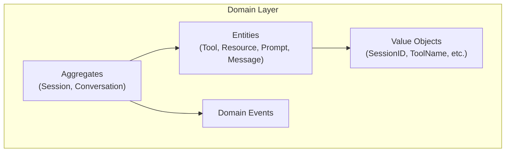
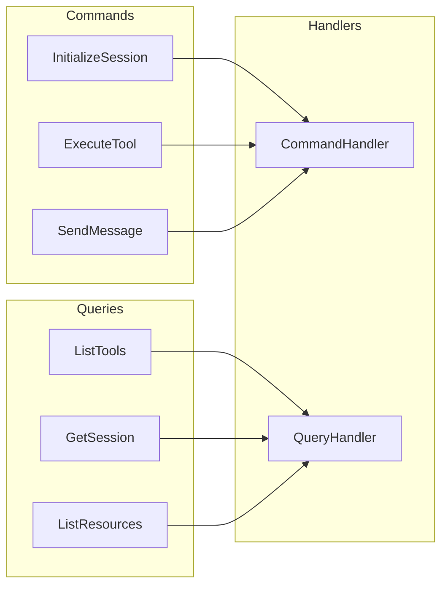
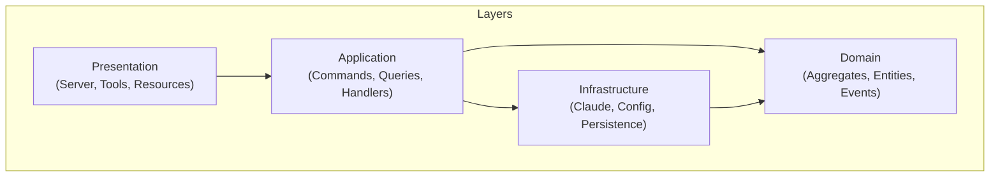

# TelemetryFlow Python MCP - Technology Stack

## Overview

This document summarizes the core technologies and architectural patterns used in the TelemetryFlow Python MCP Server.

## Core Stack

### Language & Runtime

| Technology | Version | Purpose |
|------------|---------|---------|
| Python | ≥3.11 | Primary language |
| asyncio | Built-in | Async runtime |
| typing | Built-in | Type annotations |

### Dependencies

| Package | Version | Purpose |
|---------|---------|---------|
| anthropic | ≥0.40.0 | Claude API client |
| pydantic | ≥2.10.0 | Data validation |
| pydantic-settings | ≥2.6.0 | Configuration management |
| structlog | ≥24.4.0 | Structured logging |
| click | ≥8.1.7 | CLI framework |
| httpx | ≥0.28.0 | HTTP client |
| tenacity | ≥9.0.0 | Retry logic |
| aiofiles | ≥24.1.0 | Async file I/O |
| pyyaml | ≥6.0.2 | YAML configuration |
| python-dotenv | ≥1.0.1 | Environment variables |

### Development Dependencies

| Package | Version | Purpose |
|---------|---------|---------|
| pytest | ≥8.3.0 | Testing framework |
| pytest-asyncio | ≥0.24.0 | Async test support |
| pytest-cov | ≥6.0.0 | Coverage reporting |
| mypy | ≥1.13.0 | Type checking |
| ruff | ≥0.8.0 | Linting |
| black | ≥24.10.0 | Code formatting |
| pre-commit | ≥4.0.0 | Git hooks |

### Optional Dependencies

| Package | Version | Purpose |
|---------|---------|---------|
| redis | ≥5.2.0 | Caching |
| nats-py | ≥2.9.0 | Message queue |
| asyncpg | ≥0.30.0 | PostgreSQL |
| sqlalchemy[asyncio] | ≥2.0.0 | ORM |
| clickhouse-connect | ≥0.8.0 | Analytics DB |
| opentelemetry-* | ≥1.28.0 | Telemetry |

## Architecture Patterns

### Domain-Driven Design (DDD)



**Key Concepts:**
- **Aggregates**: Consistency boundaries (Session, Conversation)
- **Entities**: Objects with identity (Tool, Message)
- **Value Objects**: Immutable objects (SessionID, ToolName)
- **Domain Events**: State change notifications

### CQRS (Command Query Responsibility Segregation)



**Key Concepts:**
- **Commands**: Write operations that change state
- **Queries**: Read operations that return data
- **Handlers**: Process commands and queries

### Clean Architecture



**Dependency Rule:** Dependencies flow inward toward domain.

### Repository Pattern

```python
# Interface (Domain)
class SessionRepository(Protocol):
    async def save(self, session: Session) -> None: ...
    async def find_by_id(self, id: SessionID) -> Session | None: ...

# Implementation (Infrastructure)
class InMemorySessionRepository:
    async def save(self, session: Session) -> None:
        self._sessions[str(session.id)] = session
```

## MCP Protocol

### Version

- **Protocol**: MCP 2024-11-05
- **Transport**: stdio (JSON-RPC 2.0)

### Capabilities

| Capability | Status | Description |
|------------|--------|-------------|
| Tools | ✅ | Tool registration and execution |
| Resources | ✅ | Resource listing and reading |
| Prompts | ✅ | Prompt templates |
| Logging | ✅ | Log level control |
| Sampling | ⚠️ | Optional |

### Methods

| Method | Type | Description |
|--------|------|-------------|
| initialize | Request | Initialize session |
| notifications/initialized | Notification | Confirm initialization |
| ping | Request | Health check |
| tools/list | Request | List available tools |
| tools/call | Request | Execute a tool |
| resources/list | Request | List resources |
| resources/read | Request | Read a resource |
| prompts/list | Request | List prompts |
| prompts/get | Request | Get prompt messages |

## Claude Integration

### SDK

```python
from anthropic import AsyncAnthropic

client = AsyncAnthropic(api_key="...")
response = await client.messages.create(
    model="claude-sonnet-4-20250514",
    max_tokens=4096,
    messages=[{"role": "user", "content": "Hello"}],
)
```

### Available Models

| Model | ID | Use Case |
|-------|-----|----------|
| Claude 4 Opus | claude-opus-4-20250514 | Most capable |
| Claude 4 Sonnet | claude-sonnet-4-20250514 | Balanced |
| Claude 3.5 Sonnet | claude-3-5-sonnet-20241022 | Fast |
| Claude 3.5 Haiku | claude-3-5-haiku-20241022 | Fastest |

### Features

- Message sending with tools
- Streaming responses
- Tool use handling
- Retry with exponential backoff

## Configuration

### Pydantic Settings

```python
from pydantic_settings import BaseSettings

class Config(BaseSettings):
    model_config = SettingsConfigDict(
        env_prefix="TELEMETRYFLOW_MCP_",
        env_nested_delimiter="__",
    )

    server: ServerConfig = Field(default_factory=ServerConfig)
    claude: ClaudeConfig = Field(default_factory=ClaudeConfig)
```

### Sources (Priority Order)

1. Environment variables
2. Configuration file (YAML)
3. Default values

### Environment Variables

| Variable | Description |
|----------|-------------|
| ANTHROPIC_API_KEY | Claude API key |
| TELEMETRYFLOW_MCP_SERVER_NAME | Server name |
| TELEMETRYFLOW_MCP_LOG_LEVEL | Log level |
| TELEMETRYFLOW_MCP_SERVER_DEBUG | Debug mode |

## Logging

### Structlog

```python
import structlog

logger = structlog.get_logger()
logger.info("message", key="value", another="data")
```

### Format Options

- **JSON**: Production (structured, parseable)
- **Console**: Development (human-readable)

### Log Levels

| Level | Usage |
|-------|-------|
| DEBUG | Detailed debugging |
| INFO | General operation |
| WARNING | Warning conditions |
| ERROR | Error conditions |

## Testing

### Framework

```python
import pytest

@pytest.mark.asyncio
async def test_something():
    result = await some_async_function()
    assert result == expected
```

### Coverage Target

- Unit: ≥85%
- Integration: ≥70%
- Overall: ≥80%

### Test Types

| Type | Speed | Isolation | Dependencies |
|------|-------|-----------|--------------|
| Unit | Fast | High | Mocked |
| Integration | Medium | Medium | Real |
| E2E | Slow | Low | All real |

## Docker

### Multi-Stage Build

```dockerfile
# Build stage
FROM python:3.11-slim as builder
WORKDIR /app
COPY . .
RUN pip wheel -w /wheels .

# Runtime stage
FROM python:3.11-slim
COPY --from=builder /wheels /wheels
RUN pip install /wheels/*.whl
ENTRYPOINT ["tfo-mcp"]
```

### Compose Services

| Service | Purpose |
|---------|---------|
| tfo-mcp | MCP server |
| redis | Caching (optional) |
| postgres | Persistence (optional) |
| clickhouse | Analytics (optional) |

## Future Enhancements

### Planned

- [ ] SSE transport support
- [ ] WebSocket transport
- [ ] PostgreSQL persistence
- [ ] ClickHouse analytics
- [ ] Redis caching
- [ ] NATS messaging
- [ ] OpenTelemetry integration

### Considerations

- Rate limiting
- API key authentication
- Multi-tenant support
- Horizontal scaling
