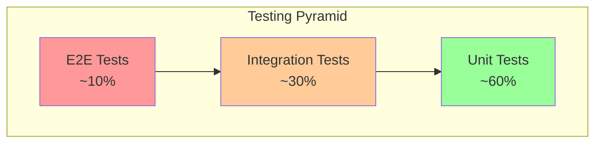

# TelemetryFlow Python MCP - Testing Standards

## Overview

This document defines the comprehensive testing framework for the TelemetryFlow Python MCP Server, targeting ≥80% overall code coverage.

## Testing Pyramid



## Test Organization

```
tests/
├── conftest.py              # Shared fixtures
├── mocks/                   # Mock implementations
│   ├── __init__.py
│   ├── claude.py
│   ├── persistence.py
│   ├── session.py
│   └── tool.py
├── unit/                    # Unit tests
│   ├── __init__.py
│   ├── test_domain.py
│   ├── test_entities.py
│   ├── test_valueobjects.py
│   ├── test_events.py
│   ├── test_tools.py
│   ├── test_resources.py
│   ├── test_prompts.py
│   ├── test_config.py
│   ├── test_claude.py
│   └── test_persistence.py
├── integration/             # Integration tests
│   ├── __init__.py
│   ├── test_server.py
│   ├── test_session.py
│   ├── test_claude.py
│   └── test_persistence.py
└── e2e/                    # End-to-end tests
    ├── __init__.py
    └── test_mcp.py
```

## Coverage Requirements

| Category | Target | Description |
|----------|--------|-------------|
| Unit Tests | ≥85% | Domain logic, entities, value objects |
| Integration Tests | ≥70% | Handler integration, repository integration |
| E2E Tests | ≥50% | Critical paths coverage |
| Overall | ≥80% | Combined coverage |

## Unit Tests

### Characteristics

- **Fast**: < 1 second per test
- **Isolated**: No external dependencies
- **Focused**: Test single unit of behavior
- **Deterministic**: Same result every run

### Domain Tests

```python
class TestSession:
    """Unit tests for Session aggregate."""

    def test_create_session(self):
        """Test session creation."""
        session = Session.create()
        assert session.state == SessionState.CREATED
        assert session.id is not None

    def test_initialize_session(self):
        """Test session initialization."""
        session = Session.create()
        client = ClientInfo(name="test", version="1.0")
        result = session.initialize(client)

        assert session.state == SessionState.READY
        assert "protocolVersion" in result
        assert "serverInfo" in result

    def test_cannot_initialize_twice(self):
        """Test double initialization fails."""
        session = Session.create()
        session.initialize(ClientInfo(name="test", version="1.0"))

        with pytest.raises(ValueError):
            session.initialize(ClientInfo(name="test2", version="2.0"))
```

### Entity Tests

```python
class TestTool:
    """Unit tests for Tool entity."""

    def test_create_tool(self):
        """Test tool creation."""
        tool = Tool.create(
            name="echo",
            description="Echo a message",
            input_schema={"type": "object"},
        )
        assert str(tool.name) == "echo"
        assert tool.enabled

    def test_to_mcp_format(self):
        """Test MCP format conversion."""
        tool = Tool.create(
            name="test",
            description="Test tool",
            input_schema={
                "type": "object",
                "properties": {"arg": {"type": "string"}},
            },
        )
        mcp_format = tool.to_mcp_format()

        assert mcp_format["name"] == "test"
        assert "inputSchema" in mcp_format


class TestMessage:
    """Unit tests for Message entity."""

    def test_user_message(self):
        """Test user message creation."""
        msg = Message.user("Hello")
        assert msg.role == Role.USER
        assert msg.text == "Hello"

    def test_assistant_message(self):
        """Test assistant message creation."""
        msg = Message.assistant("Hi there")
        assert msg.role == Role.ASSISTANT
```

### Value Object Tests

```python
class TestToolName:
    """Unit tests for ToolName value object."""

    @pytest.mark.parametrize("name,valid", [
        ("read_file", True),
        ("tool_v2", True),
        ("ReadFile", False),
        ("read-file", False),
        ("", False),
    ])
    def test_validation(self, name: str, valid: bool):
        """Test tool name validation."""
        if valid:
            ToolName(value=name)
        else:
            with pytest.raises(ValueError):
                ToolName(value=name)


class TestResourceURI:
    """Unit tests for ResourceURI value object."""

    def test_config_scheme(self):
        """Test config:// URI."""
        uri = ResourceURI(value="config://server")
        assert uri.scheme == "config"
        assert uri.path == "server"

    def test_invalid_scheme(self):
        """Test invalid scheme raises."""
        with pytest.raises(ValueError):
            ResourceURI(value="invalid://path")
```

### Tool Handler Tests

```python
class TestEchoTool:
    """Unit tests for echo tool handler."""

    @pytest.mark.asyncio
    async def test_echo_message(self):
        """Test echoing a message."""
        result = await _echo_handler({"message": "Hello"})
        assert not result.is_error
        assert "Hello" in result.content[0]["text"]

    @pytest.mark.asyncio
    async def test_echo_empty(self):
        """Test echoing empty message."""
        result = await _echo_handler({})
        assert not result.is_error


class TestReadFileTool:
    """Unit tests for read_file tool."""

    @pytest.mark.asyncio
    async def test_read_existing(self, tmp_path):
        """Test reading existing file."""
        file = tmp_path / "test.txt"
        file.write_text("content")

        result = await _read_file_handler({"path": str(file)})
        assert not result.is_error
        assert "content" in result.content[0]["text"]

    @pytest.mark.asyncio
    async def test_read_missing(self):
        """Test reading missing file."""
        result = await _read_file_handler({"path": "/nonexistent"})
        assert result.is_error
```

## Integration Tests

### Characteristics

- **Medium speed**: < 10 seconds per test
- **Real dependencies**: Use actual implementations
- **End-to-end flows**: Test complete operations
- **Database transactions**: Use test database

### Server Integration

```python
class TestMCPServer:
    """Integration tests for MCP server."""

    @pytest.fixture
    def server(self):
        """Create test server."""
        config = Config()
        return MCPServer(config, stdin=StringIO(), stdout=StringIO())

    @pytest.mark.asyncio
    async def test_initialize(self, server):
        """Test initialize request."""
        request = {
            "jsonrpc": "2.0",
            "id": 1,
            "method": "initialize",
            "params": {
                "protocolVersion": "2024-11-05",
                "clientInfo": {"name": "test", "version": "1.0"},
            },
        }

        response = await server._handle_request(request)

        assert "result" in response
        assert response["result"]["protocolVersion"] == "2024-11-05"

    @pytest.mark.asyncio
    async def test_tools_list(self, server):
        """Test tools/list after initialization."""
        # Initialize first
        await server._handle_initialize({
            "protocolVersion": "2024-11-05",
            "clientInfo": {"name": "test", "version": "1.0"},
        })

        result = await server._handle_tools_list({})

        assert "tools" in result
        assert len(result["tools"]) > 0
```

### Session Integration

```python
class TestSessionLifecycle:
    """Integration tests for session lifecycle."""

    @pytest.fixture
    def repository(self):
        """Create repository."""
        return InMemorySessionRepository()

    @pytest.mark.asyncio
    async def test_full_lifecycle(self, repository):
        """Test complete session lifecycle."""
        # Create
        session = Session.create()
        await repository.save(session)

        # Initialize
        session.initialize(ClientInfo(name="test", version="1.0"))
        await repository.save(session)

        # Verify persisted
        found = await repository.find_by_id(session.id)
        assert found.is_ready

        # Close
        session.close()
        await repository.save(session)

        found = await repository.find_by_id(session.id)
        assert found.state == SessionState.CLOSED
```

### Claude Integration

```python
@pytest.mark.skipif(
    not os.environ.get("ANTHROPIC_API_KEY"),
    reason="ANTHROPIC_API_KEY not set",
)
class TestClaudeIntegration:
    """Integration tests requiring Claude API."""

    @pytest.fixture
    def client(self):
        """Create Claude client."""
        return ClaudeClient(ClaudeConfig(
            api_key=os.environ["ANTHROPIC_API_KEY"],
            default_model="claude-3-5-haiku-20241022",
            max_tokens=100,
        ))

    @pytest.mark.asyncio
    async def test_simple_message(self, client):
        """Test sending a simple message."""
        messages = [{"role": "user", "content": "Say hi"}]
        response = await client.send_message(messages)

        assert len(response.content) > 0
        assert response.content[0]["type"] == "text"
```

## E2E Tests

### Characteristics

- **Slow**: May take minutes
- **Full system**: Test complete flows
- **Real protocols**: Use actual JSON-RPC
- **Critical paths**: Cover main use cases

### MCP Protocol Tests

```python
class TestMCPProtocol:
    """E2E tests for MCP protocol."""

    @pytest.fixture
    async def initialized_server(self):
        """Create and initialize server."""
        server = MCPServer(Config(), stdin=StringIO(), stdout=StringIO())

        await server._handle_request({
            "jsonrpc": "2.0",
            "id": 1,
            "method": "initialize",
            "params": {
                "protocolVersion": "2024-11-05",
                "clientInfo": {"name": "e2e-test", "version": "1.0"},
            },
        })

        return server

    @pytest.mark.asyncio
    async def test_full_tool_workflow(self, initialized_server):
        """Test complete tool workflow."""
        # List tools
        list_response = await initialized_server._handle_request({
            "jsonrpc": "2.0",
            "id": 2,
            "method": "tools/list",
            "params": {},
        })
        assert "tools" in list_response["result"]

        # Call tool
        call_response = await initialized_server._handle_request({
            "jsonrpc": "2.0",
            "id": 3,
            "method": "tools/call",
            "params": {
                "name": "echo",
                "arguments": {"message": "test"},
            },
        })
        assert not call_response["result"]["isError"]

    @pytest.mark.asyncio
    async def test_full_resource_workflow(self, initialized_server):
        """Test complete resource workflow."""
        # List resources
        list_response = await initialized_server._handle_request({
            "jsonrpc": "2.0",
            "id": 4,
            "method": "resources/list",
            "params": {},
        })
        assert "resources" in list_response["result"]

        # Read resource
        read_response = await initialized_server._handle_request({
            "jsonrpc": "2.0",
            "id": 5,
            "method": "resources/read",
            "params": {"uri": "config://server"},
        })
        assert "contents" in read_response["result"]
```

## Mock Implementations

### Claude Mock

```python
class MockClaudeService:
    """Mock Claude service for testing."""

    def __init__(self) -> None:
        self.messages: list[dict] = []
        self._response = mock_claude_response()

    def set_response(self, response: MockClaudeMessage) -> None:
        self._response = response

    async def send_message(self, messages, **kwargs):
        self.messages.extend(messages)
        return self._response


def mock_claude_response(text: str = "Mock response") -> MockClaudeMessage:
    """Create mock Claude response."""
    return MockClaudeMessage(
        content=[{"type": "text", "text": text}],
        model="claude-sonnet-4-20250514",
        usage={"input_tokens": 10, "output_tokens": 20},
    )
```

### Repository Mocks

```python
class MockSessionRepository:
    """Mock session repository for testing."""

    def __init__(self) -> None:
        self._sessions: dict[str, Session] = {}

    async def save(self, session: Session) -> None:
        self._sessions[str(session.id)] = session

    async def find_by_id(self, session_id: SessionID) -> Session | None:
        return self._sessions.get(str(session_id))

    def add_session(self, session: Session) -> None:
        self._sessions[str(session.id)] = session

    def clear(self) -> None:
        self._sessions.clear()
```

## Test Utilities

### Fixtures

```python
# conftest.py
@pytest.fixture
def config():
    """Create test configuration."""
    return Config()


@pytest.fixture
def session():
    """Create test session."""
    return Session.create()


@pytest.fixture
def initialized_session(session):
    """Create initialized session."""
    session.initialize(ClientInfo(name="test", version="1.0"))
    return session


@pytest.fixture
def session_with_tools(initialized_session):
    """Create session with built-in tools."""
    register_builtin_tools(initialized_session, Config())
    return initialized_session
```

### Helpers

```python
def create_test_tool(
    name: str = "test_tool",
    description: str = "A test tool",
) -> Tool:
    """Create a test tool."""
    return Tool.create(
        name=name,
        description=description,
        input_schema={"type": "object"},
    )


def create_test_message(
    role: Role = Role.USER,
    content: str = "Test message",
) -> Message:
    """Create a test message."""
    if role == Role.USER:
        return Message.user(content)
    return Message.assistant(content)
```

## Running Tests

### Commands

```bash
# Run all tests
make test

# Run with coverage
make test-cov

# Run unit tests only
make test-unit

# Run integration tests only
make test-integration

# Run e2e tests only
make test-e2e

# Run fast tests (no slow markers)
make test-fast
```

### pytest Configuration

```toml
# pyproject.toml
[tool.pytest.ini_options]
testpaths = ["tests"]
asyncio_mode = "auto"
asyncio_default_fixture_loop_scope = "function"
addopts = "-v --tb=short"
markers = [
    "slow: marks tests as slow",
    "integration: marks tests as integration tests",
    "e2e: marks tests as end-to-end tests",
]
```

### Coverage Configuration

```toml
# pyproject.toml
[tool.coverage.run]
source = ["src/tfo_mcp"]
branch = true
omit = ["*/tests/*", "*/__pycache__/*"]

[tool.coverage.report]
exclude_lines = [
    "pragma: no cover",
    "def __repr__",
    "raise NotImplementedError",
    "if TYPE_CHECKING:",
]
fail_under = 80
```

## CI Integration

```yaml
# GitHub Actions example
test:
  runs-on: ubuntu-latest
  steps:
    - uses: actions/checkout@v4
    - uses: actions/setup-python@v5
      with:
        python-version: "3.11"

    - name: Install dependencies
      run: make deps-dev

    - name: Run tests
      run: make test-cov

    - name: Upload coverage
      uses: codecov/codecov-action@v4
      with:
        files: build/coverage.xml
```
