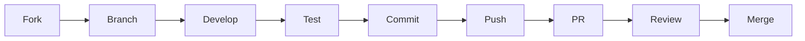

<div align="center">
  <picture>
    <source media="(prefers-color-scheme: dark)" srcset="https://github.com/telemetryflow/.github/raw/main/docs/assets/tfo-logo-mcp-dark.svg">
    <source media="(prefers-color-scheme: light)" srcset="https://github.com/telemetryflow/.github/raw/main/docs/assets/tfo-logo-mcp-light.svg">
    
  </picture>

  <h3>TelemetryFlow Python MCP Server (TFO-Python-MCP)</h3>

[](CHANGELOG.md)
[](https://opensource.org/licenses/Apache-2.0)
[](https://python.org/)
[](https://modelcontextprotocol.io/)
[](https://anthropic.com)
[](https://opentelemetry.io/)
[](docs/ARCHITECTURE.md)
[](https://www.postgresql.org/)
[](https://clickhouse.com/)

</div>

---

# Contributing to TelemetryFlow Python MCP

Thank you for your interest in contributing to TelemetryFlow Python MCP Server! This document provides guidelines and information for contributors.

## Table of Contents

- [Code of Conduct](#code-of-conduct)
- [Getting Started](#getting-started)
- [Development Setup](#development-setup)
- [How to Contribute](#how-to-contribute)
- [Pull Request Process](#pull-request-process)
- [Coding Standards](#coding-standards)
- [Testing Guidelines](#testing-guidelines)
- [Documentation](#documentation)
- [Community](#community)

---

## Code of Conduct

This project adheres to the [Contributor Covenant Code of Conduct](https://www.contributor-covenant.org/version/2/1/code_of_conduct/). By participating, you are expected to uphold this code. Please report unacceptable behavior to the project maintainers.

### Our Standards

- Be respectful and inclusive
- Welcome newcomers and help them learn
- Focus on constructive feedback
- Accept responsibility for mistakes
- Prioritize the community's best interests

---

## Getting Started

### Prerequisites

- Python 3.11 or higher
- Git
- Make
- Docker (optional, for containerized development)

### Quick Start

```bash
# Fork and clone the repository
git clone https://github.com/YOUR_USERNAME/telemetryflow-python-mcp.git
cd telemetryflow-python-mcp

# Run development setup
make setup

# Create a branch for your changes
git checkout -b feature/your-feature-name

# Make your changes and test
make test

# Submit a pull request
```

---

## Development Setup

### Automated Setup

```bash
# Run the development setup
make setup
```

This will:

- Create a virtual environment
- Install all dependencies (including dev dependencies)
- Set up pre-commit hooks
- Create local configuration files

### Manual Setup

```bash
# Create virtual environment
python -m venv .venv
source .venv/bin/activate  # Linux/macOS
# or .venv\Scripts\activate  # Windows

# Install dependencies
pip install -e ".[dev]"

# Install pre-commit hooks
pre-commit install

# Create local configuration
cp .env.example .env
# Edit .env with your API keys
```

### Environment Variables

```bash
# Required for full functionality
export ANTHROPIC_API_KEY="your-api-key"

# Optional
export TELEMETRYFLOW_MCP_LOG_LEVEL="debug"
export TELEMETRYFLOW_MCP_SERVER_DEBUG="true"
```

---

## How to Contribute

### Types of Contributions

We welcome many types of contributions:

| Type             | Description                      |
| ---------------- | -------------------------------- |
| Bug Reports      | Report issues and bugs           |
| Feature Requests | Suggest new features             |
| Bug Fixes        | Fix existing issues              |
| New Features     | Implement new functionality      |
| Documentation    | Improve docs, examples, comments |
| Tests            | Add or improve tests             |
| Performance      | Optimize code performance        |
| Refactoring      | Improve code quality             |

### Reporting Bugs

Before reporting a bug:

1. Check existing issues to avoid duplicates
2. Use the latest version
3. Collect relevant information

**Bug Report Template:**

```markdown
## Description

Brief description of the bug.

## Steps to Reproduce

1. Step one
2. Step two
3. Step three

## Expected Behavior

What should happen.

## Actual Behavior

What actually happens.

## Environment

- TFO-Python-MCP Version:
- OS:
- Python Version:

## Logs
```

Paste relevant logs here

```

## Additional Context
Any other relevant information.
```

### Suggesting Features

**Feature Request Template:**

```markdown
## Problem Statement

Describe the problem this feature would solve.

## Proposed Solution

Describe your proposed solution.

## Alternatives Considered

What alternatives have you considered?

## Use Cases

How would this feature be used?

## Additional Context

Any other relevant information.
```

---

## Pull Request Process

### Workflow



### Step-by-Step

1. **Fork the repository**

   ```bash
   # Fork on GitHub, then clone your fork
   git clone https://github.com/YOUR_USERNAME/telemetryflow-python-mcp.git
   cd telemetryflow-python-mcp
   ```

2. **Create a feature branch**

   ```bash
   git checkout -b feature/your-feature-name
   # or
   git checkout -b fix/bug-description
   ```

3. **Make your changes**

   - Follow coding standards
   - Add tests for new functionality
   - Update documentation as needed

4. **Test your changes**

   ```bash
   make test          # Run tests
   make lint          # Run linter
   make fmt           # Format code
   make typecheck     # Run type checker
   ```

5. **Commit with conventional commits**

   ```bash
   git commit -m "feat(tools): add new search tool"
   ```

6. **Push and create PR**
   ```bash
   git push origin feature/your-feature-name
   # Create PR on GitHub
   ```

### Commit Message Format

We use [Conventional Commits](https://www.conventionalcommits.org/):

```
<type>(<scope>): <subject>

[optional body]

[optional footer]
```

**Types:**

- `feat`: New feature
- `fix`: Bug fix
- `docs`: Documentation
- `style`: Formatting (no code change)
- `refactor`: Code restructuring
- `test`: Tests
- `chore`: Maintenance
- `perf`: Performance improvement
- `ci`: CI/CD changes

**Examples:**

```
feat(tools): add file search tool with regex support

Implements a new search_files tool that supports both glob
and regex patterns for searching files.

Closes #123
```

```
fix(session): handle timeout correctly

Session timeout was not being reset after successful requests.
```

### Pull Request Template

```markdown
## Description

Brief description of changes.

## Type of Change

- [ ] Bug fix (non-breaking change fixing an issue)
- [ ] New feature (non-breaking change adding functionality)
- [ ] Breaking change (fix or feature causing existing functionality to change)
- [ ] Documentation update

## Related Issues

Fixes #(issue number)

## Changes Made

- Change 1
- Change 2
- Change 3

## Testing

- [ ] Unit tests added/updated
- [ ] Integration tests added/updated
- [ ] Manual testing performed

## Checklist

- [ ] My code follows the project's style guidelines
- [ ] I have performed a self-review
- [ ] I have commented hard-to-understand code
- [ ] I have updated the documentation
- [ ] My changes generate no new warnings
- [ ] I have added tests proving my fix/feature works
- [ ] All tests pass locally
```

---

## Coding Standards

### Python Style Guide

Follow [PEP 8](https://peps.python.org/pep-0008/) with the project's specific configurations in `pyproject.toml`.

We use the following tools:
- **ruff**: Fast linting and import sorting
- **black**: Code formatting
- **mypy**: Static type checking

### Naming Conventions

| Type             | Convention               | Example              |
| ---------------- | ------------------------ | -------------------- |
| Package          | lowercase                | `valueobjects`       |
| Module           | lowercase_with_underscores | `session_handler` |
| Class            | PascalCase               | `SessionHandler`     |
| Function         | lowercase_with_underscores | `handle_request`  |
| Variable         | lowercase_with_underscores | `session_id`      |
| Constant         | UPPERCASE_WITH_UNDERSCORES | `MAX_RETRIES`     |
| Type Variable    | PascalCase               | `T`, `SessionT`      |

### File Organization

```python
"""Module docstring describing the module purpose."""

from __future__ import annotations

# Standard library imports
import asyncio
from dataclasses import dataclass
from typing import Any

# Third-party imports
from pydantic import BaseModel

# Local imports
from tfo_mcp.domain.entities import Tool


# Constants
MAX_RETRIES = 3


# Exceptions
class SessionNotFoundError(Exception):
    """Raised when session is not found."""
    pass


# Type aliases
ToolHandler = Callable[[dict[str, Any]], Awaitable[ToolResult]]


# Classes (interfaces/protocols first)
class Repository(Protocol):
    """Repository interface."""

    async def save(self, entity: Any) -> None:
        """Save an entity."""
        ...


@dataclass
class Session:
    """Session aggregate root."""

    id: SessionID
    state: SessionState


# Functions
async def create_session() -> Session:
    """Create a new session."""
    ...
```

### Error Handling

```python
# Define domain errors
class DomainError(Exception):
    """Base domain error."""
    pass


class SessionNotFoundError(DomainError):
    """Session not found."""

    def __init__(self, session_id: str) -> None:
        self.session_id = session_id
        super().__init__(f"Session not found: {session_id}")


# Wrap errors with context
async def get_session(session_id: str) -> Session:
    """Get session by ID."""
    session = await repo.find_by_id(session_id)
    if session is None:
        raise SessionNotFoundError(session_id)
    return session


# Handle specific errors
try:
    session = await get_session(session_id)
except SessionNotFoundError as e:
    logger.warning("session_not_found", session_id=e.session_id)
    raise
```

---

## Testing Guidelines

### Test Requirements

- All new code must have tests
- Maintain minimum 80% coverage
- Write both unit and integration tests

### Test Structure

```python
import pytest

from tfo_mcp.domain.valueobjects import SessionID


class TestSessionID:
    """Tests for SessionID value object."""

    def test_create_valid_session_id(self) -> None:
        """Test creating a valid session ID."""
        # Arrange
        value = "123e4567-e89b-12d3-a456-426614174000"

        # Act
        session_id = SessionID(value=value)

        # Assert
        assert str(session_id) == value

    def test_create_invalid_session_id_raises(self) -> None:
        """Test that invalid UUID raises ValueError."""
        with pytest.raises(ValueError):
            SessionID(value="invalid")
```

### Table-Driven Tests

```python
import pytest

from tfo_mcp.domain.valueobjects import ToolName


class TestToolName:
    """Tests for ToolName value object."""

    @pytest.mark.parametrize("name,expected_valid", [
        ("read_file", True),
        ("write_file", True),
        ("ReadFile", False),  # Invalid: uppercase
        ("read-file", False),  # Invalid: hyphen
        ("", False),  # Invalid: empty
    ])
    def test_tool_name_validation(self, name: str, expected_valid: bool) -> None:
        """Test tool name validation."""
        if expected_valid:
            ToolName(value=name)
        else:
            with pytest.raises(ValueError):
                ToolName(value=name)
```

### Async Tests

```python
import pytest


class TestAsyncHandler:
    """Tests for async handler."""

    @pytest.mark.asyncio
    async def test_handle_request(self) -> None:
        """Test handling a request."""
        # Arrange
        handler = SessionHandler()

        # Act
        result = await handler.handle(request)

        # Assert
        assert result.status == "success"
```

### Running Tests

```bash
# Run all tests
make test

# Run with coverage
make test-cov

# Run unit tests only
make test-unit

# Run integration tests only
make test-integration

# Run specific test file
pytest tests/unit/test_session.py -v

# Run with verbose output
pytest -v --tb=short
```

---

## Documentation

### What to Document

- All public APIs
- Complex internal logic
- Configuration options
- Usage examples

### Documentation Format

```python
class Session:
    """
    Session aggregate root for MCP protocol.

    The Session manages the lifecycle of an MCP connection,
    including tools, resources, prompts, and conversations.

    Attributes:
        id: Unique session identifier.
        state: Current session state.
        tools: Registered tools dictionary.

    Example:
        >>> session = Session.create()
        >>> session.initialize(client_info)
        >>> tools = session.list_tools()
    """

    def initialize(self, client_info: ClientInfo) -> dict[str, Any]:
        """
        Initialize the session.

        Args:
            client_info: Client information from initialize request.

        Returns:
            Initialize response with server info and capabilities.

        Raises:
            ValueError: If session is already initialized.

        Example:
            >>> client = ClientInfo(name="test", version="1.0")
            >>> result = session.initialize(client)
            >>> print(result["protocolVersion"])
            '2024-11-05'
        """
        ...
```

### Updating Documentation

When making changes:

1. Update code docstrings
2. Update relevant markdown files in `docs/`
3. Update README if needed
4. Update CHANGELOG

---

## Community

### Getting Help

- **Documentation**: [docs/](docs/)
- **Issues**: [GitHub Issues](https://github.com/telemetryflow/telemetryflow-python-mcp/issues)
- **Discussions**: [GitHub Discussions](https://github.com/telemetryflow/telemetryflow-python-mcp/discussions)

### Recognition

Contributors will be recognized in:

- CONTRIBUTORS.md file
- Release notes
- Project documentation

---

## License

By contributing to TelemetryFlow Python MCP, you agree that your contributions will be licensed under the Apache License 2.0.

---

Thank you for contributing to TelemetryFlow Python MCP!
