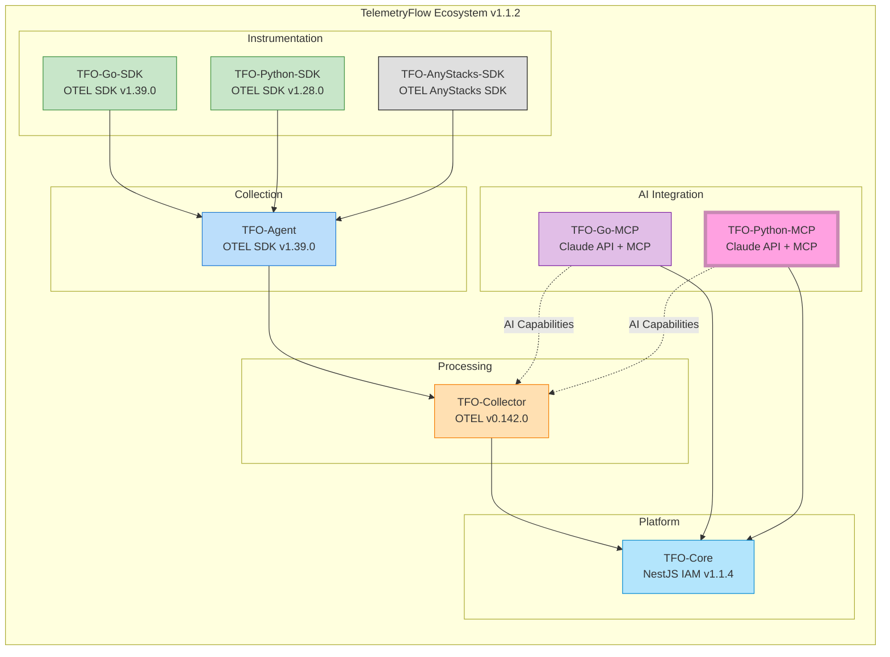
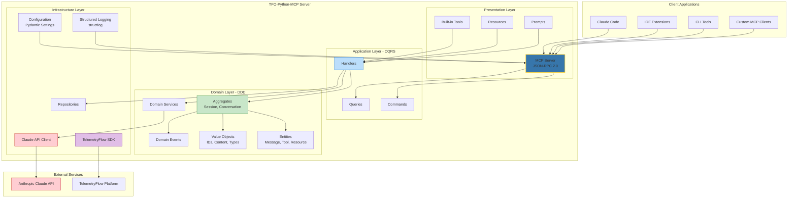
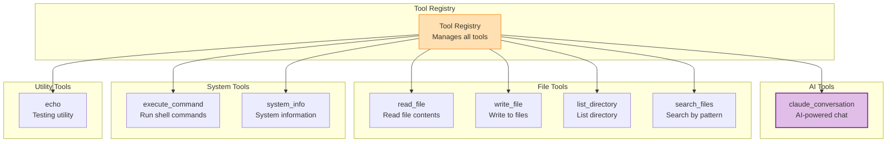

<div align="center">
  <picture>
    <source media="(prefers-color-scheme: dark)" srcset="https://github.com/telemetryflow/.github/raw/main/docs/assets/tfo-logo-mcp-dark.svg">
    <source media="(prefers-color-scheme: light)" srcset="https://github.com/telemetryflow/.github/raw/main/docs/assets/tfo-logo-mcp-light.svg">
    
  </picture>

  <h3>TelemetryFlow Python MCP Server (TFO-Python-MCP)</h3>

[](CHANGELOG.md)
[](https://opensource.org/licenses/Apache-2.0)
[](https://python.org/)
[](https://modelcontextprotocol.io/)
[](https://anthropic.com)
[](https://opentelemetry.io/)
[](docs/ARCHITECTURE.md)
[](https://www.postgresql.org/)
[](https://clickhouse.com/)

</div>

---

**Enterprise-Grade Model Context Protocol Server with Claude AI Integration**

A comprehensive MCP server implementation built using Python and following Domain-Driven Design (DDD) patterns, providing seamless integration between the Model Context Protocol and Anthropic's Claude AI.

This server works as the **AI integration layer** for the TelemetryFlow Platform, providing:

- Claude AI conversation capabilities via MCP
- Tool execution with built-in and custom tools
- Resource management and prompt templates
- TelemetryFlow SDK observability integration

---

## TelemetryFlow Ecosystem



| Component          | Version    | OTEL Base       | Role                              |
| ------------------ | ---------- | --------------- | --------------------------------- |
| TFO-Core           | v1.1.4     | -               | Identity & Access Management      |
| TFO-Agent          | v1.1.2     | SDK v1.39.0     | Telemetry Collection Agent        |
| TFO-Collector      | v1.1.2     | v0.142.0        | Central Telemetry Processing      |
| TFO-Go-SDK         | v1.1.2     | SDK v1.39.0     | Go Instrumentation                |
| TFO-Python-SDK     | v1.1.2     | SDK v1.28.0     | Python Instrumentation            |
| TFO-Go-MCP         | v1.1.2     | SDK v1.39.0     | Go MCP Server + Claude AI         |
| **TFO-Python-MCP** | **v1.1.2** | **SDK v1.28.0** | **Python MCP Server + Claude AI** |

---

## Quick Facts

| Property             | Value                                                   |
| -------------------- | ------------------------------------------------------- |
| **Version**          | 1.1.2                                                   |
| **Language**         | Python 3.11+                                            |
| **MCP Protocol**     | 2024-11-05                                              |
| **Claude SDK**       | anthropic>=0.40.0                                       |
| **OTEL SDK**         | TelemetryFlow SDK v1.28.0                               |
| **Architecture**     | DDD/CQRS                                                |
| **Transport**        | stdio, SSE (planned), WebSocket (planned)               |
| **Built-in Tools**   | 8 tools                                                 |
| **Supported Models** | Claude 4 Opus, Claude 4 Sonnet, Claude 3.5 Sonnet/Haiku |
| **Async Runtime**    | asyncio with async/await                                |

---

## System Architecture



---

## Built-in Tools



### Tool Reference

| Tool                  | Category | Description                | Key Parameters                      |
| --------------------- | -------- | -------------------------- | ----------------------------------- |
| `claude_conversation` | AI       | Send messages to Claude AI | `message`, `model`, `system_prompt` |
| `read_file`           | File     | Read file contents         | `path`, `encoding`                  |
| `write_file`          | File     | Write content to file      | `path`, `content`, `create_dirs`    |
| `list_directory`      | File     | List directory contents    | `path`, `recursive`                 |
| `search_files`        | File     | Search files by pattern    | `path`, `pattern`                   |
| `execute_command`     | System   | Execute shell commands     | `command`, `working_dir`, `timeout` |
| `system_info`         | System   | Get system information     | -                                   |
| `echo`                | Utility  | Echo input (testing)       | `message`                           |

---

## Built-in Resources

| Resource          | Description            |
| ----------------- | ---------------------- |
| `config://server` | Server configuration   |
| `status://health` | Health status          |
| `file:///{path}`  | File access (template) |

---

## Built-in Prompts

| Prompt         | Description              |
| -------------- | ------------------------ |
| `code_review`  | Get thorough code review |
| `explain_code` | Get code explanation     |
| `debug_help`   | Get debugging assistance |

---

## Installation

### Prerequisites

- Python 3.11 or later
- Anthropic API key

### From Source

```bash
# Clone the repository
git clone https://github.com/telemetryflow/telemetryflow-python-mcp.git
cd telemetryflow-python-mcp

# Install package
pip install -e .

# Or with all optional dependencies
pip install -e ".[all]"

# Or with telemetry support only
pip install -e ".[telemetry]"
```

### Using pip

```bash
pip install tfo-mcp
```

### Docker

```bash
# Build image
docker build -t telemetryflow-python-mcp:1.1.2 .

# Run container
docker run --rm -it \
  -e ANTHROPIC_API_KEY="your-api-key" \
  telemetryflow-python-mcp:1.1.2
```

---

## Configuration

### Configuration File

Create `tfo-mcp.yaml` or run `tfo-mcp init-config`:

```yaml
# =============================================================================
# TelemetryFlow Python MCP Server Configuration
# Version: 1.1.2
# =============================================================================

server:
  name: "TelemetryFlow-MCP"
  version: "1.1.2"
  transport: "stdio" # stdio, sse, websocket
  debug: false

claude:
  # api_key: Set via ANTHROPIC_API_KEY env var
  default_model: "claude-sonnet-4-20250514"
  max_tokens: 4096
  temperature: 1.0
  timeout: 120.0
  max_retries: 3

mcp:
  protocol_version: "2024-11-05"
  enable_tools: true
  enable_resources: true
  enable_prompts: true
  enable_logging: true
  tool_timeout: 30.0

logging:
  level: "info" # debug, info, warn, error
  format: "json" # json, text
  output: "stderr"

telemetry:
  enabled: false
  api_key_id: "" # or TELEMETRYFLOW_API_KEY_ID env var
  api_key_secret: "" # or TELEMETRYFLOW_API_KEY_SECRET env var
  endpoint: "api.telemetryflow.id:4317"
  service_name: "telemetryflow-python-mcp"
  environment: "production"
```

### Environment Variables

| Variable                                 | Description               | Default                     |
| ---------------------------------------- | ------------------------- | --------------------------- |
| `ANTHROPIC_API_KEY`                      | Claude API key (required) | -                           |
| `TELEMETRYFLOW_MCP_SERVER_DEBUG`         | Debug mode                | `false`                     |
| `TELEMETRYFLOW_MCP_LOG_LEVEL`            | Log level                 | `info`                      |
| `TELEMETRYFLOW_MCP_CLAUDE_DEFAULT_MODEL` | Default Claude model      | `claude-sonnet-4-20250514`  |
| `TELEMETRYFLOW_ENABLED`                  | Enable telemetry          | `false`                     |
| `TELEMETRYFLOW_API_KEY_ID`               | TelemetryFlow API key ID  | -                           |
| `TELEMETRYFLOW_API_KEY_SECRET`           | TelemetryFlow API secret  | -                           |
| `TELEMETRYFLOW_ENDPOINT`                 | OTLP endpoint             | `api.telemetryflow.id:4317` |

---

## Usage

### Running the Server

```bash
# Run with default config
tfo-mcp serve

# Run with custom config
tfo-mcp serve --config /path/to/config.yaml

# Run in debug mode
tfo-mcp serve --debug

# Show version
tfo-mcp --version

# Validate configuration
tfo-mcp validate

# Show server info
tfo-mcp info

# Generate default config
tfo-mcp init-config
```

### Integration with Claude Desktop

Add to your Claude Desktop configuration (`claude_desktop_config.json`):

```json
{
  "mcpServers": {
    "telemetryflow": {
      "command": "tfo-mcp",
      "args": ["serve"],
      "env": {
        "ANTHROPIC_API_KEY": "your-api-key"
      }
    }
  }
}
```

---

## TelemetryFlow SDK Integration

The MCP server integrates with the TelemetryFlow Python SDK to provide comprehensive observability:

### Enable Telemetry

```bash
# Install with telemetry support
pip install -e ".[telemetry]"

# Configure via environment variables
export TELEMETRYFLOW_ENABLED=true
export TELEMETRYFLOW_API_KEY_ID=tfk_your-key-id
export TELEMETRYFLOW_API_KEY_SECRET=tfs_your-secret-key
export TELEMETRYFLOW_ENDPOINT=api.telemetryflow.id:4317
```

### Collected Telemetry

| Signal  | Metric/Span           | Description                   |
| ------- | --------------------- | ----------------------------- |
| Metrics | `mcp.tools.calls`     | Tool call count by tool name  |
| Metrics | `mcp.tools.duration`  | Tool execution duration       |
| Metrics | `mcp.tools.errors`    | Tool error count              |
| Metrics | `mcp.resources.reads` | Resource read count           |
| Metrics | `mcp.prompts.gets`    | Prompt get count              |
| Metrics | `mcp.sessions.events` | Session lifecycle events      |
| Traces  | `mcp.tools.execute.*` | Tool execution spans          |
| Logs    | Various               | Structured logs for debugging |

---

## Project Structure

```
telemetryflow-python-mcp/
├── src/tfo_mcp/
│   ├── domain/                    # Domain Layer (DDD)
│   │   ├── aggregates/            # Session, Conversation aggregates
│   │   ├── entities/              # Message, Tool, Resource, Prompt
│   │   ├── valueobjects/          # Immutable value objects
│   │   ├── events/                # Domain events
│   │   ├── repositories/          # Repository interfaces
│   │   └── services/              # Domain service interfaces
│   ├── application/               # Application Layer (CQRS)
│   │   ├── commands/              # Write operations
│   │   ├── queries/               # Read operations
│   │   └── handlers/              # Command/Query handlers
│   ├── infrastructure/            # Infrastructure Layer
│   │   ├── claude/                # Claude API client
│   │   ├── config/                # Pydantic configuration
│   │   ├── logging/               # Structured logging
│   │   ├── persistence/           # Repository implementations
│   │   └── telemetry/             # TelemetryFlow SDK integration
│   ├── presentation/              # Presentation Layer
│   │   ├── server/                # MCP server implementation
│   │   ├── tools/                 # Built-in tools
│   │   ├── resources/             # Built-in resources
│   │   └── prompts/               # Built-in prompts
│   └── main.py                    # CLI entry point
├── configs/                       # Configuration files
├── tests/                         # Test suites
│   ├── unit/                      # Unit tests
│   ├── integration/               # Integration tests
│   └── e2e/                       # End-to-end tests
├── docs/                          # Documentation
├── .kiro/                         # Specifications and steering
├── Makefile                       # Build automation
├── Dockerfile                     # Container build
├── docker-compose.yaml            # Development stack
├── pyproject.toml                 # Python package config
└── .env.example                   # Environment template
```

---

## Development

### Make Commands

```bash
# Development
make deps               # Install dependencies
make dev                # Install with dev dependencies
make setup              # Full development setup

# Code Quality
make fmt                # Format code (black + ruff)
make lint               # Run linters
make typecheck          # Run mypy type checking

# Testing
make test               # Run all tests
make test-unit          # Run unit tests
make test-integration   # Run integration tests
make test-cov           # Tests with coverage

# CI/CD
make ci-test            # Full CI test pipeline
make ci-lint            # CI lint pipeline
make ci-security        # Security scanning

# Docker
make docker-build       # Build Docker image
make docker-run         # Run Docker container
```

### Testing

```bash
# Run all tests
make test

# Run with coverage
make test-cov

# Run specific test file
pytest tests/unit/test_config.py -v

# Run CI test pipeline
make ci-test
```

---

## MCP Capabilities Matrix

| Capability              | Status | Description                   |
| ----------------------- | ------ | ----------------------------- |
| `tools`                 | ✅     | Tool listing and execution    |
| `tools.listChanged`     | ✅     | Dynamic tool registration     |
| `resources`             | ✅     | Resource listing and reading  |
| `resources.subscribe`   | ✅     | Resource change subscriptions |
| `resources.listChanged` | ✅     | Dynamic resource registration |
| `prompts`               | ✅     | Prompt templates              |
| `prompts.listChanged`   | ✅     | Dynamic prompt registration   |
| `logging`               | ✅     | Log level management          |
| `sampling`              | 🔜     | LLM sampling (planned)        |

---

## Claude AI Integration

### Supported Models

| Model             | ID                           | Use Case                       |
| ----------------- | ---------------------------- | ------------------------------ |
| Claude 4 Opus     | `claude-opus-4-20250514`     | Complex reasoning, analysis    |
| Claude 4 Sonnet   | `claude-sonnet-4-20250514`   | Balanced performance (default) |
| Claude 3.7 Sonnet | `claude-3-7-sonnet-20250219` | Extended thinking              |
| Claude 3.5 Sonnet | `claude-3-5-sonnet-20241022` | Fast, capable                  |
| Claude 3.5 Haiku  | `claude-3-5-haiku-20241022`  | Quick responses                |

---

## Security Considerations

| Aspect                | Implementation                        |
| --------------------- | ------------------------------------- |
| **API Key Storage**   | Environment variables only            |
| **Command Execution** | Configurable timeout, path validation |
| **File Access**       | Path validation, no traversal         |
| **Rate Limiting**     | Configurable per-minute limits        |
| **Input Validation**  | Pydantic validation for all inputs    |

---

## Documentation Index

| Document                                       | Description                         |
| ---------------------------------------------- | ----------------------------------- |
| [README.md](README.md)                         | Project overview and quick start    |
| [docs/ARCHITECTURE.md](docs/ARCHITECTURE.md)   | Detailed architecture documentation |
| [docs/CONFIGURATION.md](docs/CONFIGURATION.md) | Configuration reference             |
| [docs/COMMANDS.md](docs/COMMANDS.md)           | CLI commands reference              |
| [CONTRIBUTING.md](CONTRIBUTING.md)             | Contribution guidelines             |
| [SECURITY.md](SECURITY.md)                     | Security policy                     |
| [CHANGELOG.md](CHANGELOG.md)                   | Version history                     |

---

## Contributing

1. Fork the repository
2. Create a feature branch (`git checkout -b feature/amazing-feature`)
3. Commit your changes (`git commit -m 'Add amazing feature'`)
4. Push to the branch (`git push origin feature/amazing-feature`)
5. Open a Pull Request

### Development Guidelines

- Follow Python best practices and PEP 8
- Use DDD patterns for domain logic
- Write unit tests for all handlers
- Document public APIs
- Keep commits atomic and well-described

---

## License

This project is licensed under the Apache License 2.0 - see the [LICENSE](LICENSE) file for details.

---

## Related Projects

- [TelemetryFlow Go MCP](https://github.com/telemetryflow/telemetryflow-go-mcp) - Go implementation
- [TelemetryFlow Python SDK](https://github.com/telemetryflow/telemetryflow-python-sdk) - Python observability SDK
- [TelemetryFlow Go SDK](https://github.com/telemetryflow/telemetryflow-go-sdk) - Go observability SDK
- [TelemetryFlow Platform](https://github.com/telemetryflow/telemetryflow) - Main platform

---

## Support

- **Documentation**: [TelemetryFlow Docs](https://docs.telemetryflow.id)
- **Issues**: [GitHub Issues](https://github.com/telemetryflow/telemetryflow-python-mcp/issues)
- **Discussions**: [GitHub Discussions](https://github.com/telemetryflow/telemetryflow-python-mcp/discussions)

---

<p align="center">
  <strong>Built with Python and Claude AI integration for the TelemetryFlow Platform</strong>
  <br/>
  <sub>Copyright &copy; 2024-2026 DevOpsCorner Indonesia. All rights reserved.</sub>
</p>
