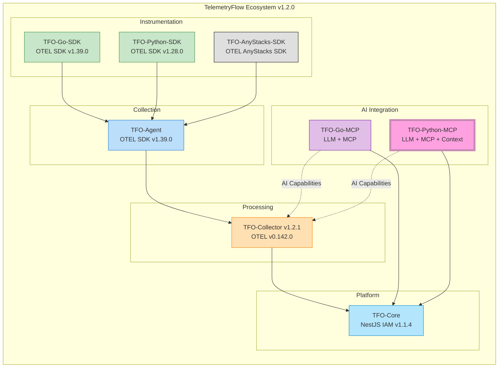
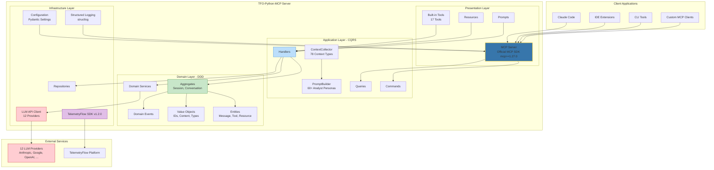

<div align="center">
  <picture>
    <source media="(prefers-color-scheme: dark)" srcset="https://github.com/telemetryflow/.github/raw/main/docs/assets/tfo-logo-mcp-dark.svg">
    <source media="(prefers-color-scheme: light)" srcset="https://github.com/telemetryflow/.github/raw/main/docs/assets/tfo-logo-mcp-light.svg">
    
  </picture>

  <h3>TelemetryFlow Python MCP Server (TFO-Python-MCP)</h3>

[](CHANGELOG.md)
[](https://opensource.org/licenses/Apache-2.0)
[](https://python.org/)
[](https://modelcontextprotocol.io/)
[](https://anthropic.com)
[](https://opentelemetry.io/)
[](docs/ARCHITECTURE.md)
[](docs/DEVELOPMENT.md)
[](https://www.postgresql.org/)
[](https://clickhouse.com/)

</div>

---

**Enterprise-Grade Model Context Protocol Server with Multi-Provider LLM Integration**

A comprehensive MCP server implementation built using Python and the official MCP SDK (`mcp>=1.27.0`), following Domain-Driven Design (DDD) patterns, providing seamless integration between the Model Context Protocol and 12 LLM providers with 111 models.

This server works as the **AI integration layer** for the TelemetryFlow Platform, providing:

- Multi-provider LLM conversation capabilities via MCP (12 providers, 111 models)
- Tool execution with 17 built-in tools (8 builtin + 4 PostgreSQL + 5 ClickHouse)
- Resource management and prompt templates
- TelemetryFlow SDK observability integration
- TFO-Platform ContextCollector and PromptBuilder integration

---

## TelemetryFlow Ecosystem


```mermaid
graph LR
    subgraph "TelemetryFlow Ecosystem v1.2.0"
        subgraph "Instrumentation"
            SDK_GO[TFO-Go-SDK<br/>OTEL SDK v1.39.0]
            SDK_PY[TFO-Python-SDK<br/>OTEL SDK v1.28.0]
            SDK_OTHER[TFO-AnyStacks-SDK<br/>OTEL AnyStacks SDK]
        end
        subgraph "Collection"
            AGENT[TFO-Agent<br/>OTEL SDK v1.39.0]
        end
        subgraph "Processing"
            COLLECTOR[TFO-Collector v1.2.1<br/>OTEL v0.142.0]
        end
        subgraph "AI Integration"
            MCP_GO[TFO-Go-MCP<br/>LLM + MCP]
            MCP_PY[TFO-Python-MCP<br/>LLM + MCP + Context]
        end
        subgraph "Platform"
            CORE[TFO-Core<br/>NestJS IAM v1.1.4]
        end
    end

    SDK_GO --> AGENT
    SDK_PY --> AGENT
    SDK_OTHER --> AGENT
    AGENT --> COLLECTOR
    COLLECTOR --> CORE
    MCP_GO --> CORE
    MCP_PY --> CORE
    MCP_GO -.-> |AI Capabilities| COLLECTOR
    MCP_PY -.-> |AI Capabilities| COLLECTOR

    style MCP_GO fill:#E1BEE7,stroke:#7B1FA2
    style MCP_PY fill:#FFA1E1,stroke:#C989B4,stroke-width:5px
    style SDK_GO fill:#C8E6C9,stroke:#388E3C
    style SDK_PY fill:#C8E6C9,stroke:#388E3C
    style SDK_OTHER fill:#DFDFDF,stroke:#0F0F0F
    style AGENT fill:#BBDEFB,stroke:#1976D2
    style COLLECTOR fill:#FFE0B2,stroke:#F57C00
    style CORE fill:#B3E5FC,stroke:#0288D1
```

| Component          | Version    | OTEL Base       | Role                              |
| ------------------ | ---------- | --------------- | --------------------------------- |
| TFO-Core           | v1.1.4     | -               | Identity & Access Management      |
| TFO-Agent          | v1.1.2     | SDK v1.39.0     | Telemetry Collection Agent        |
| TFO-Collector      | v1.1.2     | v0.142.0        | Central Telemetry Processing      |
| TFO-Go-SDK         | v1.1.2     | SDK v1.39.0     | Go Instrumentation                |
| TFO-Python-SDK     | v1.1.2     | SDK v1.28.0     | Python Instrumentation            |
| TFO-Go-MCP         | v1.1.2     | SDK v1.39.0     | Go MCP Server + LLM AI            |
| **TFO-Python-MCP** | **v1.2.0** | **TFO SDK v1.2.0** | **Python MCP Server + LLM AI** |

---

## Quick Facts

| Property             | Value                                                   |
| -------------------- | ------------------------------------------------------- |
| **Version**          | 1.2.0                                                   |
| **Language**         | Python 3.11+                                            |
| **MCP Protocol**     | 2024-11-05                                              |
| **MCP SDK**          | mcp>=1.27.0 (official)                                  |
| **Claude SDK**       | anthropic>=0.40.0                                       |
| **OTEL SDK**         | telemetryflow-sdk>=1.2.0                                |
| **Architecture**     | DDD/CQRS                                                |
| **Transport**        | stdio, SSE (planned), WebSocket (planned)               |
| **Built-in Tools**   | 17 tools + ContextCollector + PromptBuilder              |
| **Context Types**    | 78 context types across 8 categories                    |
| **Supported Models** | 111 models across 12 LLM providers                     |
| **Test Coverage**    | 98% coverage, 1174 tests                                |
| **Async Runtime**    | asyncio with async/await                                |

---

## System Architecture


```mermaid
graph TB
    subgraph "Client Applications"
        CC[Claude Code]
        IDE[IDE Extensions]
        CLI[CLI Tools]
        CUSTOM[Custom MCP Clients]
    end

    subgraph "TFO-Python-MCP Server"
        subgraph "Presentation Layer"
            SERVER[MCP Server<br/>Official MCP SDK mcp>=1.27.0]
            TOOLS[Built-in Tools<br/>17 Tools]
            RESOURCES[Resources]
            PROMPTS[Prompts]
        end

        subgraph "Application Layer - CQRS"
            CMD[Commands]
            QRY[Queries]
            HANDLERS[Handlers]
            CONTEXT[ContextCollector<br/>78 Context Types]
            PROMPT_BUILDER[PromptBuilder<br/>60+ Analyst Personas]
        end

        subgraph "Domain Layer - DDD"
            AGG[Aggregates<br/>Session, Conversation]
            ENT[Entities<br/>Message, Tool, Resource]
            VO[Value Objects<br/>IDs, Content, Types]
            EVT[Domain Events]
            SVC[Domain Services]
        end

        subgraph "Infrastructure Layer"
            LLM[LLM API Client<br/>12 Providers]
            CONFIG[Configuration<br/>Pydantic Settings]
            REPO[Repositories]
            LOG[Structured Logging<br/>structlog]
            OTEL[TelemetryFlow SDK v1.2.0]
        end
    end

    subgraph "External Services"
        PROVIDERS[12 LLM Providers<br/>Anthropic, Google, OpenAI, ...]
        TFO[TelemetryFlow Platform]
    end

    CC --> SERVER
    IDE --> SERVER
    CLI --> SERVER
    CUSTOM --> SERVER

    SERVER --> CMD
    SERVER --> QRY
    TOOLS --> HANDLERS
    RESOURCES --> HANDLERS
    PROMPTS --> HANDLERS

    CONTEXT --> PROMPT_BUILDER
    HANDLERS --> AGG
    HANDLERS --> SVC
    AGG --> ENT
    AGG --> VO
    AGG --> EVT

    SVC --> LLM
    HANDLERS --> REPO
    CONFIG --> SERVER
    LOG --> SERVER
    OTEL --> TFO

    LLM --> PROVIDERS

    style SERVER fill:#3776AB,stroke:#FFD43B,stroke-width:2px
    style LLM fill:#FFCDD2,stroke:#C62828
    style PROVIDERS fill:#FFCDD2,stroke:#C62828
    style AGG fill:#C8E6C9,stroke:#388E3C
    style HANDLERS fill:#BBDEFB,stroke:#1976D2
    style OTEL fill:#E1BEE7,stroke:#7B1FA2
```

---

## Built-in Tools


```mermaid
graph TB
    subgraph "Tool Registry"
        REG[Tool Registry<br/>Manages all tools]
    end

    subgraph "AI Tools"
        T1[claude_conversation<br/>AI-powered chat]
    end

    subgraph "File Tools"
        T2[read_file<br/>Read file contents]
        T3[write_file<br/>Write to files]
        T4[list_directory<br/>List directory]
        T5[search_files<br/>Search by pattern]
    end

    subgraph "System Tools"
        T6[execute_command<br/>Run shell commands]
        T7[system_info<br/>System information]
    end

    subgraph "Utility Tools"
        T8[echo<br/>Testing utility]
    end

    subgraph "PostgreSQL Datasource Tools"
        T9[pg_query<br/>Execute SQL]
        T10[pg_list_tables<br/>List tables]
        T11[pg_describe_table<br/>Describe schema]
        T12[pg_sessions<br/>Session history]
    end

    subgraph "ClickHouse Analytics Tools"
        T13[ch_query<br/>Execute SQL]
        T14[ch_tool_analytics<br/>Tool analytics]
        T15[ch_session_analytics<br/>Session analytics]
        T16[ch_error_analytics<br/>Error analytics]
        T17[ch_api_usage<br/>API usage analytics]
    end

    REG --> T1
    REG --> T2
    REG --> T3
    REG --> T4
    REG --> T5
    REG --> T6
    REG --> T7
    REG --> T8
    REG --> T9
    REG --> T10
    REG --> T11
    REG --> T12
    REG --> T13
    REG --> T14
    REG --> T15
    REG --> T16
    REG --> T17

    style T1 fill:#E1BEE7,stroke:#7B1FA2,stroke-width:2px
    style REG fill:#FFE0B2,stroke:#F57C00
```

### Tool Reference

| Tool                  | Category | Description                | Key Parameters                      |
| --------------------- | -------- | -------------------------- | ----------------------------------- |
| `claude_conversation` | AI       | Send messages to Claude AI | `message`, `model`, `system_prompt` |
| `read_file`           | File     | Read file contents         | `path`, `encoding`                  |
| `write_file`          | File     | Write content to file      | `path`, `content`, `create_dirs`    |
| `list_directory`      | File     | List directory contents    | `path`, `recursive`                 |
| `search_files`        | File     | Search files by pattern    | `path`, `pattern`                   |
| `execute_command`     | System   | Execute shell commands     | `command`, `working_dir`, `timeout` |
| `system_info`         | System   | Get system information     | -                                   |
| `echo`                | Utility  | Echo input (testing)       | `message`                           |

### TFO Datasource Tools - PostgreSQL

| Tool | Category | Description | Key Parameters |
|------|----------|-------------|----------------|
| `pg_query` | datasource | Execute SQL against TFO PostgreSQL | `query`, `params`, `max_rows`, `read_only` |
| `pg_list_tables` | datasource | List tables in TFO PostgreSQL | `schema` |
| `pg_describe_table` | datasource | Describe table schema | `table`, `schema` |
| `pg_sessions` | datasource | Query MCP session history | `limit`, `state` |

### TFO Datasource Tools - ClickHouse Analytics

| Tool | Category | Description | Key Parameters |
|------|----------|-------------|----------------|
| `ch_query` | analytics | Execute SQL against TFO ClickHouse | `query`, `max_rows`, `read_only` |
| `ch_tool_analytics` | analytics | Tool call analytics | `tool_name`, `hours`, `limit` |
| `ch_session_analytics` | analytics | Session analytics | `hours`, `limit` |
| `ch_error_analytics` | analytics | Error analytics | `hours`, `limit` |
| `ch_api_usage` | analytics | LLM API usage analytics | `hours`, `model`, `limit` |

---

## TFO-Platform Integration

### ContextCollector Service

Python port of TFO-Platform `ContextCollector.service.ts` — collects live telemetry context from ClickHouse materialized views and PostgreSQL for AI analysis.

**78 Context Types across 8 categories:**

| Category | Context Types |
|----------|---------------|
| **Observability** | metrics, logs, traces, exemplars, correlations, dashboard |
| **Infrastructure** | uptime, status-page, audit, infra-overview, infra-cpu/memory/storage/network |
| **Kubernetes** | overview, clusters, namespaces, nodes, pods, deployments, pv, api-server, coredns |
| **Hybrid (PG+CH)** | agents, service-map, network-map |
| **Platform (PG)** | alerts, alert-rules, iam, iam-users/roles/permissions/matrix/assignments, tenancy, tenancy-regions/organizations/workspaces/tenants |
| **Security** | data-masking, ai-assistant, system-setup, system-channels |
| **Account** | profile, security, sessions, notifications, preferences, organization |
| **AI Intelligence** | anomaly-detection, corrective-maintenance, predictive-maintenance, cost-optimization |
| **DB Monitoring** | inventory, clickhouse, mariadb, mysql, percona, sqlite3, timescaledb, aurora, mssql, postgresql, mongodb-community/atlas, aws-rds-mysql/aurora, aws-dynamodb, cockroachdb, qan |

**ClickHouse Materialized Views queried:**
`metrics_5m` (AggMT), `logs_1h` (SumMT), `service_latency_percentiles_1h`, `service_error_rates_1h`, `exemplars_1h`, `uptime_checks`, `audit_logs_1h`, `signal_correlations_1h`, `vm_metrics_1h`, `kubernetes_metrics_1h`, `service_map_metrics_1h`, `network_map_traffic_1h`, `network_map_connection_metrics_1h`

### PromptBuilder Service

Python port of TFO-Platform `PromptBuilder.service.ts` — builds context-aware system prompts for LLM interactions.

- **60+ specialized analyst personas** — one per context type (e.g., metrics analyst, log analyst, trace analyst, Kubernetes admin, DB administrator, etc.)
- **5 insight types**: chronology, prediction, recommendation, root-cause, pattern
- Context-aware prompt generation with live data injection (10K char JSON truncation)

---

## Built-in Resources

| Resource          | Description            |
| ----------------- | ---------------------- |
| `config://server` | Server configuration   |
| `status://health` | Health status          |
| `file:///{path}`  | File access (template) |

---

## Built-in Prompts

| Prompt         | Description              |
| -------------- | ------------------------ |
| `code_review`  | Get thorough code review |
| `explain_code` | Get code explanation     |
| `debug_help`   | Get debugging assistance |

---

## Installation

### Prerequisites

- Python 3.11 or later
- Anthropic API key (or other supported LLM provider API key)

### From Source

```bash
# Clone the repository
git clone https://github.com/telemetryflow/telemetryflow-python-mcp.git
cd telemetryflow-python-mcp

# Install package
pip install -e .

# Or with all optional dependencies
pip install -e ".[all]"

# Or with telemetry support only
pip install -e ".[telemetry]"
```

### Using pip

```bash
pip install tfo-mcp

# Install with PostgreSQL datasource support
pip install tfo-mcp[postgres]

# Install with ClickHouse analytics support
pip install tfo-mcp[clickhouse]
```

### Docker

```bash
# Build image
docker build -t telemetryflow-python-mcp:1.2.0 .

# Run container
docker run --rm -it \
  -e ANTHROPIC_API_KEY="your-api-key" \
  telemetryflow-python-mcp:1.2.0
```

---

## Configuration

### Configuration File

Create `tfo-mcp.yaml` or run `tfo-mcp init-config`:

```yaml
# =============================================================================
# TelemetryFlow Python MCP Server Configuration
# Version: 1.2.0
# =============================================================================

server:
  name: "TelemetryFlow-MCP"
  version: "1.2.0"
  transport: "stdio" # stdio, sse, websocket
  debug: false

claude:
  # api_key: Set via ANTHROPIC_API_KEY env var
  default_model: "claude-sonnet-4-20250514"
  max_tokens: 4096
  temperature: 1.0
  timeout: 120.0
  max_retries: 3

mcp:
  protocol_version: "2024-11-05"
  enable_tools: true
  enable_resources: true
  enable_prompts: true
  enable_logging: true
  tool_timeout: 30.0

logging:
  level: "info" # debug, info, warn, error
  format: "json" # json, text
  output: "stderr"

telemetry:
  enabled: false
  api_key_id: "" # or TELEMETRYFLOW_API_KEY_ID env var
  api_key_secret: "" # or TELEMETRYFLOW_API_KEY_SECRET env var
  endpoint: "api.telemetryflow.id:4317"
  service_name: "telemetryflow-python-mcp"
  environment: "production"
```

### Environment Variables

| Variable                                 | Description               | Default                     |
| ---------------------------------------- | ------------------------- | --------------------------- |
| `ANTHROPIC_API_KEY`                      | Claude API key (required) | -                           |
| `TELEMETRYFLOW_MCP_SERVER_DEBUG`         | Debug mode                | `false`                     |
| `TELEMETRYFLOW_MCP_LOG_LEVEL`            | Log level                 | `info`                      |
| `TELEMETRYFLOW_MCP_CLAUDE_DEFAULT_MODEL` | Default Claude model      | `claude-sonnet-4-20250514`  |
| `TELEMETRYFLOW_ENABLED`                  | Enable telemetry          | `false`                     |
| `TELEMETRYFLOW_API_KEY_ID`               | TelemetryFlow API key ID  | -                           |
| `TELEMETRYFLOW_API_KEY_SECRET`           | TelemetryFlow API secret  | -                           |
| `TELEMETRYFLOW_ENDPOINT`                 | OTLP endpoint             | `api.telemetryflow.id:4317` |

---

## Usage

### Running the Server

```bash
# Run with default config
tfo-mcp serve

# Run with custom config
tfo-mcp serve --config /path/to/config.yaml

# Run in debug mode
tfo-mcp serve --debug

# Show version
tfo-mcp --version

# Validate configuration
tfo-mcp validate

# Show server info
tfo-mcp info

# Generate default config
tfo-mcp init-config
```

### Integration with Claude Desktop

Add to your Claude Desktop configuration (`claude_desktop_config.json`):

```json
{
  "mcpServers": {
    "telemetryflow": {
      "command": "tfo-mcp",
      "args": ["serve"],
      "env": {
        "ANTHROPIC_API_KEY": "your-api-key"
      }
    }
  }
}
```

---

## TelemetryFlow SDK Integration

The MCP server integrates with the TelemetryFlow Python SDK (`telemetryflow-sdk>=1.2.0`) to provide comprehensive observability:

### Enable Telemetry

```bash
# Install with telemetry support
pip install -e ".[telemetry]"

# Configure via environment variables
export TELEMETRYFLOW_ENABLED=true
export TELEMETRYFLOW_API_KEY_ID=tfk_your-key-id
export TELEMETRYFLOW_API_KEY_SECRET=tfs_your-secret-key
export TELEMETRYFLOW_ENDPOINT=api.telemetryflow.id:4317
```

### TFO-Platform Integration

The MCP server integrates with TFO-Platform components for context-aware AI analysis via Python port services:

- **ContextCollector** — Python port of `ContextCollector.service.ts`. Collects live telemetry context from ClickHouse materialized views and PostgreSQL, providing rich operational data for AI analysis across 78 context types in 8 categories
- **PromptBuilder** — Python port of `PromptBuilder.service.ts`. Builds context-aware system prompts per context type, leveraging 60+ specialized analyst personas and 5 insight types for targeted telemetry analysis

### Collected Telemetry

| Signal  | Metric/Span           | Description                   |
| ------- | --------------------- | ----------------------------- |
| Metrics | `mcp.tools.calls`     | Tool call count by tool name  |
| Metrics | `mcp.tools.duration`  | Tool execution duration       |
| Metrics | `mcp.tools.errors`    | Tool error count              |
| Metrics | `mcp.resources.reads` | Resource read count           |
| Metrics | `mcp.prompts.gets`    | Prompt get count              |
| Metrics | `mcp.sessions.events` | Session lifecycle events      |
| Traces  | `mcp.tools.execute.*` | Tool execution spans          |
| Logs    | Various               | Structured logs for debugging |

---

## Project Structure

```
telemetryflow-python-mcp/
├── src/tfo_mcp/
│   ├── domain/                    # Domain Layer (DDD)
│   │   ├── aggregates/            # Session, Conversation aggregates
│   │   ├── entities/              # Message, Tool, Resource, Prompt
│   │   ├── valueobjects/          # Immutable value objects
│   │   ├── events/                # Domain events
│   │   ├── repositories/          # Repository interfaces
│   │   └── services/              # Domain service interfaces
│   ├── application/               # Application Layer (CQRS)
│   │   ├── commands/              # Write operations
│   │   ├── queries/               # Read operations
│   │   ├── handlers/              # Command/Query handlers
│   │   └── services/              # Application services (ContextCollector, PromptBuilder)
│   ├── infrastructure/            # Infrastructure Layer
│   │   ├── claude/                # LLM API client (12 providers)
│   │   ├── config/                # Pydantic configuration
│   │   ├── logging/               # Structured logging
│   │   ├── persistence/           # Repository implementations
│   │   └── telemetry/             # TelemetryFlow SDK integration
│   ├── presentation/              # Presentation Layer
│   │   ├── server/                # MCP server implementation (mcp>=1.27.0)
│   │   ├── tools/                 # Built-in tools (17 total)
│   │   ├── resources/             # Built-in resources
│   │   └── prompts/               # Built-in prompts
│   └── main.py                    # CLI entry point
├── configs/                       # Configuration files
├── tests/                         # Test suites (1174 tests, 98% coverage)
│   ├── unit/                      # Unit tests
│   │   ├── domain/                # Domain layer tests
│   │   ├── application/           # Application layer tests
│   │   ├── infrastructure/        # Infrastructure layer tests
│   │   └── presentation/          # Presentation layer tests
│   ├── integration/               # Integration tests
│   │   ├── datasource/            # PostgreSQL & ClickHouse tests
│   │   ├── handlers/              # Handler integration tests
│   │   └── server/                # Server integration tests
│   └── e2e/                       # End-to-end tests
│       ├── protocol/              # MCP protocol tests
│       └── flow/                  # Full flow tests
├── docs/                          # Documentation
├── .kiro/                         # Specifications and steering
├── Makefile                       # Build automation
├── Dockerfile                     # Container build
├── docker-compose.yaml            # Development stack
├── pyproject.toml                 # Python package config
└── .env.example                   # Environment template
```

---

## Development

### Make Commands

```bash
# Development
make deps               # Install dependencies
make dev                # Install with dev dependencies
make setup              # Full development setup

# Code Quality
make fmt                # Format code (black + ruff)
make lint               # Run linters
make typecheck          # Run mypy type checking

# Testing
make test               # Run all tests (1174 tests)
make test-unit          # Run unit tests
make test-integration   # Run integration tests
make test-cov           # Tests with coverage (98%)

# CI/CD
make ci-test            # Full CI test pipeline
make ci-lint            # CI lint pipeline
make ci-security        # Security scanning

# Docker
make docker-build       # Build Docker image
make docker-run         # Run Docker container
```

### Testing

```bash
# Run all tests
make test

# Run with coverage
make test-cov

# Run specific test file
pytest tests/unit/domain/test_aggregates.py -v

# Run CI test pipeline
make ci-test
```

---

## MCP Capabilities Matrix

> Capabilities are handled internally by the official MCP SDK (`mcp>=1.27.0`).

| Capability              | Status | Description                         |
| ----------------------- | ------ | ----------------------------------- |
| `tools`                 | ✅     | Tool listing and execution (SDK)    |
| `tools.listChanged`     | ✅     | Dynamic tool registration (SDK)     |
| `resources`             | ✅     | Resource listing and reading (SDK)  |
| `resources.subscribe`   | ✅     | Resource change subscriptions (SDK) |
| `resources.listChanged` | ✅     | Dynamic resource registration (SDK) |
| `prompts`               | ✅     | Prompt templates (SDK)              |
| `prompts.listChanged`   | ✅     | Dynamic prompt registration (SDK)   |
| `logging`               | ✅     | Log level management (SDK)          |
| `sampling`              | 🔜     | LLM sampling (planned)              |

---

## LLM AI Integration

### Supported Providers (12 Providers, 111 Models)

| Provider   | Example Models                                | API Key Env Variable        |
| ---------- | --------------------------------------------- | --------------------------- |
| Anthropic  | Claude 4 Opus, Claude 4 Sonnet, Claude 3.5    | `ANTHROPIC_API_KEY`         |
| Google     | Gemini 2.5 Pro, Gemini 2.5 Flash              | `GOOGLE_API_KEY`            |
| OpenAI     | GPT-4o, GPT-4o-mini, o3, o4-mini             | `OPENAI_API_KEY`            |
| DeepSeek   | DeepSeek-V3, DeepSeek-R1                      | `DEEPSEEK_API_KEY`          |
| Qwen       | Qwen3-235B, Qwen3-32B                         | `QWEN_API_KEY`              |
| Ollama     | llama3, mistral, codellama (local)            | `OLLAMA_HOST`               |
| Mistral    | Mistral Large, Mistral Medium, Codestral      | `MISTRAL_API_KEY`           |
| Grok       | grok-3, grok-3-mini                           | `XAI_API_KEY`               |
| Kimi       | moonshot-v1-128k, moonshot-v1-32k             | `MOONSHOT_API_KEY`          |
| Zhipu      | GLM-4, GLM-4-Plus, GLM-4-Flash               | `ZHIPU_API_KEY`             |
| MiMo       | MiMo-7B                                       | `MIMO_API_KEY`              |
| Custom     | Any OpenAI-compatible endpoint                | `CUSTOM_LLM_API_KEY`        |

### Default Model

The default model is `claude-sonnet-4-20250514` (Anthropic Claude 4 Sonnet), configurable via the `claude.default_model` setting or `TELEMETRYFLOW_MCP_CLAUDE_DEFAULT_MODEL` environment variable.

---

## Security Considerations

| Aspect                | Implementation                        |
| --------------------- | ------------------------------------- |
| **API Key Storage**   | Environment variables only            |
| **Command Execution** | Configurable timeout, path validation |
| **File Access**       | Path validation, no traversal         |
| **Rate Limiting**     | Configurable per-minute limits        |
| **Input Validation**  | Pydantic validation for all inputs    |

---

## Documentation Index

| Document                                       | Description                         |
| ---------------------------------------------- | ----------------------------------- |
| [README.md](README.md)                         | Project overview and quick start    |
| [docs/ARCHITECTURE.md](docs/ARCHITECTURE.md)   | Detailed architecture documentation |
| [docs/CONFIGURATION.md](docs/CONFIGURATION.md) | Configuration reference             |
| [docs/COMMANDS.md](docs/COMMANDS.md)           | CLI commands reference              |
| [CONTRIBUTING.md](CONTRIBUTING.md)             | Contribution guidelines             |
| [SECURITY.md](SECURITY.md)                     | Security policy                     |
| [CHANGELOG.md](CHANGELOG.md)                   | Version history                     |

---

## Contributing

1. Fork the repository
2. Create a feature branch (`git checkout -b feature/amazing-feature`)
3. Commit your changes (`git commit -m 'Add amazing feature'`)
4. Push to the branch (`git push origin feature/amazing-feature`)
5. Open a Pull Request

### Development Guidelines

- Follow Python best practices and PEP 8
- Use DDD patterns for domain logic
- Write unit tests for all handlers
- Document public APIs
- Keep commits atomic and well-described

---

## License

This project is licensed under the Apache License 2.0 - see the [LICENSE](LICENSE) file for details.

---

## Related Projects

- [TelemetryFlow Go MCP](https://github.com/telemetryflow/telemetryflow-go-mcp) - Go implementation
- [TelemetryFlow Python SDK](https://github.com/telemetryflow/telemetryflow-python-sdk) - Python observability SDK
- [TelemetryFlow Go SDK](https://github.com/telemetryflow/telemetryflow-go-sdk) - Go observability SDK
- [TelemetryFlow Platform](https://github.com/telemetryflow/telemetryflow) - Main platform

---

## Support

- **Documentation**: [TelemetryFlow Docs](https://docs.telemetryflow.id)
- **Issues**: [GitHub Issues](https://github.com/telemetryflow/telemetryflow-python-mcp/issues)
- **Discussions**: [GitHub Discussions](https://github.com/telemetryflow/telemetryflow-python-mcp/discussions)

---

<p align="center">
  <strong>Built with Python and multi-provider LLM integration for the TelemetryFlow Platform</strong>
  <br/>
  <sub>Copyright &copy; 2024-2026 Telemetri Data Indonesia. All rights reserved.</sub>
</p>
