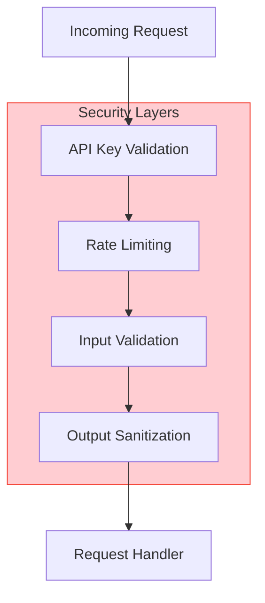

<div align="center">
  <picture>
    <source media="(prefers-color-scheme: dark)" srcset="https://github.com/telemetryflow/.github/raw/main/docs/assets/tfo-logo-mcp-dark.svg">
    <source media="(prefers-color-scheme: light)" srcset="https://github.com/telemetryflow/.github/raw/main/docs/assets/tfo-logo-mcp-light.svg">
    
  </picture>

  <h3>TelemetryFlow Python MCP Server (TFO-Python-MCP)</h3>

[](CHANGELOG.md)
[](https://opensource.org/licenses/Apache-2.0)
[](https://python.org/)
[](https://modelcontextprotocol.io/)
[](https://anthropic.com)
[](https://opentelemetry.io/)
[](docs/ARCHITECTURE.md)
[](https://www.postgresql.org/)
[](https://clickhouse.com/)

</div>

---

# Security Policy

## Table of Contents

- [Supported Versions](#supported-versions)
- [Reporting a Vulnerability](#reporting-a-vulnerability)
- [Security Measures](#security-measures)
- [Security Best Practices](#security-best-practices)
- [Dependency Security](#dependency-security)
- [API Key Security](#api-key-security)
- [Security Checklist](#security-checklist)

---

## Supported Versions

We provide security updates for the following versions:

| Version | Supported          |
| ------- | ------------------ |
| 1.1.x   | :white_check_mark: |
| 1.0.x   | :x:                |
| < 1.0   | :x:                |

We recommend always using the latest version for the best security.

---

## Reporting a Vulnerability

### How to Report

**Please do NOT report security vulnerabilities through public GitHub issues.**

Instead, please report them via one of the following methods:

1. **Email**: security@devopscorner.id
2. **GitHub Security Advisories**: [Create a security advisory](https://github.com/telemetryflow/telemetryflow-python-mcp/security/advisories/new)

### What to Include

Please include the following information in your report:

- Type of vulnerability (e.g., XSS, SQL injection, command injection)
- Full paths of source file(s) related to the vulnerability
- Location of the affected source code (tag/branch/commit or direct URL)
- Step-by-step instructions to reproduce the issue
- Proof-of-concept or exploit code (if possible)
- Impact of the issue, including how an attacker might exploit it

### Response Timeline

| Stage                      | Timeline              |
| -------------------------- | --------------------- |
| Initial Response           | Within 48 hours       |
| Vulnerability Confirmation | Within 7 days         |
| Fix Development            | Within 30 days        |
| Public Disclosure          | After fix is released |

### What to Expect

1. **Acknowledgment**: We will acknowledge receipt of your report within 48 hours.
2. **Assessment**: We will investigate and validate the reported vulnerability.
3. **Updates**: We will keep you informed of our progress.
4. **Fix**: We will develop and test a fix.
5. **Disclosure**: We will coordinate disclosure with you.
6. **Credit**: We will credit you in the security advisory (if desired).

---

## Security Measures

### Authentication & Authorization



### API Key Management

- API keys are never logged
- Keys are stored in environment variables
- Keys are not included in configuration files committed to version control
- Keys are validated on every request

### Input Validation

- All inputs are validated before processing
- JSON schema validation for tool arguments
- Path traversal prevention for file operations
- Command injection prevention for shell operations

### Rate Limiting

- Configurable request limits per minute
- Burst allowance for temporary spikes
- Per-client rate tracking

### Secure Defaults

- TLS for external API calls
- Minimal file permissions
- Secure default configuration

---

## Security Best Practices

### For Users

#### API Key Security

```bash
# DO: Use environment variables
export ANTHROPIC_API_KEY="your-api-key"

# DO: Use secret managers in production
ANTHROPIC_API_KEY=$(aws secretsmanager get-secret-value --secret-id telemetryflow-python-mcp/api-key)

# DON'T: Put keys in config files
# DON'T: Commit keys to version control
# DON'T: Share keys in logs or error messages
```

#### Configuration Security

```yaml
# config.yaml - DO NOT include secrets here
claude:
  api_key: "" # Use environment variable instead

security:
  rate_limit:
    enabled: true
    requests_per_minute: 60
```

#### File Operations

- Use absolute paths
- Validate file paths
- Restrict operations to allowed directories
- Set appropriate file permissions

#### Command Execution

- Validate all command inputs
- Use allowlists for permitted commands
- Set execution timeouts
- Run with minimal privileges

### For Developers

#### Code Security

```python
# DO: Validate inputs
async def execute(self, arguments: dict[str, Any]) -> ToolResult:
    """Execute tool with validated input."""
    # Validate using Pydantic
    validated = ToolInput.model_validate(arguments)

    # Sanitize file paths
    safe_path = self._sanitize_path(validated.path)
    if not self._is_allowed_path(safe_path):
        return ToolResult.error("Path not allowed")

    # Execute with validated input
    return await self._do_execute(validated)


# DO: Use parameterized queries (for database operations)
# DO: Sanitize outputs
# DO: Handle errors without leaking information
```

#### Dependency Management

```bash
# Regularly update dependencies
pip install --upgrade pip
pip install -e ".[dev]"

# Check for vulnerabilities
pip-audit
safety check

# Generate requirements with hashes
pip-compile --generate-hashes requirements.in
```

#### Secrets in Code

```python
# DON'T: Hardcode secrets
API_KEY = "sk-ant-api..."  # NEVER DO THIS

# DO: Use environment variables
import os

api_key = os.environ.get("ANTHROPIC_API_KEY")
if not api_key:
    raise ValueError("ANTHROPIC_API_KEY environment variable required")
```

---

## Dependency Security

### Vulnerability Scanning

We use multiple tools to scan for vulnerabilities:

| Tool        | Purpose                        |
| ----------- | ------------------------------ |
| `pip-audit` | Python package vulnerabilities |
| `safety`    | PyUp.io vulnerability database |
| `bandit`    | Python security linter         |
| `trivy`     | Container image scanning       |

### Running Security Scans

```bash
# Install security tools
pip install pip-audit safety bandit

# Scan for vulnerabilities
pip-audit

# Check with safety
safety check

# Run bandit security linter
bandit -r src/

# Docker image scanning
trivy image telemetryflow-python-mcp:latest
```

### Dependency Update Policy

- Critical vulnerabilities: Patch within 24 hours
- High vulnerabilities: Patch within 7 days
- Medium vulnerabilities: Patch within 30 days
- Low vulnerabilities: Patch in next release

---

## API Key Security

### Storage Guidelines

| Environment | Recommendation                           |
| ----------- | ---------------------------------------- |
| Development | `.env` file (gitignored)                 |
| CI/CD       | Secret management (GitHub Secrets, etc.) |
| Production  | Secret manager (AWS, GCP, Azure, Vault)  |

### Rotation Policy

- Rotate keys every 90 days
- Rotate immediately if compromised
- Use separate keys for dev/staging/production

### Access Control

- Limit key access to necessary personnel
- Use separate keys per application/environment
- Monitor key usage for anomalies

---

## Security Checklist

### Before Deployment

- [ ] API keys stored securely (not in code/config)
- [ ] Rate limiting enabled
- [ ] Input validation implemented
- [ ] Logging does not include sensitive data
- [ ] TLS configured for external connections
- [ ] File permissions set correctly
- [ ] Dependencies scanned for vulnerabilities
- [ ] Security tests passing

### Ongoing Security

- [ ] Regular dependency updates
- [ ] Regular security scans
- [ ] Monitor for security advisories
- [ ] Review access controls
- [ ] Audit logging enabled
- [ ] Incident response plan ready

### For Contributors

- [ ] No secrets in code
- [ ] Input validation for new features
- [ ] Security tests for new functionality
- [ ] Documentation updated for security features
- [ ] Security review for significant changes

---

## Security Features

### Built-in Security

| Feature           | Description                            |
| ----------------- | -------------------------------------- |
| Rate Limiting     | Prevent abuse with configurable limits |
| Input Validation  | Pydantic validation for all inputs     |
| Path Sanitization | Prevent directory traversal attacks    |
| Command Allowlist | Restrict executable commands           |
| Error Handling    | Secure error messages without leaks    |
| Logging           | Sensitive data redaction               |

### Configuration

```yaml
security:
  rate_limit:
    enabled: true
    requests_per_minute: 60
    burst_size: 10

  api_key_validation: true

  allowed_commands:
    - "python"
    - "pip"
    - "make"
    - "git"
```

---

## Contact

For security concerns, please contact:

- **Security Email**: security@devopscorner.id
- **GitHub Security**: [Security Advisories](https://github.com/telemetryflow/telemetryflow-python-mcp/security/advisories)

---

Thank you for helping keep TelemetryFlow Python MCP and its users secure!
