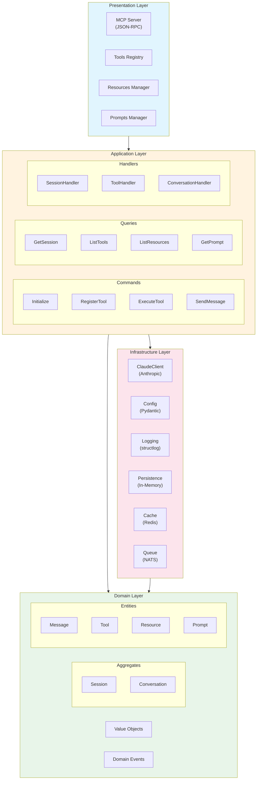
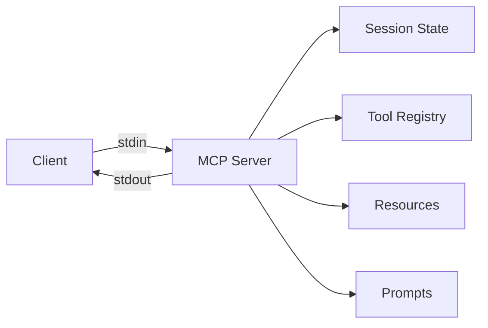
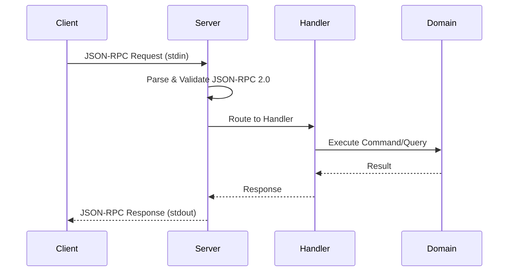
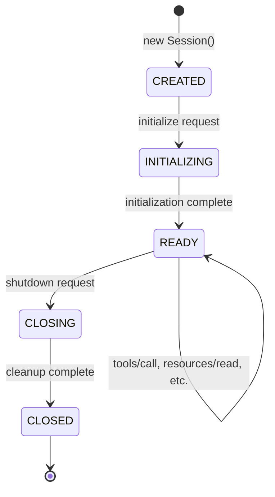
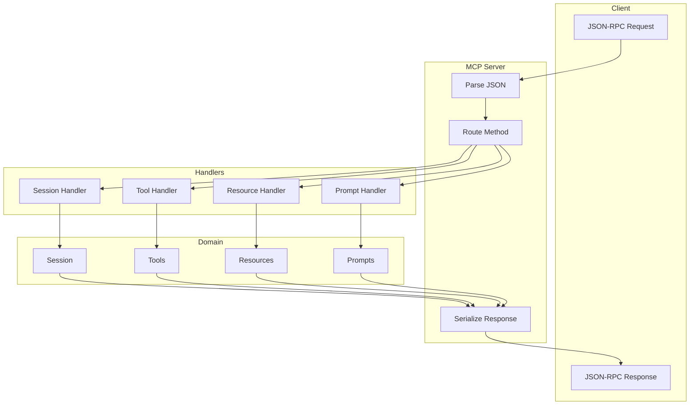
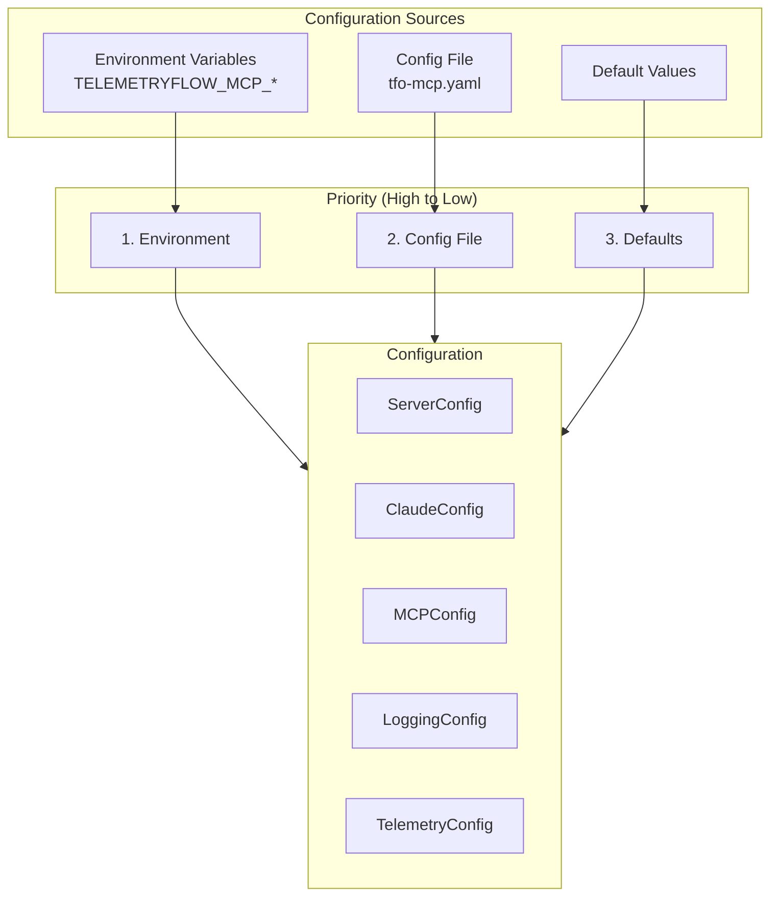
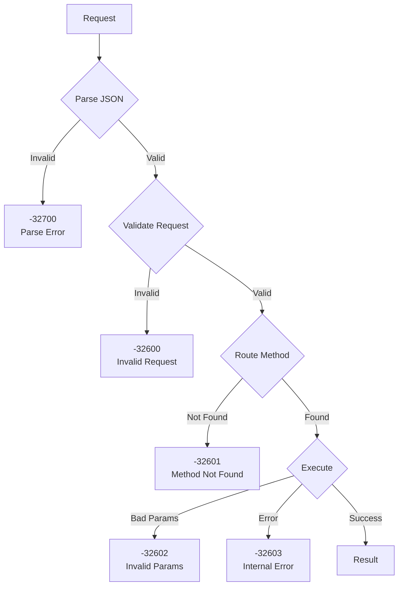
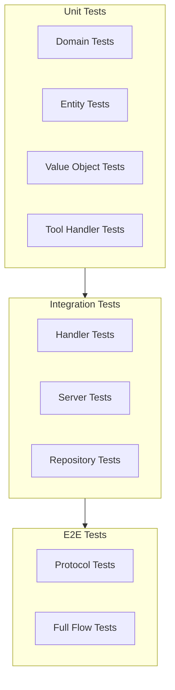
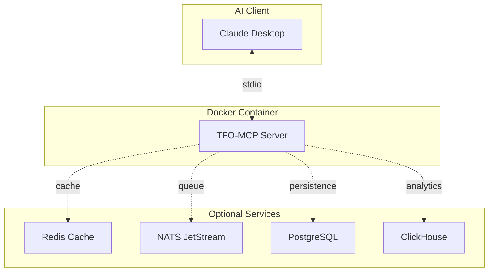

# TelemetryFlow Python MCP Server - Architecture

This document describes the architecture of the TelemetryFlow Python MCP Server Python implementation.

## Overview

The TelemetryFlow Python MCP Server is an enterprise-grade Model Context Protocol (MCP) implementation that serves as the AI integration layer for the TelemetryFlow platform. It follows Domain-Driven Design (DDD) and CQRS patterns for maintainability and scalability.

## Architecture Layers



## Layer Responsibilities

### Presentation Layer

The presentation layer handles all external communication:

- **MCP Server**: JSON-RPC 2.0 server over stdio
- **Tools Registry**: Manages tool registration and execution
- **Resources Manager**: Handles resource listing and reading
- **Prompts Manager**: Manages prompt templates

### Application Layer

The application layer orchestrates business operations using CQRS:

- **Commands**: Write operations (Initialize, RegisterTool, ExecuteTool)
- **Queries**: Read operations (ListTools, GetSession, ReadResource)
- **Handlers**: Process commands and queries

### Domain Layer

The domain layer contains core business logic:

- **Aggregates**: Session and Conversation manage their invariants
- **Entities**: Tool, Resource, Prompt, Message
- **Value Objects**: Immutable types (IDs, enums, configs)
- **Domain Events**: For event sourcing and cross-aggregate communication

### Infrastructure Layer

The infrastructure layer provides external service implementations:

- **Claude Client**: Anthropic API integration
- **Configuration**: Pydantic settings management
- **Logging**: Structured logging with structlog
- **Persistence**: Repository implementations

## MCP Protocol Implementation

### Transport



### Message Flow



### Supported Methods

| Category  | Methods                                                  |
| --------- | -------------------------------------------------------- |
| Lifecycle | initialize, notifications/initialized, ping, shutdown    |
| Tools     | tools/list, tools/call                                   |
| Resources | resources/list, resources/read, resources/templates/list |
| Prompts   | prompts/list, prompts/get                                |
| Logging   | logging/setLevel                                         |

## Session Lifecycle



## Data Flow



## Built-in Components

### Tools (8)

| Tool                | Category | Description        |
| ------------------- | -------- | ------------------ |
| echo                | utility  | Echo testing tool  |
| read_file           | file     | Read file contents |
| write_file          | file     | Write to file      |
| list_directory      | file     | List directory     |
| search_files        | file     | Search by pattern  |
| execute_command     | system   | Run shell command  |
| system_info         | system   | System information |
| claude_conversation | ai       | Chat with Claude   |

### Resources (3)

| Resource        | Type     | Description          |
| --------------- | -------- | -------------------- |
| config://server | static   | Server configuration |
| status://health | static   | Health status        |
| file:///{path}  | template | File access          |

### Prompts (3)

| Prompt       | Description            |
| ------------ | ---------------------- |
| code_review  | Code review assistance |
| explain_code | Code explanation       |
| debug_help   | Debugging assistance   |

## Configuration



### Key Configuration Sections

```yaml
server: # Server settings (name, version, transport)
claude: # Claude API settings (api_key, model, tokens)
mcp: # MCP protocol settings (capabilities, timeouts)
logging: # Logging settings (level, format, output)
telemetry: # Telemetry settings (OTLP endpoint)
```

## Error Handling



### Error Codes

| Code   | Name               | Description        |
| ------ | ------------------ | ------------------ |
| -32700 | Parse error        | Invalid JSON       |
| -32600 | Invalid Request    | Not valid JSON-RPC |
| -32601 | Method not found   | Unknown method     |
| -32602 | Invalid params     | Invalid parameters |
| -32603 | Internal error     | Server error       |
| -32001 | Tool not found     | MCP specific       |
| -32002 | Resource not found | MCP specific       |
| -32003 | Prompt not found   | MCP specific       |

## Testing Strategy



## Deployment Architecture



## Future Enhancements

1. **Additional Transports**: SSE, WebSocket support
2. **Database Persistence**: PostgreSQL, ClickHouse
3. **Caching**: Redis integration
4. **Message Queue**: NATS JetStream
5. **Observability**: OpenTelemetry integration
6. **Authentication**: API key validation
7. **Rate Limiting**: Request throttling
