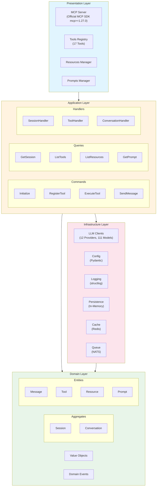
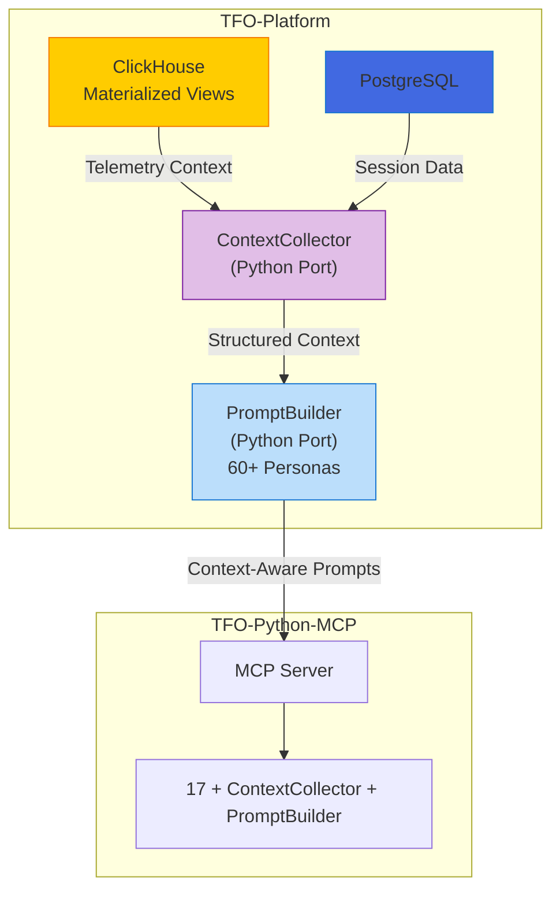
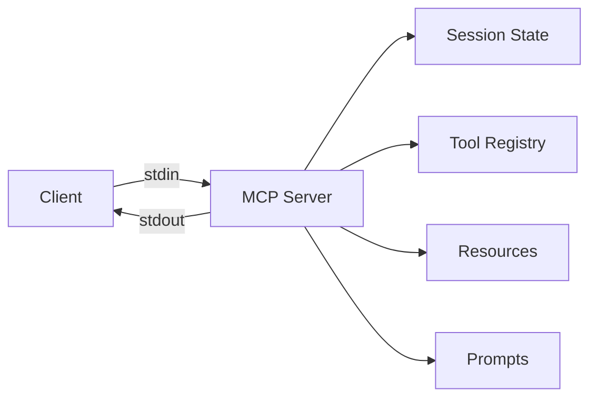
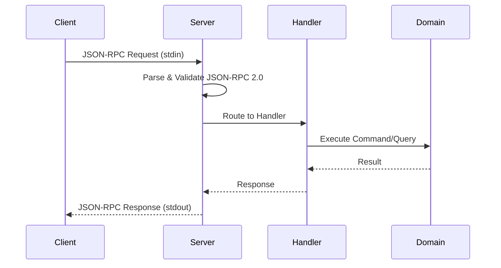
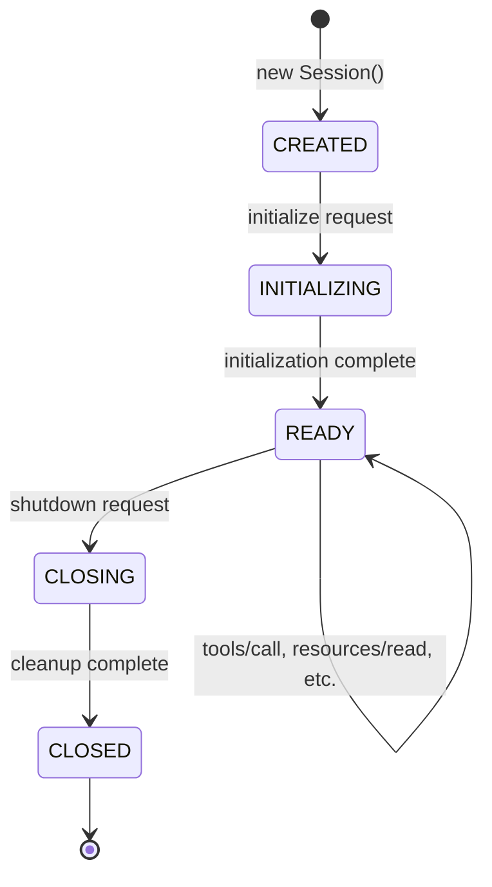
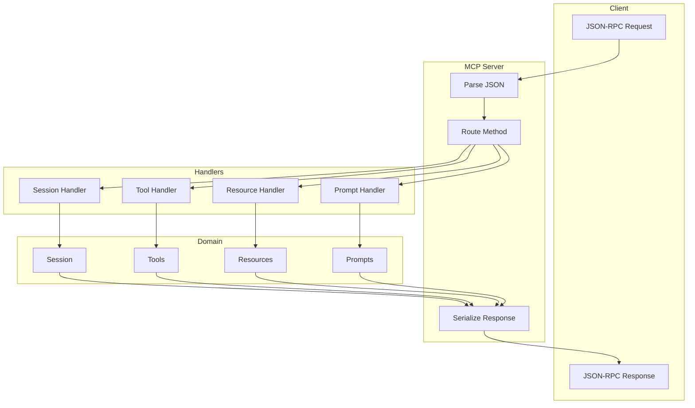
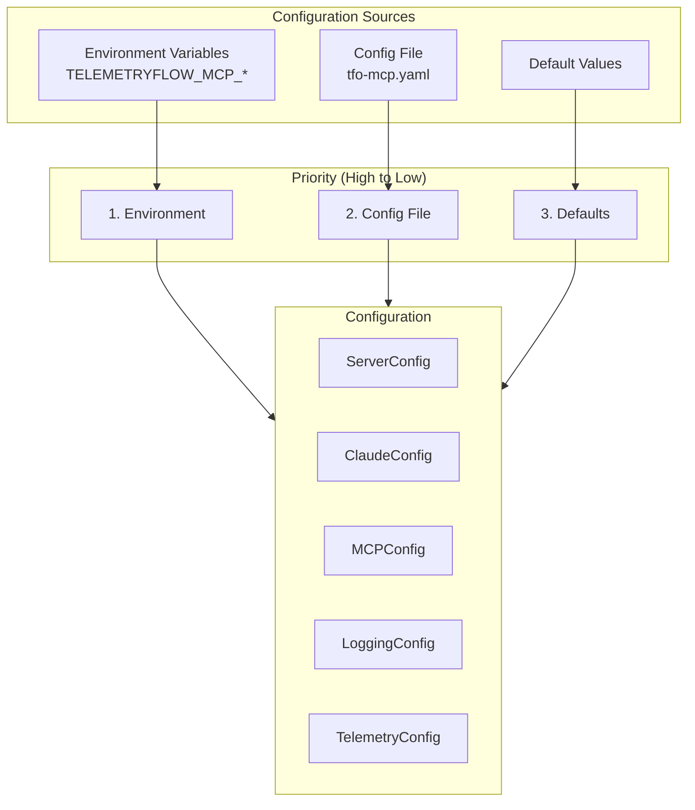
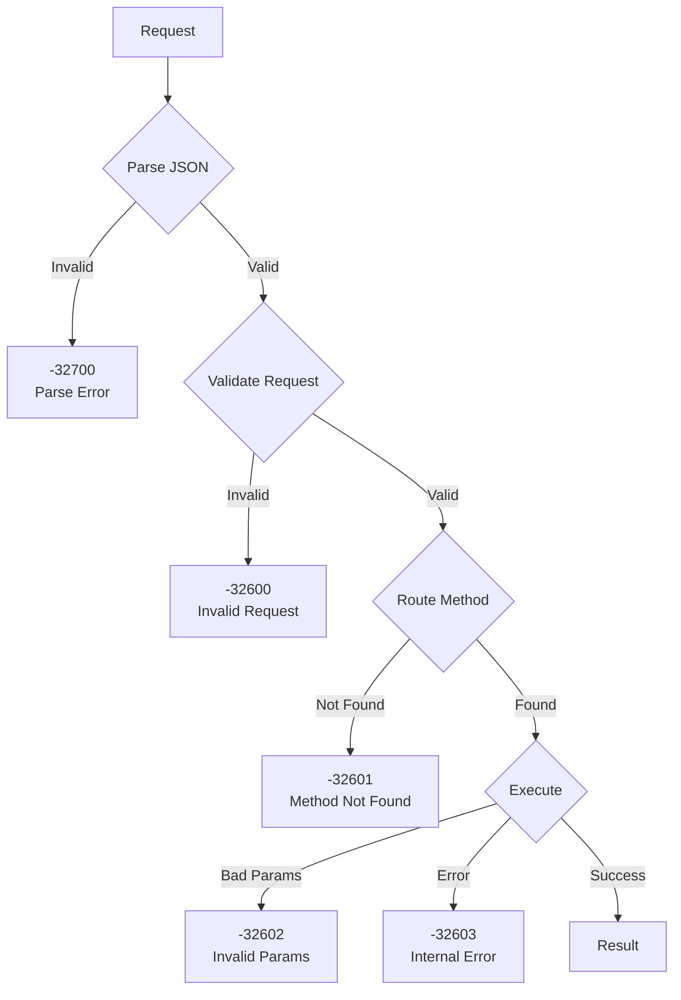
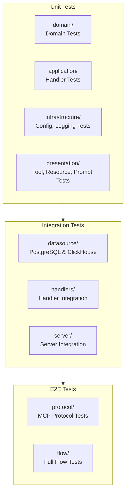
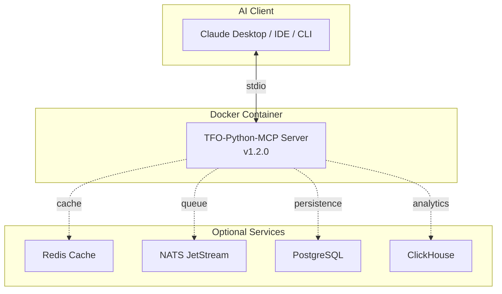

# TelemetryFlow Python MCP Server - Architecture

This document describes the architecture of the TelemetryFlow Python MCP Server Python implementation.

## Overview

The TelemetryFlow Python MCP Server is an enterprise-grade Model Context Protocol (MCP) implementation that serves as the AI integration layer for the TelemetryFlow platform. It is built on the official MCP SDK (`mcp>=1.27.0`) and follows Domain-Driven Design (DDD) and CQRS patterns for maintainability and scalability. The server supports 12 LLM providers with 111 models, providing 17 built-in tools (8 builtin + 4 PostgreSQL + 5 ClickHouse) + ContextCollector + PromptBuilder services.

## Architecture Layers


```mermaid
graph TB
    subgraph Presentation["Presentation Layer"]
        Server["MCP Server<br/>(Official MCP SDK mcp>=1.27.0)"]
        Tools["Tools Registry<br/>(17 Tools)"]
        Resources["Resources Manager"]
        Prompts["Prompts Manager"]
    end

    subgraph Application["Application Layer"]
        subgraph Commands["Commands"]
            C1["Initialize"]
            C2["RegisterTool"]
            C3["ExecuteTool"]
            C4["SendMessage"]
        end
        subgraph Queries["Queries"]
            Q1["GetSession"]
            Q2["ListTools"]
            Q3["ListResources"]
            Q4["GetPrompt"]
        end
        subgraph Handlers["Handlers"]
            H1["SessionHandler"]
            H2["ToolHandler"]
            H3["ConversationHandler"]
        end
    end

    subgraph Domain["Domain Layer"]
        subgraph Aggregates["Aggregates"]
            Session["Session"]
            Conversation["Conversation"]
        end
        subgraph Entities["Entities"]
            Message["Message"]
            Tool["Tool"]
            Resource["Resource"]
            Prompt["Prompt"]
        end
        ValueObjects["Value Objects"]
        DomainEvents["Domain Events"]
    end

    subgraph Infrastructure["Infrastructure Layer"]
        LLM["LLM Clients<br/>(12 Providers, 111 Models)"]
        Config["Config<br/>(Pydantic)"]
        Logging["Logging<br/>(structlog)"]
        Persistence["Persistence<br/>(In-Memory)"]
        Cache["Cache<br/>(Redis)"]
        Queue["Queue<br/>(NATS)"]
    end

    Presentation --> Application
    Application --> Domain
    Infrastructure --> Domain
    Application --> Infrastructure

    style Presentation fill:#e1f5fe
    style Application fill:#fff3e0
    style Domain fill:#e8f5e9
    style Infrastructure fill:#fce4ec
```

## Layer Responsibilities

### Presentation Layer

The presentation layer handles all external communication using the official MCP SDK:

- **MCP Server**: Built on official MCP SDK (`mcp>=1.27.0`), handles JSON-RPC 2.0 over stdio
- **Tools Registry**: Manages registration and execution of 17 built-in tools
- **Resources Manager**: Handles resource listing and reading
- **Prompts Manager**: Manages prompt templates

### Application Layer

The application layer orchestrates business operations using CQRS:

- **Commands**: Write operations (Initialize, RegisterTool, ExecuteTool)
- **Queries**: Read operations (ListTools, GetSession, ReadResource)
- **Handlers**: Process commands and queries

### Application Services

#### ContextCollector Service (`application/services/context_collector.py`)

Python port of TFO-Platform `ContextCollector.service.ts`. Collects real telemetry context from ClickHouse materialized views and PostgreSQL for AI analysis.

**Data sources:**

| Source                         | Tables/Views                                                                                                                                                                                                                                                                                                       | Context Types                                                                                           |
| ------------------------------ | ------------------------------------------------------------------------------------------------------------------------------------------------------------------------------------------------------------------------------------------------------------------------------------------------------------------ | ------------------------------------------------------------------------------------------------------- |
| **ClickHouse (timescale)**     | `metrics_5m` (AggMT), `logs_1h` (SumMT), `service_latency_percentiles_1h`, `service_error_rates_1h`, `exemplars_1h`, `uptime_checks`, `audit_logs_1h`, `signal_correlations_1h`, `vm_metrics_1h`, `kubernetes_metrics_1h`, `service_map_metrics_1h`, `network_map_traffic_1h`, `network_map_connection_metrics_1h` | metrics, logs, traces, exemplars, uptime, audit, infra-\*, kubernetes metrics, service-map, network-map |
| **PostgreSQL (non-timescale)** | `alert_rules`, `alert_instances`, `users`, `roles`, `organizations`, `workspaces`, `retention_policies`, `api_keys`, `notification_channels`, `report_definitions`, `data_masking_policies`, `llm_providers`                                                                                                       | alerts, IAM, tenancy, retention, api-keys, notifications, reports, data-masking, ai-assistant           |
| **Hybrid (PG+CH)**             | PG inventory + CH metrics                                                                                                                                                                                                                                                                                          | kubernetes, agents, service-map, network-map, DB monitoring                                             |

**Key methods:**

- `collect_context(context_type, organization_id, ...)` — main entry point with 5s timeout
- `_pg_query(sql, params)` — safe PostgreSQL query (returns [] on error)
- `_ch_query(query, params)` — safe ClickHouse query (returns [] on error)
- 30+ private context collection methods (one per context type)

#### PromptBuilder Service (`application/services/prompt_builder.py`)

Python port of TFO-Platform `PromptBuilder.service.ts`. Builds context-aware system prompts for LLM interactions.

**Key methods:**

- `build_system_prompt(context_type, custom_prompt?)` — generates system prompt with IMPORTANT INSTRUCTIONS
- `build_context_prompt(context)` — formats TelemetryContext as markdown (10K char JSON truncation)
- `build_insight_prompt(insight_type, context)` — 5 insight types: chronology, prediction, recommendation, root-cause, pattern
- `get_available_context_types()` — returns all 78 context type keys

**60+ specialized analyst personas** covering observability, infrastructure, Kubernetes, security, DB monitoring, and more.

### Domain Layer

The domain layer contains core business logic:

- **Aggregates**: Session and Conversation manage their invariants
- **Entities**: Tool, Resource, Prompt, Message
- **Value Objects**: Immutable types (IDs, enums, configs)
- **Domain Events**: For event sourcing and cross-aggregate communication

#### Context Value Objects (`domain/valueobjects/context.py`)

- `ContextType` (str, Enum) — 78 context types matching TFO-Platform's ContextType union
- `InsightType` (str, Enum) — chronology, prediction, recommendation, root-cause, pattern
- `TelemetryContext` (frozen dataclass) — type, time_range, summary, data
- `TimeRange` (frozen dataclass) — from_time, to_time with validation

### Infrastructure Layer

The infrastructure layer provides external service implementations:

- **LLM Clients**: Multi-provider support (12 providers, 111 models)
- **Configuration**: Pydantic settings management
- **Logging**: Structured logging with structlog
- **Persistence**: Repository implementations

## LLM Provider Support

The server supports 12 LLM providers with a total of 111 models:


```mermaid
graph TB
    subgraph Providers["12 LLM Providers"]
        ANTHROPIC["Anthropic<br/>Claude 4, 3.5"]
        GOOGLE["Google<br/>Gemini 2.5"]
        OPENAI["OpenAI<br/>GPT-4o, o3, o4"]
        DEEPSEEK["DeepSeek<br/>V3, R1"]
        QWEN["Qwen<br/>Qwen3"]
        OLLAMA["Ollama<br/>Local Models"]
        MISTRAL["Mistral<br/>Large, Codestral"]
        GROK["Grok<br/>grok-3"]
        KIMI["Kimi<br/>Moonshot"]
        ZHIPU["Zhipu<br/>GLM-4"]
        MIMO["MiMo<br/>MiMo-7B"]
        CUSTOM["Custom<br/>OpenAI-Compatible"]
    end

    MCP["MCP Server"]

    MCP --> ANTHROPIC
    MCP --> GOOGLE
    MCP --> OPENAI
    MCP --> DEEPSEEK
    MCP --> QWEN
    MCP --> OLLAMA
    MCP --> MISTRAL
    MCP --> GROK
    MCP --> KIMI
    MCP --> ZHIPU
    MCP --> MIMO
    MCP --> CUSTOM

    style MCP fill:#3776AB,stroke:#FFD43B,stroke-width:2px
    style ANTHROPIC fill:#E1BEE7,stroke:#7B1FA2
    style GOOGLE fill:#BBDEFB,stroke:#1976D2
    style OPENAI fill:#C8E6C9,stroke:#388E3C
    style DEEPSEEK fill:#FFE0B2,stroke:#F57C00
    style QWEN fill:#B3E5FC,stroke:#0288D1
    style OLLAMA fill:#F3E5F5,stroke:#7B1FA2
    style MISTRAL fill:#FFCDD2,stroke:#C62828
    style GROK fill:#FFF9C4,stroke:#F9A825
    style KIMI fill:#D1C4E9,stroke:#512DA8
    style ZHIPU fill:#C8E6C9,stroke:#2E7D32
    style MIMO fill:#FFE0B2,stroke:#E65100
    style CUSTOM fill:#ECEFF1,stroke:#546E7A
```

| Provider  | Example Models                   | Use Case                        |
| --------- | -------------------------------- | ------------------------------- |
| Anthropic | Claude 4 Opus, Claude 4 Sonnet   | Complex reasoning, analysis     |
| Google    | Gemini 2.5 Pro, Gemini 2.5 Flash | Multimodal, long context        |
| OpenAI    | GPT-4o, o3, o4-mini              | General purpose, reasoning      |
| DeepSeek  | DeepSeek-V3, DeepSeek-R1         | Cost-effective reasoning        |
| Qwen      | Qwen3-235B, Qwen3-32B            | Multilingual, code              |
| Ollama    | llama3, mistral, codellama       | Local/private deployment        |
| Mistral   | Mistral Large, Codestral         | European compliance, code       |
| Grok      | grok-3, grok-3-mini              | Real-time knowledge             |
| Kimi      | moonshot-v1-128k                 | Long context (128K)             |
| Zhipu     | GLM-4, GLM-4-Plus                | Chinese language, enterprise    |
| MiMo      | MiMo-7B                          | Lightweight inference           |
| Custom    | Any OpenAI-compatible endpoint   | Self-hosted, proprietary models |

## TFO-Platform Integration

The MCP server integrates with TFO-Platform components for context-aware AI analysis. The Python implementation includes direct ports of the TFO-Platform TypeScript services:

### ContextCollector (Python Port)

The **ContextCollector** service (`application/services/context_collector.py`) is a Python port of TFO-Platform `ContextCollector.service.ts`. It collects real telemetry context from ClickHouse materialized views and PostgreSQL for AI analysis:

- Queries ClickHouse materialized views for aggregated telemetry metrics
- Retrieves session and trace context from PostgreSQL
- Provides structured context for AI-powered telemetry analysis
- Supports configurable time windows and filtering
- Main entry point: `collect_context(context_type, organization_id, ...)` with 5s timeout
- Safe query wrappers: `_pg_query()` and `_ch_query()` (return `[]` on error)
- 30+ private context collection methods (one per context type)

### PromptBuilder (Python Port)

The **PromptBuilder** service (`application/services/prompt_builder.py`) is a Python port of TFO-Platform `PromptBuilder.service.ts`. It builds context-aware system prompts per context type, leveraging 60+ specialized analyst personas for targeted telemetry analysis:

- Dynamically constructs system prompts based on context type with IMPORTANT INSTRUCTIONS
- Selects from 60+ specialized analyst personas (e.g., performance analyst, error analyst, infrastructure analyst)
- Incorporates real-time telemetry data into prompt context (10K char JSON truncation)
- Supports custom persona definitions for domain-specific analysis
- 5 insight types: chronology, prediction, recommendation, root-cause, pattern
- Returns all 78 context type keys via `get_available_context_types()`


```mermaid
graph TB
    subgraph TFOPlatform["TFO-Platform"]
        ContextCollector["ContextCollector<br/>(Python Port)"]
        PromptBuilder["PromptBuilder<br/>(Python Port)<br/>60+ Personas"]
        CH["ClickHouse<br/>Materialized Views"]
        PG["PostgreSQL"]
    end

    subgraph MCP["TFO-Python-MCP"]
        Server["MCP Server"]
        Tools["17 + ContextCollector + PromptBuilder"]
    end

    CH -->|"Telemetry Context"| ContextCollector
    PG -->|"Session Data"| ContextCollector
    ContextCollector -->|"Structured Context"| PromptBuilder
    PromptBuilder -->|"Context-Aware Prompts"| Server
    Server --> Tools

    style ContextCollector fill:#E1BEE7,stroke:#7B1FA2
    style PromptBuilder fill:#BBDEFB,stroke:#1976D2
    style CH fill:#FFCC00,stroke:#F57C00
    style PG fill:#4169E1,stroke:#1976D2
```

## TFO-Platform Context Types

The following 78 context types are supported, matching TFO-Platform's ContextType union:

### Observability Core (20)

| #   | Context Type     | Description                       |
| --- | ---------------- | --------------------------------- |
| 1   | `metrics`        | Aggregated metric data            |
| 2   | `logs`           | Log entries and patterns          |
| 3   | `traces`         | Distributed trace data            |
| 4   | `exemplars`      | Metric exemplars linked to traces |
| 5   | `uptime`         | Uptime check results              |
| 6   | `audit`          | Audit log entries                 |
| 7   | `errors`         | Error patterns and rates          |
| 8   | `latency`        | Latency percentiles and trends    |
| 9   | `throughput`     | Request throughput data           |
| 10  | `saturation`     | Resource saturation metrics       |
| 11  | `service-health` | Overall service health status     |
| 12  | `dependencies`   | Service dependency graph          |
| 13  | `topology`       | Infrastructure topology           |
| 14  | `anomalies`      | Detected anomalies                |
| 15  | `slo`            | SLO compliance data               |
| 16  | `sli`            | SLI indicators                    |
| 17  | `error-budget`   | Error budget tracking             |
| 18  | `change-events`  | Change/event tracking             |
| 19  | `deployment`     | Deployment status                 |
| 20  | `alert`          | Alert state and history           |

### Infrastructure (10)

| #   | Context Type          | Description                  |
| --- | --------------------- | ---------------------------- |
| 21  | `infra-hosts`         | Host/VM inventory            |
| 22  | `infra-containers`    | Container inventory          |
| 23  | `infra-network`       | Network infrastructure       |
| 24  | `infra-storage`       | Storage infrastructure       |
| 25  | `infra-compute`       | Compute resources            |
| 26  | `infra-database`      | Database infrastructure      |
| 27  | `infra-cache`         | Cache infrastructure         |
| 28  | `infra-queue`         | Message queue infrastructure |
| 29  | `infra-load-balancer` | Load balancer configuration  |
| 30  | `infra-dns`           | DNS configuration            |

### Kubernetes (10)

| #   | Context Type             | Description               |
| --- | ------------------------ | ------------------------- |
| 31  | `kubernetes-clusters`    | Cluster inventory         |
| 32  | `kubernetes-namespaces`  | Namespace status          |
| 33  | `kubernetes-deployments` | Deployment status         |
| 34  | `kubernetes-pods`        | Pod status and metrics    |
| 35  | `kubernetes-services`    | K8s service inventory     |
| 36  | `kubernetes-nodes`       | Node status               |
| 37  | `kubernetes-configmaps`  | ConfigMap inventory       |
| 38  | `kubernetes-secrets`     | Secret inventory          |
| 39  | `kubernetes-hpa`         | Horizontal Pod Autoscaler |
| 40  | `kubernetes-events`      | Kubernetes events         |

### Service Map (6)

| #   | Context Type               | Description                  |
| --- | -------------------------- | ---------------------------- |
| 41  | `service-map`              | Service map overview         |
| 42  | `service-map-traffic`      | Service traffic flows        |
| 43  | `service-map-errors`       | Error rates between services |
| 44  | `service-map-latency`      | Latency between services     |
| 45  | `service-map-dependencies` | Service dependency edges     |
| 46  | `service-map-topology`     | Full topology view           |

### Network Map (6)

| #   | Context Type              | Description           |
| --- | ------------------------- | --------------------- |
| 47  | `network-map`             | Network map overview  |
| 48  | `network-map-traffic`     | Network traffic flows |
| 49  | `network-map-connections` | Connection metrics    |
| 50  | `network-map-dns`         | DNS resolution        |
| 51  | `network-map-firewall`    | Firewall rules        |
| 52  | `network-map-security`    | Network security      |

### Database Monitoring (8)

| #   | Context Type      | Description            |
| --- | ----------------- | ---------------------- |
| 53  | `db-overview`     | Database overview      |
| 54  | `db-queries`      | Query performance      |
| 55  | `db-slow-queries` | Slow query analysis    |
| 56  | `db-connections`  | Connection pool status |
| 57  | `db-tables`       | Table statistics       |
| 58  | `db-indexes`      | Index usage            |
| 59  | `db-replication`  | Replication status     |
| 60  | `db-locks`        | Lock analysis          |

### Security & Compliance (6)

| #   | Context Type               | Description                |
| --- | -------------------------- | -------------------------- |
| 61  | `security-events`          | Security event analysis    |
| 62  | `security-vulnerabilities` | Vulnerability scan results |
| 63  | `security-compliance`      | Compliance status          |
| 64  | `security-access`          | Access patterns            |
| 65  | `security-threats`         | Threat detection           |
| 66  | `security-incidents`       | Incident tracking          |

### Platform & AI (12)

| #   | Context Type           | Description              |
| --- | ---------------------- | ------------------------ |
| 67  | `platform-health`      | Platform health overview |
| 68  | `platform-capacity`    | Capacity planning        |
| 69  | `platform-cost`        | Cost analysis            |
| 70  | `platform-performance` | Platform performance     |
| 71  | `ai-insights`          | AI-generated insights    |
| 72  | `ai-recommendations`   | AI recommendations       |
| 73  | `ai-anomalies`         | AI-detected anomalies    |
| 74  | `ai-predictions`       | AI predictions           |
| 75  | `ai-root-cause`        | AI root cause analysis   |
| 76  | `ai-patterns`          | AI pattern recognition   |
| 77  | `report-summary`       | Report summaries         |
| 78  | `custom`               | Custom context type      |

## MCP Protocol Implementation

### Transport


```mermaid
flowchart LR
    Client["Client"]
    Server["MCP Server"]
    Session["Session State"]
    Tools["Tool Registry"]
    Resources["Resources"]
    Prompts["Prompts"]

    Client -->|"stdin"| Server
    Server -->|"stdout"| Client
    Server --> Session
    Server --> Tools
    Server --> Resources
    Server --> Prompts
```

### Message Flow


```mermaid
sequenceDiagram
    participant Client
    participant Server
    participant Handler
    participant Domain

    Client->>Server: JSON-RPC Request (stdin)
    Server->>Server: Parse & Validate JSON-RPC 2.0
    Server->>Handler: Route to Handler
    Handler->>Domain: Execute Command/Query
    Domain-->>Handler: Result
    Handler-->>Server: Response
    Server-->>Client: JSON-RPC Response (stdout)
```

### Supported Methods

| Category  | Methods                                                  |
| --------- | -------------------------------------------------------- |
| Lifecycle | initialize, notifications/initialized, ping, shutdown    |
| Tools     | tools/list, tools/call                                   |
| Resources | resources/list, resources/read, resources/templates/list |
| Prompts   | prompts/list, prompts/get                                |
| Logging   | logging/setLevel                                         |

## Session Lifecycle


```mermaid
stateDiagram-v2
    [*] --> CREATED: new Session()
    CREATED --> INITIALIZING: initialize request
    INITIALIZING --> READY: initialization complete
    READY --> CLOSING: shutdown request
    CLOSING --> CLOSED: cleanup complete
    CLOSED --> [*]

    READY --> READY: tools/call, resources/read, etc.
```

## Data Flow


```mermaid
flowchart TB
    subgraph Client
        Request["JSON-RPC Request"]
        Response["JSON-RPC Response"]
    end

    subgraph Server["MCP Server"]
        Parse["Parse JSON"]
        Route["Route Method"]
        Serialize["Serialize Response"]
    end

    subgraph Handlers
        SessionH["Session Handler"]
        ToolH["Tool Handler"]
        ResourceH["Resource Handler"]
        PromptH["Prompt Handler"]
    end

    subgraph Domain
        Session["Session"]
        Tools["Tools"]
        Resources["Resources"]
        Prompts["Prompts"]
    end

    Request --> Parse
    Parse --> Route
    Route --> SessionH & ToolH & ResourceH & PromptH
    SessionH --> Session
    ToolH --> Tools
    ResourceH --> Resources
    PromptH --> Prompts
    Session & Tools & Resources & Prompts --> Serialize
    Serialize --> Response
```

## Built-in Components

### Tools (17 + ContextCollector + PromptBuilder)

| Tool                 | Category   | Description                      |
| -------------------- | ---------- | -------------------------------- |
| echo                 | utility    | Echo testing tool                |
| read_file            | file       | Read file contents               |
| write_file           | file       | Write to file                    |
| list_directory       | file       | List directory                   |
| search_files         | file       | Search by pattern                |
| execute_command      | system     | Run shell command                |
| system_info          | system     | System information               |
| claude_conversation  | ai         | Chat with LLM (12 providers)     |
| pg_query             | datasource | Execute SQL against PostgreSQL   |
| pg_list_tables       | datasource | List PostgreSQL tables           |
| pg_describe_table    | datasource | Describe PostgreSQL table schema |
| pg_sessions          | datasource | Query MCP session history        |
| ch_query             | analytics  | Execute SQL against ClickHouse   |
| ch_tool_analytics    | analytics  | Tool call analytics              |
| ch_session_analytics | analytics  | Session analytics                |
| ch_error_analytics   | analytics  | Error analytics                  |
| ch_api_usage         | analytics  | LLM API usage analytics          |

### Resources (3)

| Resource        | Type     | Description          |
| --------------- | -------- | -------------------- |
| config://server | static   | Server configuration |
| status://health | static   | Health status        |
| file:///{path}  | template | File access          |

### Prompts (3)

| Prompt       | Description            |
| ------------ | ---------------------- |
| code_review  | Code review assistance |
| explain_code | Code explanation       |
| debug_help   | Debugging assistance   |

## Configuration


```mermaid
flowchart TB
    subgraph Sources["Configuration Sources"]
        Env["Environment Variables<br/>TELEMETRYFLOW_MCP_*"]
        File["Config File<br/>tfo-mcp.yaml"]
        Default["Default Values"]
    end

    subgraph Priority["Priority (High to Low)"]
        P1["1. Environment"]
        P2["2. Config File"]
        P3["3. Defaults"]
    end

    subgraph Config["Configuration"]
        Server["ServerConfig"]
        Claude["ClaudeConfig"]
        MCP["MCPConfig"]
        Logging["LoggingConfig"]
        Telemetry["TelemetryConfig"]
    end

    Env --> P1
    File --> P2
    Default --> P3
    P1 & P2 & P3 --> Config
```

### Key Configuration Sections

```yaml
server: # Server settings (name, version, transport)
claude: # Claude API settings (api_key, model, tokens)
mcp: # MCP protocol settings (capabilities, timeouts)
logging: # Logging settings (level, format, output)
telemetry: # Telemetry settings (OTLP endpoint)
```

## Error Handling


```mermaid
flowchart TB
    Request["Request"] --> Parse{"Parse JSON"}
    Parse -->|"Invalid"| ParseError["-32700<br/>Parse Error"]
    Parse -->|"Valid"| Validate{"Validate Request"}
    Validate -->|"Invalid"| InvalidReq["-32600<br/>Invalid Request"]
    Validate -->|"Valid"| Route{"Route Method"}
    Route -->|"Not Found"| MethodNotFound["-32601<br/>Method Not Found"]
    Route -->|"Found"| Execute{"Execute"}
    Execute -->|"Bad Params"| InvalidParams["-32602<br/>Invalid Params"]
    Execute -->|"Error"| InternalError["-32603<br/>Internal Error"]
    Execute -->|"Success"| Success["Result"]
```

### Error Codes

| Code   | Name               | Description        |
| ------ | ------------------ | ------------------ |
| -32700 | Parse error        | Invalid JSON       |
| -32600 | Invalid Request    | Not valid JSON-RPC |
| -32601 | Method not found   | Unknown method     |
| -32602 | Invalid params     | Invalid parameters |
| -32603 | Internal error     | Server error       |
| -32001 | Tool not found     | MCP specific       |
| -32002 | Resource not found | MCP specific       |
| -32003 | Prompt not found   | MCP specific       |

## Testing Strategy

The project has 1174 tests with 98% coverage, organized in DDD-aligned test folders:


```mermaid
graph TB
    subgraph Unit["Unit Tests"]
        Domain["domain/<br/>Domain Tests"]
        Application["application/<br/>Handler Tests"]
        Infra["infrastructure/<br/>Config, Logging Tests"]
        Presentation["presentation/<br/>Tool, Resource, Prompt Tests"]
    end

    subgraph Integration["Integration Tests"]
        Datasource["datasource/<br/>PostgreSQL & ClickHouse"]
        Handlers["handlers/<br/>Handler Integration"]
        Server["server/<br/>Server Integration"]
    end

    subgraph E2E["E2E Tests"]
        Protocol["protocol/<br/>MCP Protocol Tests"]
        Flow["flow/<br/>Full Flow Tests"]
    end

    Unit --> Integration --> E2E
```

### Test Folder Structure

```
tests/
├── unit/
│   ├── domain/              # Domain layer unit tests
│   ├── application/         # Application layer unit tests
│   ├── infrastructure/      # Infrastructure layer unit tests
│   └── presentation/        # Presentation layer unit tests
├── integration/
│   ├── datasource/          # PostgreSQL & ClickHouse integration tests
│   ├── handlers/            # Handler integration tests
│   └── server/              # Server integration tests
└── e2e/
    ├── protocol/            # MCP protocol end-to-end tests
    └── flow/                # Full flow end-to-end tests
```

## Deployment Architecture


```mermaid
graph TB
    subgraph Client["AI Client"]
        Claude["Claude Desktop / IDE / CLI"]
    end

    subgraph Container["Docker Container"]
        MCP["TFO-Python-MCP Server<br/>v1.2.0"]
    end

    subgraph Optional["Optional Services"]
        Redis["Redis Cache"]
        NATS["NATS JetStream"]
        Postgres["PostgreSQL"]
        ClickHouse["ClickHouse"]
    end

    Claude <-->|"stdio"| MCP
    MCP -.->|"cache"| Redis
    MCP -.->|"queue"| NATS
    MCP -.->|"persistence"| Postgres
    MCP -.->|"analytics"| ClickHouse
```

## Future Enhancements

1. **Additional Transports**: SSE, WebSocket support
2. **Caching**: Redis integration
3. **Message Queue**: NATS JetStream
4. **Authentication**: API key validation
5. **Rate Limiting**: Request throttling
6. **More LLM Providers**: Additional provider integrations beyond 12
