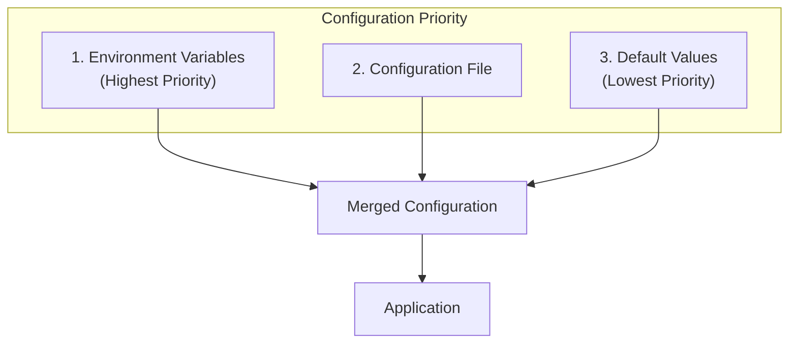
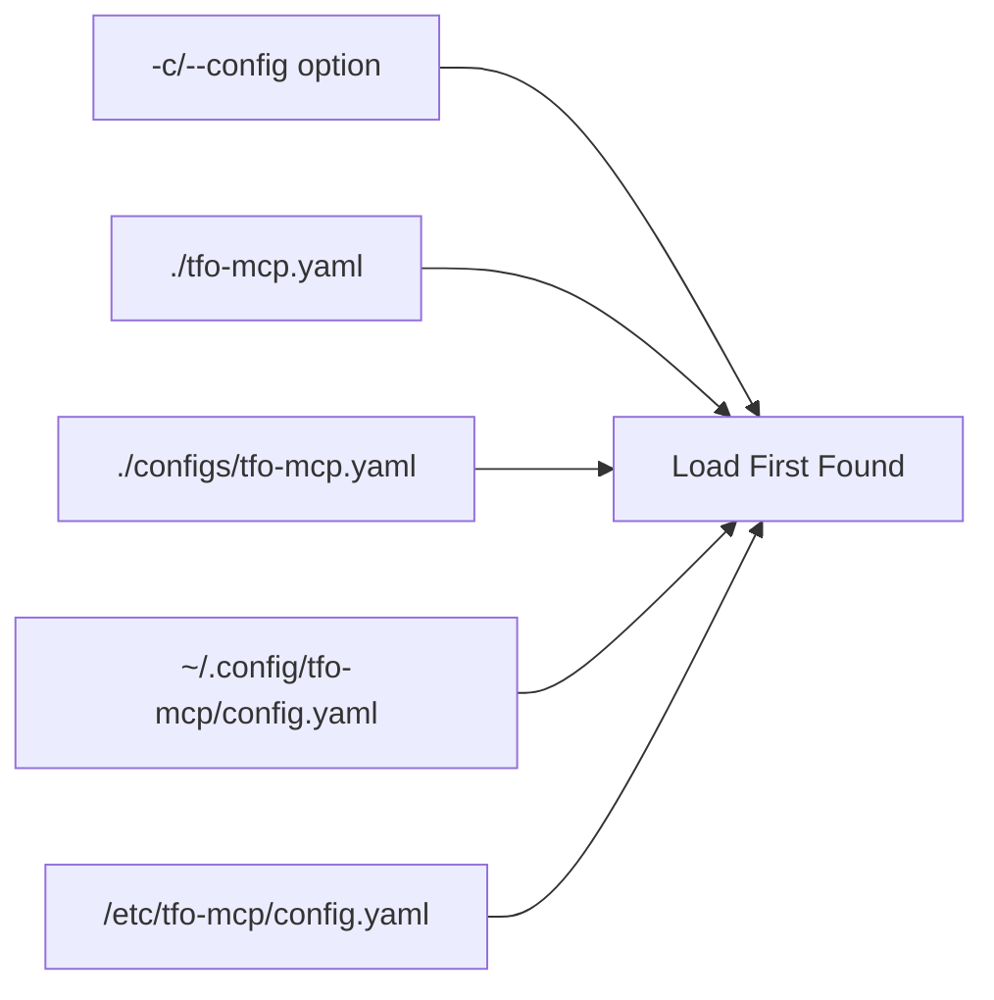
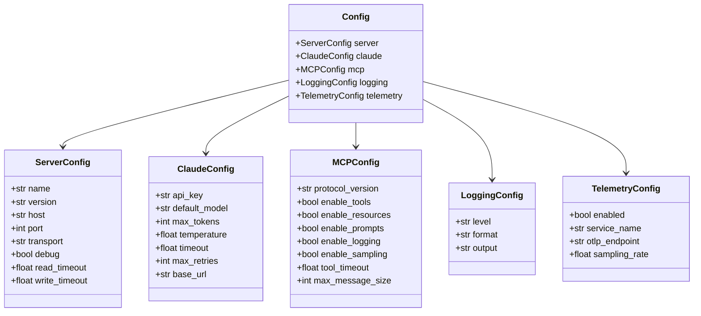
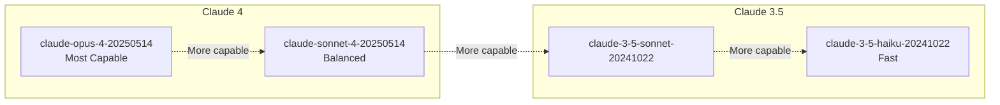
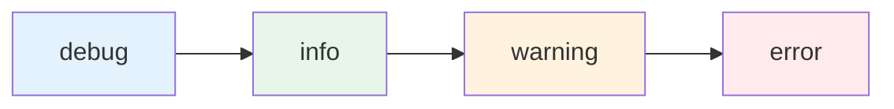

# TelemetryFlow Python MCP Server - Configuration Guide

This document describes all configuration options for the TelemetryFlow Python MCP Server.

## Configuration Sources



Configuration is loaded from multiple sources with the following priority (highest first):

1. **Environment Variables** - Prefix: `TELEMETRYFLOW_MCP_`
2. **Configuration File** - YAML format
3. **Default Values** - Built-in defaults

## Configuration File Locations



The server searches for configuration files in this order:

1. Path specified via `-c/--config` CLI option
2. `./tfo-mcp.yaml` (current directory)
3. `./configs/tfo-mcp.yaml`
4. `~/.config/tfo-mcp/config.yaml`
5. `/etc/tfo-mcp/config.yaml`

## Configuration Structure



## Server Configuration

```yaml
server:
  name: "TelemetryFlow-MCP" # Server name
  version: "1.1.2" # Server version
  host: "localhost" # Host (for future HTTP transports)
  port: 8080 # Port (for future HTTP transports)
  transport: "stdio" # Transport type: stdio, sse, websocket
  debug: false # Debug mode
  read_timeout: 300.0 # Read timeout in seconds
  write_timeout: 60.0 # Write timeout in seconds
```

| Option        | Environment Variable                     | Default           | Description       |
| ------------- | ---------------------------------------- | ----------------- | ----------------- |
| name          | `TELEMETRYFLOW_MCP_SERVER_NAME`          | TelemetryFlow-MCP | Server name       |
| version       | `TELEMETRYFLOW_MCP_SERVER_VERSION`       | 1.1.2             | Server version    |
| host          | `TELEMETRYFLOW_MCP_SERVER_HOST`          | localhost         | Server host       |
| port          | `TELEMETRYFLOW_MCP_SERVER_PORT`          | 8080              | Server port       |
| transport     | `TELEMETRYFLOW_MCP_SERVER_TRANSPORT`     | stdio             | Transport type    |
| debug         | `TELEMETRYFLOW_MCP_SERVER_DEBUG`         | false             | Debug mode        |
| read_timeout  | `TELEMETRYFLOW_MCP_SERVER_READ_TIMEOUT`  | 300.0             | Read timeout (s)  |
| write_timeout | `TELEMETRYFLOW_MCP_SERVER_WRITE_TIMEOUT` | 60.0              | Write timeout (s) |

## Claude Configuration

```yaml
claude:
  api_key: "" # Anthropic API key
  default_model: "claude-sonnet-4-20250514" # Default model
  max_tokens: 4096 # Max tokens per request
  temperature: 1.0 # Temperature (0.0-2.0)
  timeout: 120.0 # Request timeout in seconds
  max_retries: 3 # Max retry attempts
  base_url: null # Custom base URL (optional)
```

| Option        | Environment Variable                     | Default                  | Description                  |
| ------------- | ---------------------------------------- | ------------------------ | ---------------------------- |
| api_key       | `ANTHROPIC_API_KEY`                      | -                        | Anthropic API key (required) |
| default_model | `TELEMETRYFLOW_MCP_CLAUDE_DEFAULT_MODEL` | claude-sonnet-4-20250514 | Default Claude model         |
| max_tokens    | `TELEMETRYFLOW_MCP_CLAUDE_MAX_TOKENS`    | 4096                     | Maximum tokens               |
| temperature   | `TELEMETRYFLOW_MCP_CLAUDE_TEMPERATURE`   | 1.0                      | Temperature                  |
| timeout       | `TELEMETRYFLOW_MCP_CLAUDE_TIMEOUT`       | 120.0                    | Timeout (seconds)            |
| max_retries   | `TELEMETRYFLOW_MCP_CLAUDE_MAX_RETRIES`   | 3                        | Max retries                  |
| base_url      | `TELEMETRYFLOW_MCP_CLAUDE_BASE_URL`      | null                     | Custom base URL              |

### Available Models



| Model ID                   | Description                  |
| -------------------------- | ---------------------------- |
| claude-opus-4-20250514     | Claude 4 Opus - Most capable |
| claude-sonnet-4-20250514   | Claude 4 Sonnet - Balanced   |
| claude-3-5-sonnet-20241022 | Claude 3.5 Sonnet            |
| claude-3-5-haiku-20241022  | Claude 3.5 Haiku - Fast      |

## MCP Configuration

```yaml
mcp:
  protocol_version: "2024-11-05" # MCP protocol version
  enable_tools: true # Enable tools capability
  enable_resources: true # Enable resources capability
  enable_prompts: true # Enable prompts capability
  enable_logging: true # Enable logging capability
  enable_sampling: false # Enable sampling capability
  tool_timeout: 30.0 # Tool execution timeout (seconds)
  max_message_size: 10485760 # Max message size (10MB)
```

| Option           | Environment Variable                     | Default    | Description      |
| ---------------- | ---------------------------------------- | ---------- | ---------------- |
| protocol_version | `TELEMETRYFLOW_MCP_MCP_PROTOCOL_VERSION` | 2024-11-05 | Protocol version |
| enable_tools     | `TELEMETRYFLOW_MCP_MCP_ENABLE_TOOLS`     | true       | Enable tools     |
| enable_resources | `TELEMETRYFLOW_MCP_MCP_ENABLE_RESOURCES` | true       | Enable resources |
| enable_prompts   | `TELEMETRYFLOW_MCP_MCP_ENABLE_PROMPTS`   | true       | Enable prompts   |
| enable_logging   | `TELEMETRYFLOW_MCP_MCP_ENABLE_LOGGING`   | true       | Enable logging   |
| enable_sampling  | `TELEMETRYFLOW_MCP_MCP_ENABLE_SAMPLING`  | false      | Enable sampling  |
| tool_timeout     | `TELEMETRYFLOW_MCP_MCP_TOOL_TIMEOUT`     | 30.0       | Tool timeout (s) |
| max_message_size | `TELEMETRYFLOW_MCP_MCP_MAX_MESSAGE_SIZE` | 10485760   | Max message size |

## Logging Configuration

```yaml
logging:
  level: "info" # Log level
  format: "json" # Log format
  output: "stderr" # Log output
```

| Option | Environment Variable           | Default | Description |
| ------ | ------------------------------ | ------- | ----------- |
| level  | `TELEMETRYFLOW_MCP_LOG_LEVEL`  | info    | Log level   |
| format | `TELEMETRYFLOW_MCP_LOG_FORMAT` | json    | Log format  |
| output | `TELEMETRYFLOW_MCP_LOG_OUTPUT` | stderr  | Log output  |

### Log Levels



- `debug` - Detailed debugging information
- `info` - General operational information
- `warning` - Warning messages
- `error` - Error messages only

### Log Formats

- `json` - Structured JSON logs (recommended for production)
- `text` - Human-readable console output (recommended for development)

### Log Output

- `stderr` - Standard error (default)
- `stdout` - Standard output
- `/path/to/file.log` - File path

## Telemetry Configuration

```yaml
telemetry:
  enabled: false # Enable telemetry
  service_name: "telemetryflow-mcp" # Service name
  otlp_endpoint: "localhost:4317" # OTLP endpoint
  sampling_rate: 1.0 # Sampling rate (0.0-1.0)
```

| Option        | Environment Variable                        | Default           | Description      |
| ------------- | ------------------------------------------- | ----------------- | ---------------- |
| enabled       | `TELEMETRYFLOW_MCP_TELEMETRY_ENABLED`       | false             | Enable telemetry |
| service_name  | `TELEMETRYFLOW_MCP_TELEMETRY_SERVICE_NAME`  | telemetryflow-mcp | Service name     |
| otlp_endpoint | `TELEMETRYFLOW_MCP_TELEMETRY_OTLP_ENDPOINT` | localhost:4317    | OTLP endpoint    |
| sampling_rate | `TELEMETRYFLOW_MCP_TELEMETRY_SAMPLING_RATE` | 1.0               | Sampling rate    |

## Example Configurations

### Development

```yaml
server:
  name: "TelemetryFlow-MCP-Dev"
  debug: true

claude:
  default_model: "claude-3-5-haiku-20241022"
  max_tokens: 2048

logging:
  level: "debug"
  format: "text"
```

### Production

```yaml
server:
  name: "TelemetryFlow-MCP"
  debug: false

claude:
  default_model: "claude-sonnet-4-20250514"
  max_tokens: 4096
  max_retries: 5

mcp:
  tool_timeout: 60.0

logging:
  level: "info"
  format: "json"

telemetry:
  enabled: true
  otlp_endpoint: "otel-collector:4317"
```

### Minimal (Environment Variables Only)

```bash
export ANTHROPIC_API_KEY="sk-ant-..."
export TELEMETRYFLOW_MCP_LOG_LEVEL="info"
tfo-mcp serve
```

## Validation

Validate your configuration:

```bash
tfo-mcp validate -c /path/to/config.yaml
```

## Generate Default Configuration

Generate a default configuration file:

```bash
tfo-mcp init-config
```

This creates `tfo-mcp.yaml` in the current directory.
