# TelemetryFlow Python MCP Data Flow Diagrams

> Data Flow Diagrams for TelemetryFlow Python MCP Server

---

## Table of Contents

- [Overview](#overview)
- [Level 0 - Context Diagram](#level-0---context-diagram)
- [Level 1 - System Overview](#level-1---system-overview)
- [Level 2 - Request Processing](#level-2---request-processing)
- [Level 2 - Tool Execution](#level-2---tool-execution)
- [Level 2 - Claude Conversation](#level-2---claude-conversation)
- [State Diagrams](#state-diagrams)
- [Sequence Diagrams](#sequence-diagrams)

---

## Overview

This document provides Data Flow Diagrams (DFD), State Diagrams, and Sequence Diagrams that describe how data moves through the TelemetryFlow Python MCP Server system.

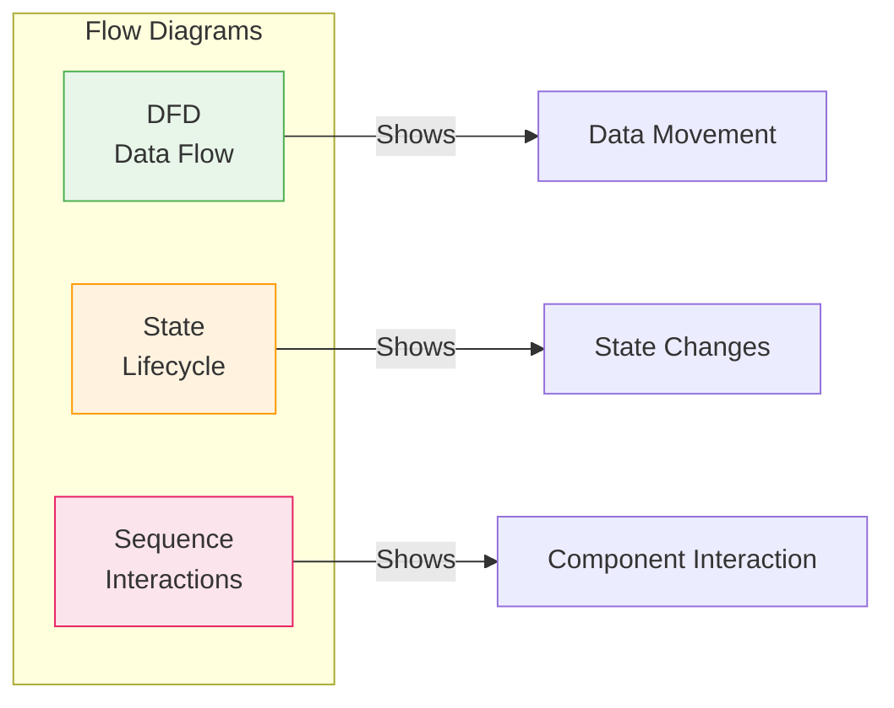

---

## Level 0 - Context Diagram

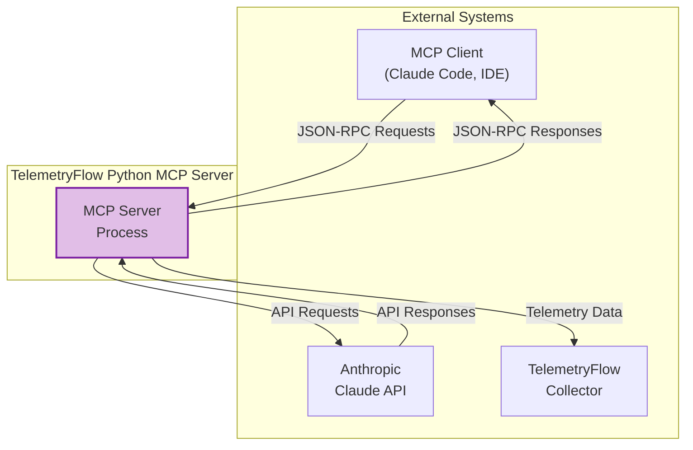

---

## Level 1 - System Overview

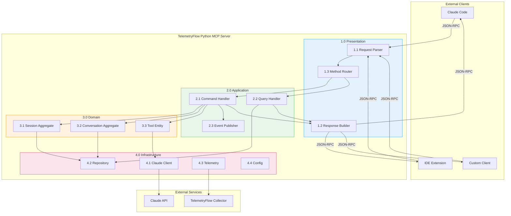

---

## Level 2 - Request Processing

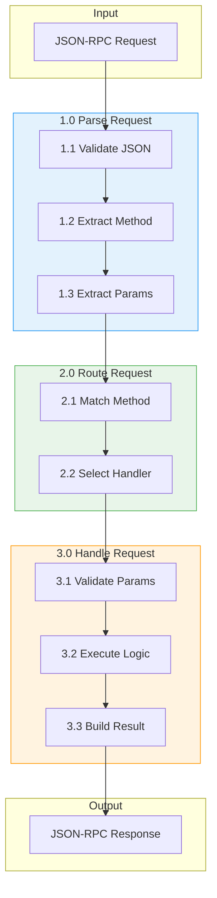

---

## Level 2 - Tool Execution

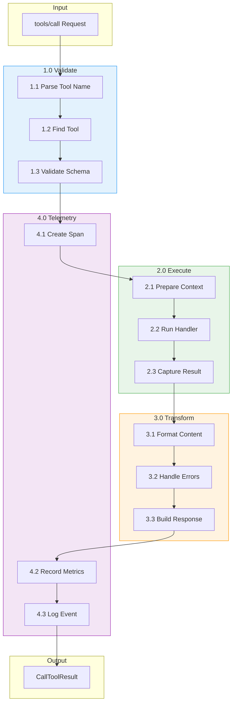

---

## Level 2 - Claude Conversation

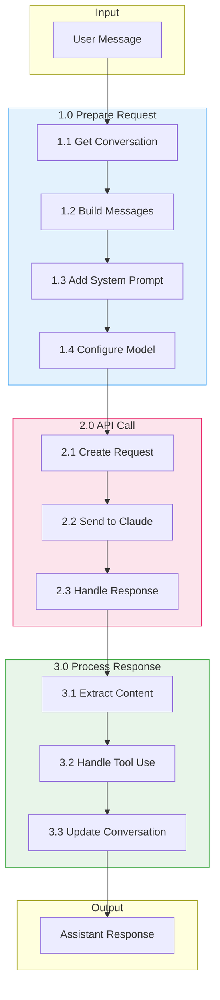

---

## Level 2 - Telemetry Flow

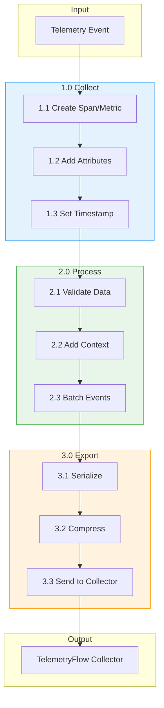

---

## State Diagrams

### Session State Machine

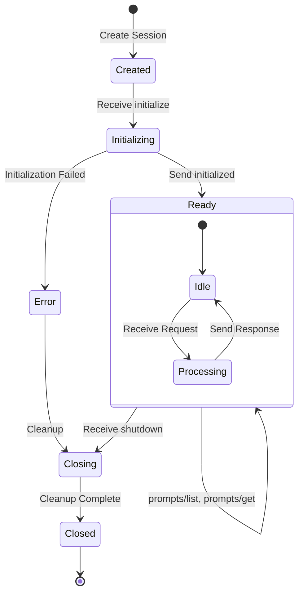

### Conversation State Machine

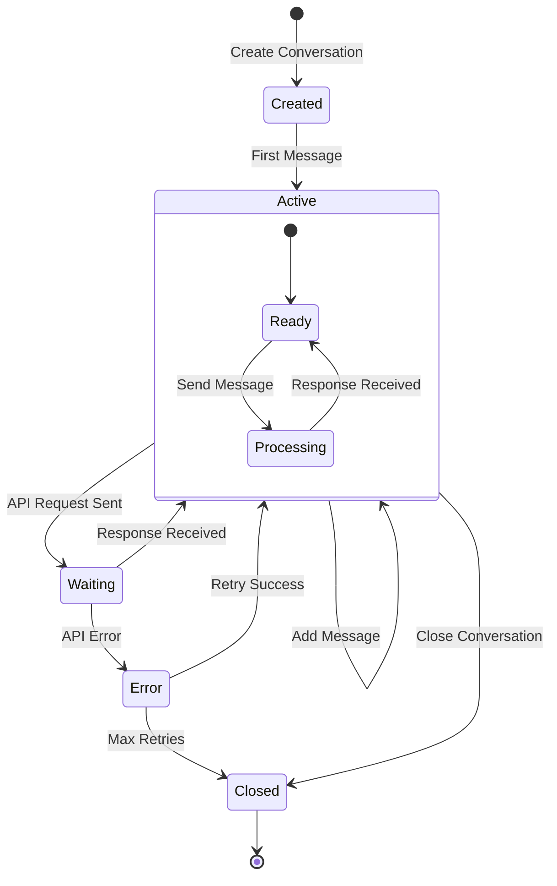

### Tool Execution State Machine

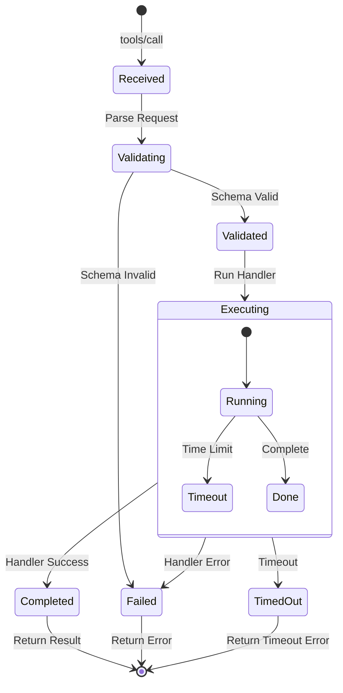

### Telemetry Client State Machine

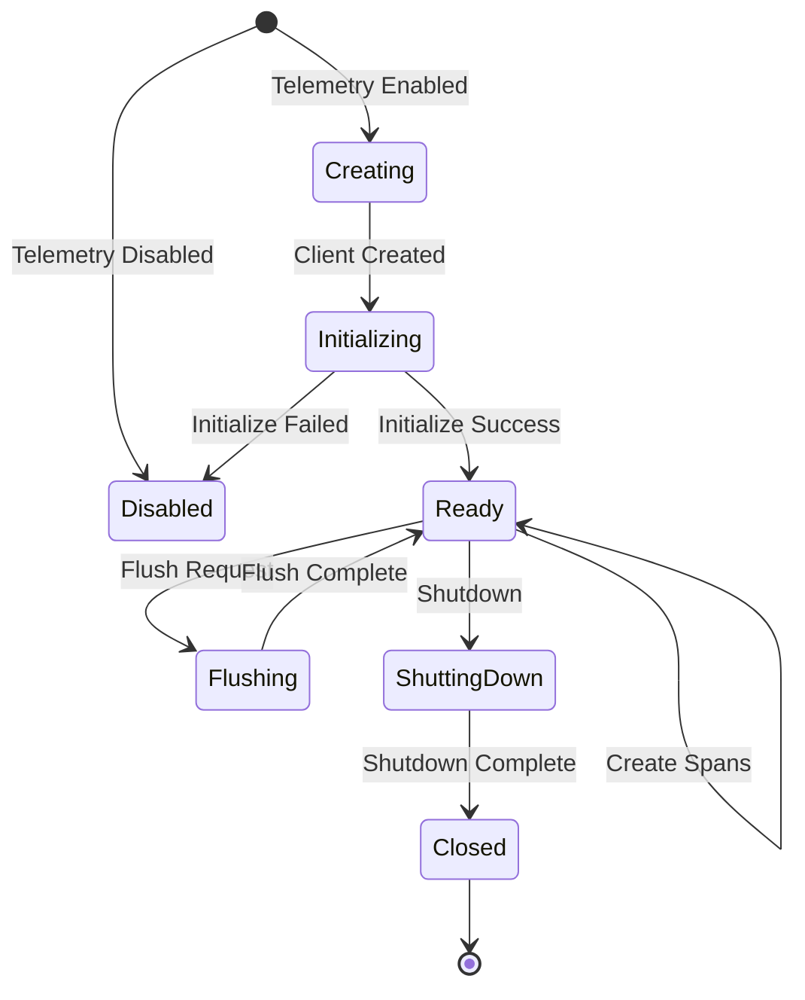

---

## Sequence Diagrams

### Complete MCP Session Flow

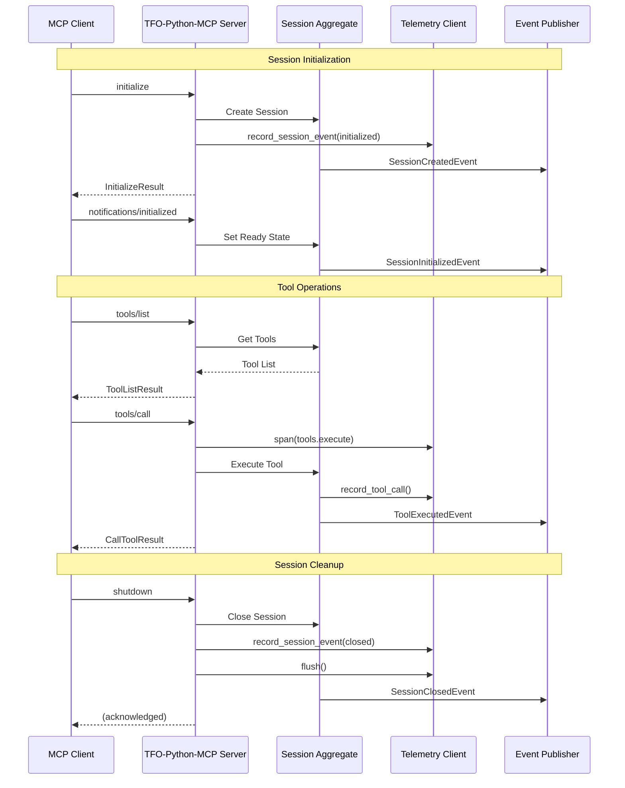

### Claude API Integration Flow

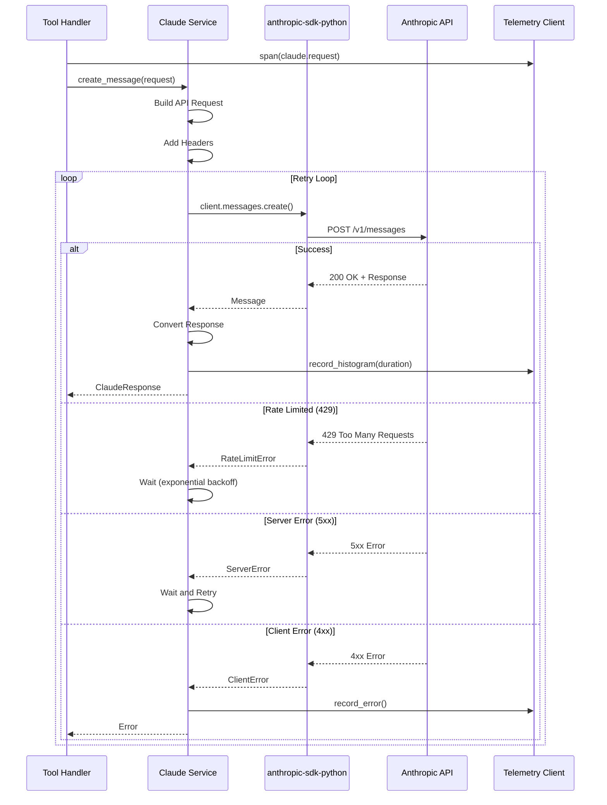

### Telemetry Recording Flow

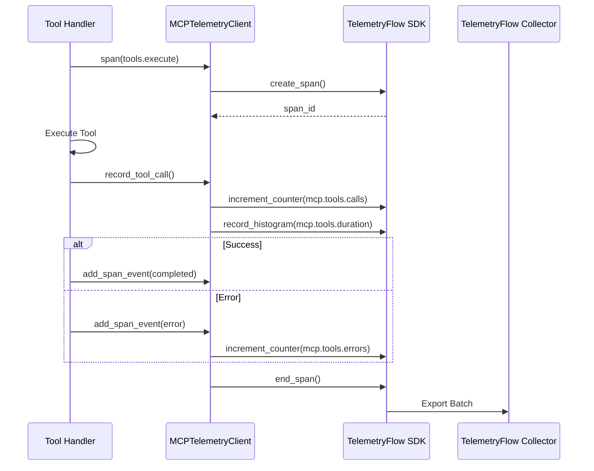

### Error Handling Flow

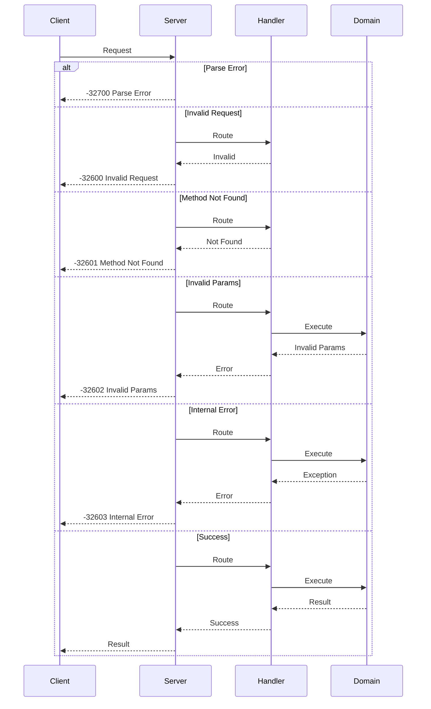

---

## Related Documentation

- [Entity Relationship Diagrams](ERD.md)
- [Architecture Guide](ARCHITECTURE.md)
- [Development Guide](DEVELOPMENT.md)

---

**[Back to Documentation Index](README.md)**

