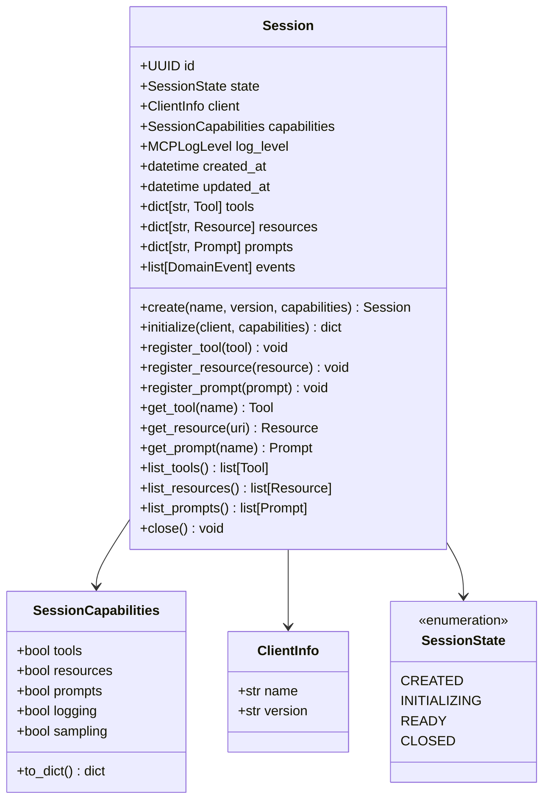

# TFO-Python-MCP Entity Relationship Diagrams

> Entity Relationship Diagrams for TelemetryFlow Python MCP Server

---

## Table of Contents

- [Overview](#overview)
- [Complete Domain ERD](#complete-domain-erd)
- [Session Aggregate ERD](#session-aggregate-erd)
- [Conversation Aggregate ERD](#conversation-aggregate-erd)
- [Value Objects ERD](#value-objects-erd)
- [Domain Model Classes](#domain-model-classes)

---

## Overview

This document provides Entity Relationship Diagrams that describe the data structures and relationships within the TFO-Python-MCP Server.


---

## Complete Domain ERD


---

## Session Aggregate ERD


---

## Conversation Aggregate ERD


---

## Value Objects ERD


---

## Domain Model Classes

### Session Domain Classes



### Tool Domain Classes


### Resource Domain Classes


### Prompt Domain Classes


### Event Domain Classes


### Telemetry Classes


---

## Python Type Annotations

### Core Types

```python
from typing import Protocol, TypeVar, Generic
from uuid import UUID
from datetime import datetime
from enum import Enum

# Session types
SessionID = UUID
ConversationID = UUID
MessageID = UUID

# Content types
class ContentType(str, Enum):
    TEXT = "text"
    IMAGE = "image"
    RESOURCE = "resource"

class Role(str, Enum):
    USER = "user"
    ASSISTANT = "assistant"

# MCP types
class MCPMethod(str, Enum):
    INITIALIZE = "initialize"
    INITIALIZED = "notifications/initialized"
    TOOLS_LIST = "tools/list"
    TOOLS_CALL = "tools/call"
    RESOURCES_LIST = "resources/list"
    RESOURCES_READ = "resources/read"
    PROMPTS_LIST = "prompts/list"
    PROMPTS_GET = "prompts/get"
    LOGGING_SET_LEVEL = "logging/setLevel"
    SHUTDOWN = "shutdown"

class MCPErrorCode(int, Enum):
    PARSE_ERROR = -32700
    INVALID_REQUEST = -32600
    METHOD_NOT_FOUND = -32601
    INVALID_PARAMS = -32602
    INTERNAL_ERROR = -32603
```

---

## Related Documentation

- [Data Flow Diagrams](DFD.md)
- [Architecture Guide](ARCHITECTURE.md)
- [Development Guide](DEVELOPMENT.md)

---

<div align="center">

**[Back to Documentation Index](README.md)**

</div>
