# TFO-Python-MCP Git Workflow

> Git workflow and branching strategy for TelemetryFlow Python MCP Server

---

## Table of Contents

- [Overview](#overview)
- [Branching Strategy](#branching-strategy)
- [Branch Types](#branch-types)
- [Workflow Diagrams](#workflow-diagrams)
- [Commit Guidelines](#commit-guidelines)
- [Pull Request Process](#pull-request-process)
- [Release Process](#release-process)
- [Hotfix Process](#hotfix-process)
- [Best Practices](#best-practices)

---

## Overview

TFO-Python-MCP follows a Git Flow-inspired branching strategy optimized for continuous delivery.

### Workflow Philosophy

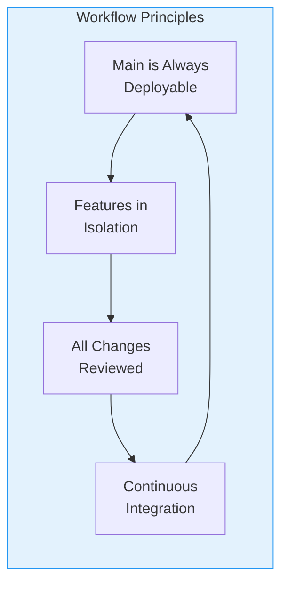

---

## Branching Strategy

### Branch Hierarchy

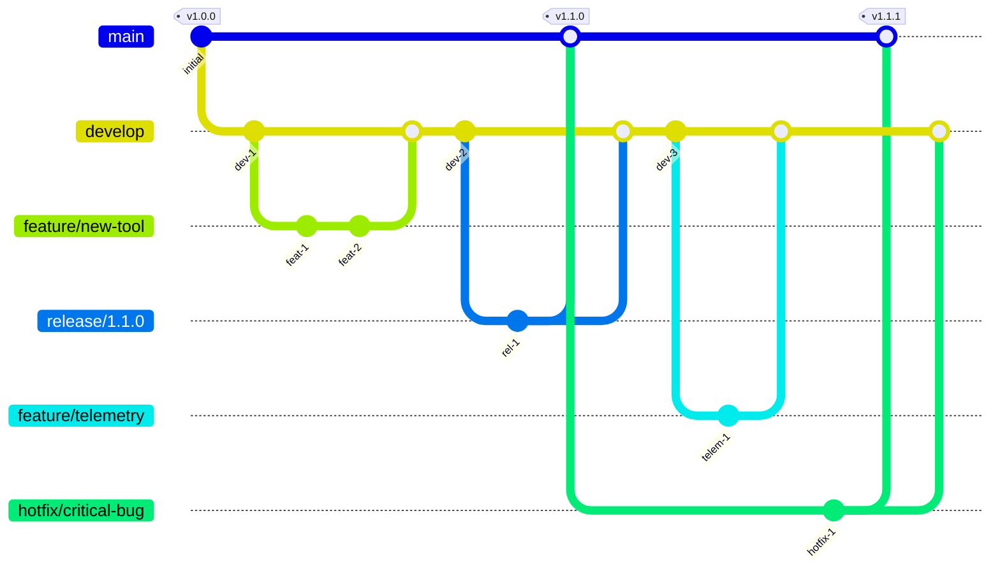

### Branch Overview

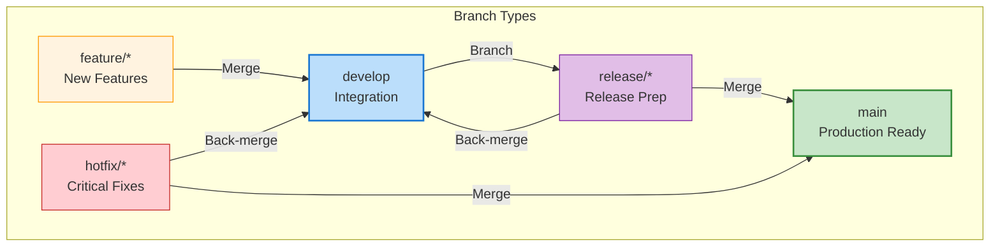

---

## Branch Types

### Main Branch

**Rules:**
- Always deployable
- Protected - no direct commits
- Requires PR with approval
- All commits tagged with version

### Develop Branch

**Rules:**
- Integration branch for features
- CI runs on every push
- Base for feature branches

### Feature Branches

**Naming Convention:**
```
feature/<ticket-id>-<short-description>
feature/add-search-tool
feature/TFO-123-telemetry-integration
feature/improve-error-handling
```

**Rules:**
- Branch from `develop`
- Merge back to `develop`
- Delete after merge

### Release Branches

**Naming Convention:**
```
release/<version>
release/1.1.0
release/1.2.0-rc1
```

**Rules:**
- Branch from `develop`
- Only bug fixes allowed
- Merge to `main` and back to `develop`
- Create version tag on merge

### Hotfix Branches

**Naming Convention:**
```
hotfix/<version>-<description>
hotfix/1.1.1-session-timeout
hotfix/1.1.2-api-auth-fix
```

**Rules:**
- Branch from `main`
- Critical fixes only
- Merge to `main` and `develop`
- Increment patch version

---

## Workflow Diagrams

### Feature Development Flow

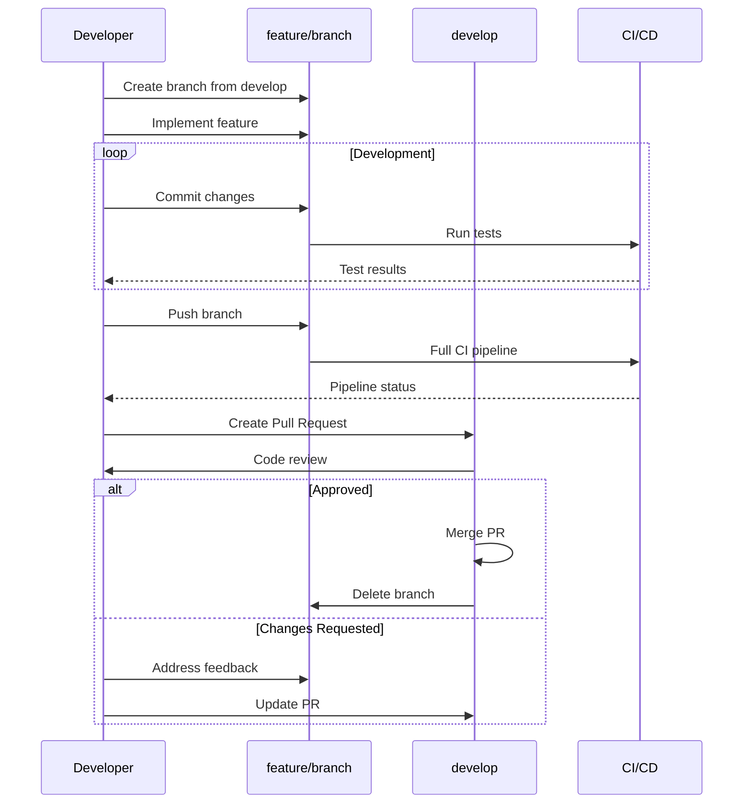

### Release Flow

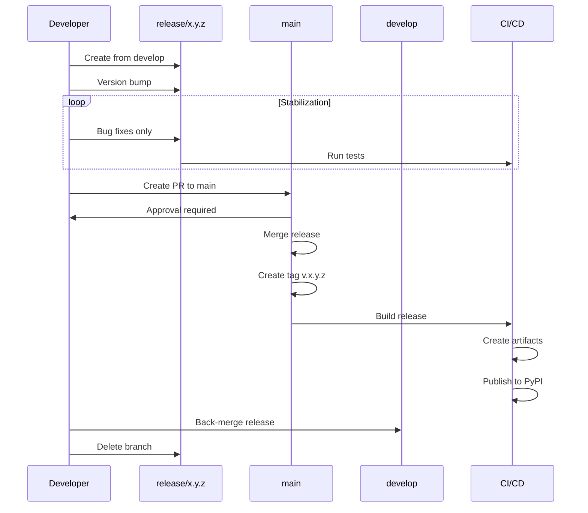

---

## Commit Guidelines

### Conventional Commits

**Format:**
```
<type>(<scope>): <description>

[optional body]

[optional footer(s)]
```

### Commit Types

| Type | Description | Example |
|------|-------------|---------|
| `feat` | New feature | `feat(tools): add file search tool` |
| `fix` | Bug fix | `fix(session): handle timeout correctly` |
| `docs` | Documentation | `docs: update API reference` |
| `style` | Formatting | `style: fix indentation` |
| `refactor` | Code restructuring | `refactor(handlers): simplify error handling` |
| `test` | Tests | `test: add session handler tests` |
| `chore` | Maintenance | `chore: update dependencies` |
| `perf` | Performance | `perf(claude): optimize token counting` |
| `ci` | CI/CD | `ci: add release workflow` |
| `build` | Build system | `build: update Dockerfile` |
| `revert` | Revert commit | `revert: feat(tools): add file search tool` |

### Commit Message Examples

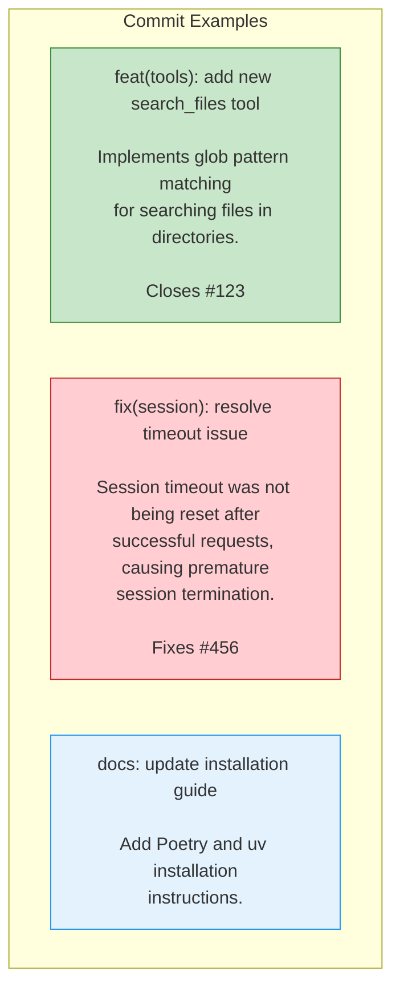

---

## Pull Request Process

### PR Workflow

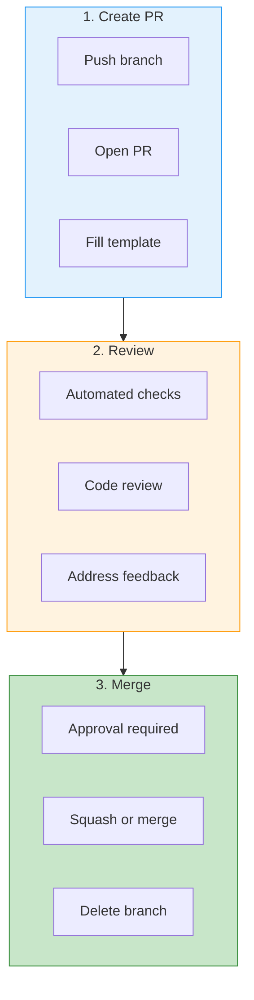

### PR Checklist

- [ ] Tests pass (`make test`)
- [ ] Linting passes (`make lint`)
- [ ] Formatting correct (`make fmt`)
- [ ] Documentation updated
- [ ] Changelog updated (if applicable)
- [ ] No merge conflicts
- [ ] Reviewed by peer

### PR Template

```markdown
## Description
Brief description of changes.

## Type of Change
- [ ] Bug fix
- [ ] New feature
- [ ] Breaking change
- [ ] Documentation update

## Related Issues
Fixes #(issue number)

## Testing
- [ ] Unit tests added
- [ ] Integration tests added
- [ ] Manual testing performed

## Checklist
- [ ] My code follows the style guidelines
- [ ] I have performed a self-review
- [ ] I have commented hard-to-understand code
- [ ] I have updated the documentation
- [ ] My changes generate no new warnings
- [ ] I have added tests proving my fix/feature works
- [ ] All tests pass locally
```

---

## Release Process

### Version Numbering

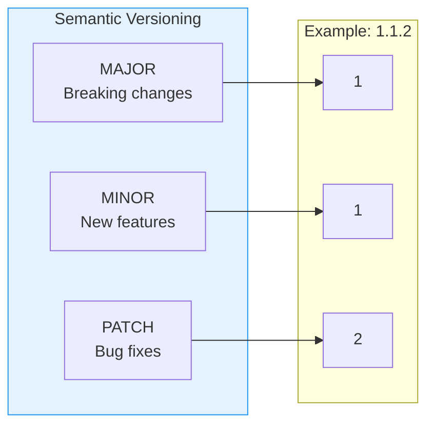

### Release Steps

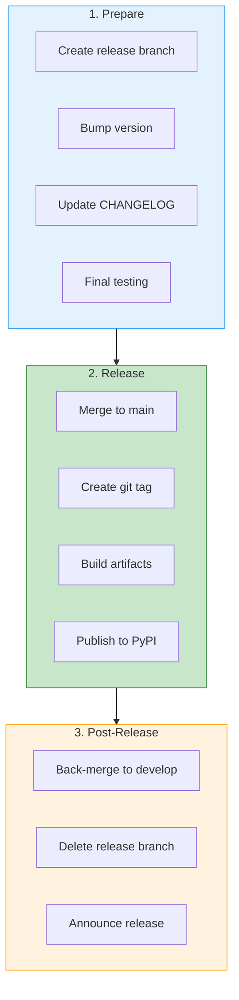

### Release Commands

```bash
# Create release branch
git checkout develop
git pull origin develop
git checkout -b release/1.2.0

# Bump version in pyproject.toml
# Update CHANGELOG.md
# Commit changes
git commit -m "chore(release): prepare v1.2.0"

# Merge to main
git checkout main
git pull origin main
git merge --no-ff release/1.2.0
git tag -a v1.2.0 -m "Release v1.2.0"
git push origin main --tags

# Build and publish
poetry build
poetry publish

# Back-merge to develop
git checkout develop
git merge --no-ff release/1.2.0
git push origin develop

# Delete release branch
git branch -d release/1.2.0
git push origin --delete release/1.2.0
```

---

## Hotfix Process

### Hotfix Steps

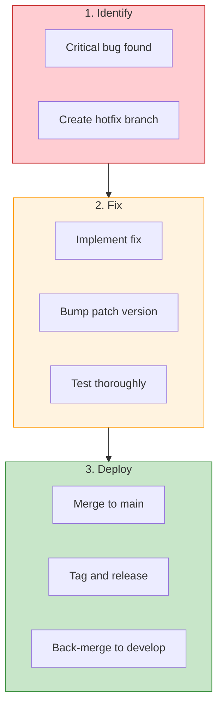

### Hotfix Commands

```bash
# Create hotfix from main
git checkout main
git pull origin main
git checkout -b hotfix/1.1.3-critical-bug

# Fix the bug
# Bump version in pyproject.toml
git commit -m "fix(critical): resolve production issue"

# Merge to main
git checkout main
git merge --no-ff hotfix/1.1.3-critical-bug
git tag -a v1.1.3 -m "Hotfix v1.1.3"
git push origin main --tags

# Publish to PyPI
poetry build
poetry publish

# Back-merge to develop
git checkout develop
git merge --no-ff hotfix/1.1.3-critical-bug
git push origin develop

# Delete hotfix branch
git branch -d hotfix/1.1.3-critical-bug
```

---

## Best Practices

### Do's and Don'ts

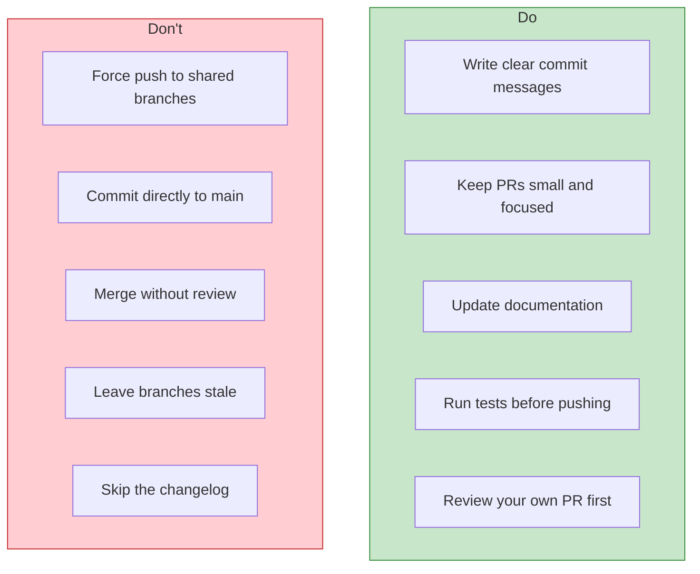

### Branch Hygiene

```bash
# List merged branches
git branch --merged

# Delete merged local branches
git branch --merged | grep -v '\*\|main\|develop' | xargs -n 1 git branch -d

# Delete remote tracking branches
git fetch --prune

# Find stale branches
git for-each-ref --sort=committerdate refs/heads/ --format='%(committerdate:short) %(refname:short)'
```

### Useful Git Aliases

```bash
# Add to ~/.gitconfig
[alias]
    co = checkout
    br = branch
    ci = commit
    st = status
    lg = log --oneline --graph --decorate
    last = log -1 HEAD
    unstage = reset HEAD --
    amend = commit --amend
    pf = push --force-with-lease
    sync = !git fetch origin && git rebase origin/develop
```

---

## Related Documentation

- [Git Hooks](githooks/README.md)
- [Contributing Guide](../CONTRIBUTING.md)
- [Development Guide](DEVELOPMENT.md)

---

<div align="center">

**[Back to Documentation Index](README.md)**

</div>
