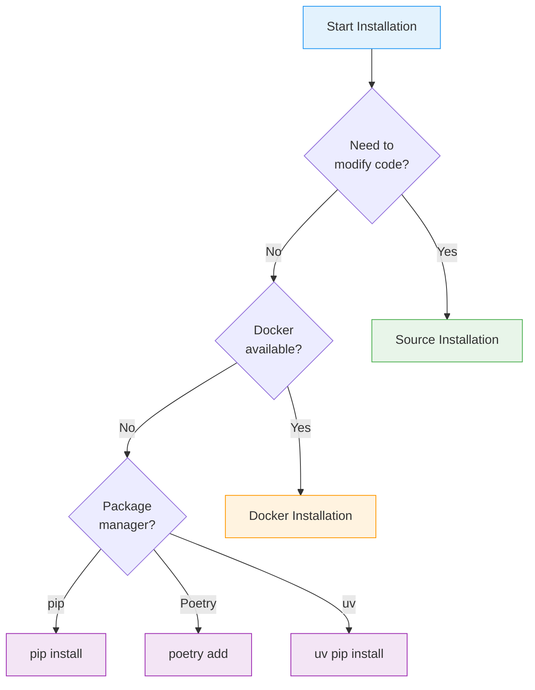
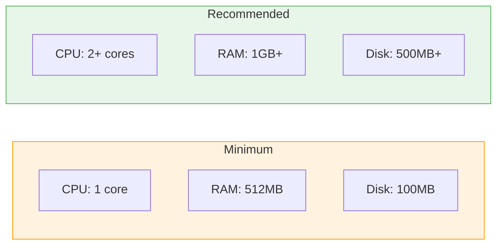
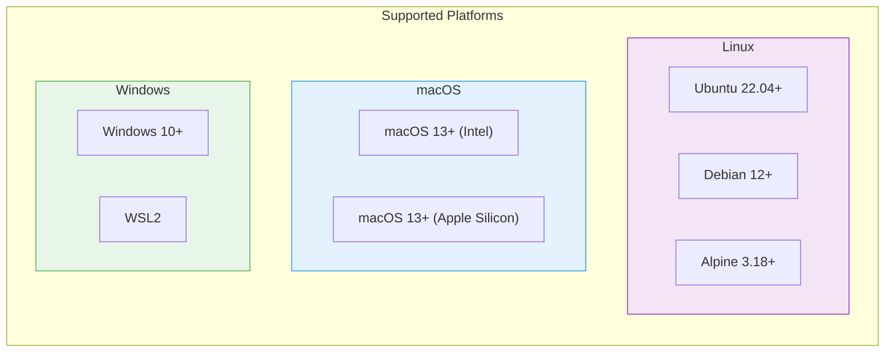
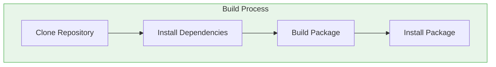
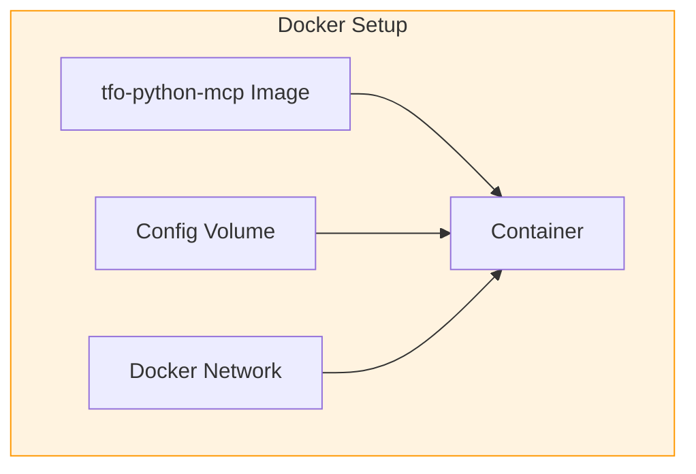
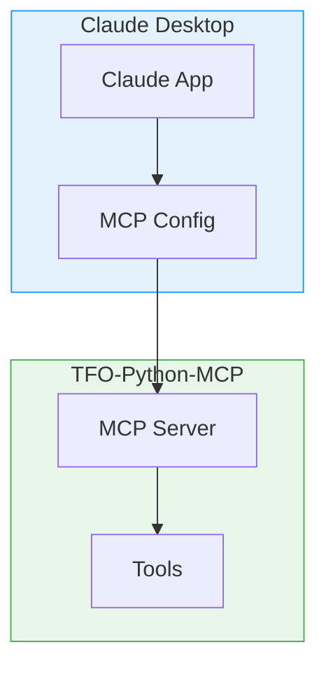
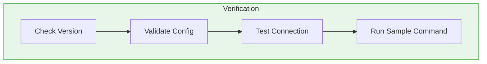
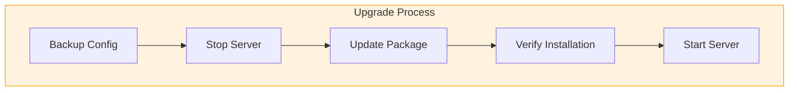

# TFO-Python-MCP Installation Guide

> Complete installation guide for TelemetryFlow Python MCP Server

---

## Table of Contents

- [Overview](#overview)
- [System Requirements](#system-requirements)
- [Installation Methods](#installation-methods)
- [pip Installation](#pip-installation)
- [Poetry Installation](#poetry-installation)
- [Source Installation](#source-installation)
- [Docker Installation](#docker-installation)
- [IDE Integration](#ide-integration)
- [Verification](#verification)
- [Upgrading](#upgrading)
- [Uninstallation](#uninstallation)

---

## Overview

TFO-Python-MCP can be installed through multiple methods depending on your needs and environment.

### Installation Decision Tree



---

## System Requirements

### Hardware Requirements



### Software Requirements

| Component         | Minimum Version | Notes                        |
| ----------------- | --------------- | ---------------------------- |
| Python            | 3.11+           | 3.12 recommended             |
| pip               | 23.0+           | Package manager              |
| Poetry (optional) | 1.7+            | For development              |
| Docker (optional) | 20.10+          | For containerized deployment |
| Git (optional)    | 2.0+            | For source installation      |

### Supported Platforms



---

## Installation Methods

### Method Comparison

| Method | Difficulty | Use Case                   | Auto-Update                |
| ------ | ---------- | -------------------------- | -------------------------- |
| pip    | Easy       | Quick setup, production    | `pip install --upgrade`    |
| Poetry | Easy       | Development                | `poetry update`            |
| uv     | Easy       | Fast installation          | `uv pip install --upgrade` |
| Source | Medium     | Development, customization | `git pull`                 |
| Docker | Easy       | Containerized environments | Image pull                 |

---

## pip Installation

### Basic Installation

```bash
# Install base package
pip install tfo-mcp

# Install with all optional dependencies
pip install tfo-mcp[full]

# Install with telemetry support only
pip install tfo-mcp[telemetry]

# Install with Claude API support
pip install tfo-mcp[claude]

# Install development dependencies
pip install tfo-mcp[dev]
```

### Installation Options

| Extra         | Dependencies      | Use Case                     |
| ------------- | ----------------- | ---------------------------- |
| `[full]`      | All optional      | Production with all features |
| `[telemetry]` | TelemetryFlow SDK | Observability integration    |
| `[claude]`    | Anthropic SDK     | Claude AI conversations      |
| `[dev]`       | Testing, linting  | Development                  |

### Virtual Environment (Recommended)

```bash
# Create virtual environment
python -m venv .venv

# Activate (macOS/Linux)
source .venv/bin/activate

# Activate (Windows)
.venv\Scripts\activate

# Install package
pip install tfo-mcp[full]

# Verify installation
python -m tfo_mcp info
```

---

## Poetry Installation

### Install with Poetry

```bash
# Add to project
poetry add tfo-mcp

# Add with extras
poetry add tfo-mcp[full]

# Add as dev dependency
poetry add --group dev tfo-mcp[dev]
```

### New Project Setup

```bash
# Create new project
poetry new my-mcp-project
cd my-mcp-project

# Add tfo-mcp
poetry add tfo-mcp[full]

# Activate shell
poetry shell

# Verify
python -m tfo_mcp info
```

---

## Source Installation

### Build from Source



### Step-by-Step

```bash
# 1. Clone repository
git clone https://github.com/devopscorner/telemetryflow-python-mcp.git
cd telemetryflow-python-mcp

# 2. Install Poetry (if not installed)
curl -sSL https://install.python-poetry.org | python3 -

# 3. Install dependencies
poetry install --all-extras

# 4. Activate environment
poetry shell

# 5. Verify installation
python -m tfo_mcp info
```

### Development Setup

```bash
# Install with all dev dependencies
poetry install --all-extras

# Install pre-commit hooks
pre-commit install

# Run tests to verify
make test

# Run linting
make lint
```

### Using uv (Fast Alternative)

```bash
# Install uv
curl -LsSf https://astral.sh/uv/install.sh | sh

# Create virtual environment
uv venv

# Activate
source .venv/bin/activate

# Install dependencies
uv pip install -e ".[full,dev]"

# Verify
python -m tfo_mcp info
```

---

## Docker Installation

### Docker Architecture



### Pull Docker Image

```bash
# Pull latest image
docker pull devopscorner/tfo-python-mcp:latest

# Pull specific version
docker pull devopscorner/tfo-python-mcp:1.1.2

# Verify image
docker images devopscorner/tfo-python-mcp
```

### Run Container

```bash
# Basic run
docker run -it --rm \
  -e ANTHROPIC_API_KEY="your-api-key" \
  devopscorner/tfo-python-mcp:latest

# With custom config
docker run -it --rm \
  -v $(pwd)/tfo-mcp.yaml:/app/tfo-mcp.yaml \
  -e ANTHROPIC_API_KEY="your-api-key" \
  devopscorner/tfo-python-mcp:latest \
  serve --config /app/tfo-mcp.yaml

# With volume for resources
docker run -it --rm \
  -v $(pwd)/tfo-mcp.yaml:/app/tfo-mcp.yaml \
  -v $(pwd)/resources:/app/resources \
  -e ANTHROPIC_API_KEY="your-api-key" \
  devopscorner/tfo-python-mcp:latest
```

### Docker Compose

```bash
# Start services
docker-compose up -d

# View logs
docker-compose logs -f tfo-mcp

# Stop all services
docker-compose down

# Stop and remove volumes
docker-compose down -v
```

### Build Custom Image

```bash
# Build image
docker build -t my-tfo-mcp:latest .

# Build with specific tag
docker build -t my-tfo-mcp:1.1.2 .

# Build multi-platform
docker buildx build \
  --platform linux/amd64,linux/arm64 \
  -t my-tfo-mcp:latest \
  --push .
```

---

## IDE Integration

### Claude Desktop Integration



### Configure Claude Desktop

**macOS** (`~/Library/Application Support/Claude/claude_desktop_config.json`):

```json
{
  "mcpServers": {
    "tfo-python-mcp": {
      "command": "python",
      "args": ["-m", "tfo_mcp", "serve"],
      "env": {
        "ANTHROPIC_API_KEY": "your-api-key"
      }
    }
  }
}
```

**With virtual environment:**

```json
{
  "mcpServers": {
    "tfo-python-mcp": {
      "command": "/path/to/.venv/bin/python",
      "args": ["-m", "tfo_mcp", "serve"],
      "env": {
        "ANTHROPIC_API_KEY": "your-api-key"
      }
    }
  }
}
```

**Windows** (`%APPDATA%\Claude\claude_desktop_config.json`):

```json
{
  "mcpServers": {
    "tfo-python-mcp": {
      "command": "python",
      "args": ["-m", "tfo_mcp", "serve"],
      "env": {
        "ANTHROPIC_API_KEY": "your-api-key"
      }
    }
  }
}
```

**Linux** (`~/.config/Claude/claude_desktop_config.json`):

```json
{
  "mcpServers": {
    "tfo-python-mcp": {
      "command": "python",
      "args": ["-m", "tfo_mcp", "serve"],
      "env": {
        "ANTHROPIC_API_KEY": "your-api-key"
      }
    }
  }
}
```

### VS Code Integration

```json
// .vscode/settings.json
{
  "mcp.servers": {
    "tfo-python-mcp": {
      "command": "python",
      "args": ["-m", "tfo_mcp", "serve", "--log-level", "debug"],
      "env": {
        "ANTHROPIC_API_KEY": "${env:ANTHROPIC_API_KEY}"
      }
    }
  }
}
```

---

## Verification

### Verification Steps



### Verify Installation

```bash
# 1. Check version
python -m tfo_mcp info

# Expected output:
# TFO-Python-MCP - TelemetryFlow Python MCP Server
# Version:    1.1.2
# Python:     3.11.x
# ...

# 2. Validate configuration
python -m tfo_mcp validate

# 3. Check help
python -m tfo_mcp --help

# 4. Test run (will fail without API key but shows it's working)
python -m tfo_mcp serve --help
```

### Test with API Key

```bash
# Set API key
export ANTHROPIC_API_KEY="sk-ant-api03-..."

# Run server
python -m tfo_mcp serve

# In another terminal, send test request
echo '{"jsonrpc":"2.0","id":1,"method":"initialize","params":{"protocolVersion":"2024-11-05","clientInfo":{"name":"test","version":"1.0.0"}}}' | python -m tfo_mcp serve
```

### Docker Verification

```bash
# Check image
docker images devopscorner/tfo-python-mcp

# Run version check
docker run --rm devopscorner/tfo-python-mcp:latest info

# Run validation
docker run --rm \
  -v $(pwd)/tfo-mcp.yaml:/app/tfo-mcp.yaml \
  devopscorner/tfo-python-mcp:latest validate
```

---

## Upgrading

### Upgrade Process



### pip Upgrade

```bash
# Upgrade to latest
pip install --upgrade tfo-mcp

# Upgrade with extras
pip install --upgrade tfo-mcp[full]

# Verify
python -m tfo_mcp info
```

### Poetry Upgrade

```bash
# Update package
poetry update tfo-mcp

# Verify
poetry show tfo-mcp
```

### Docker Upgrade

```bash
# Pull latest image
docker pull devopscorner/tfo-python-mcp:latest

# Restart container
docker-compose down
docker-compose up -d
```

### Source Upgrade

```bash
# Pull latest changes
cd telemetryflow-python-mcp
git fetch origin
git checkout main
git pull

# Update dependencies
poetry install --all-extras

# Verify
python -m tfo_mcp info
```

---

## Uninstallation

### Uninstall pip Package

```bash
# Uninstall package
pip uninstall tfo-mcp

# Remove configuration (optional)
rm -rf ~/.config/tfo-mcp
```

### Uninstall Poetry Package

```bash
# Remove from project
poetry remove tfo-mcp
```

### Uninstall Docker

```bash
# Stop and remove container
docker stop tfo-python-mcp
docker rm tfo-python-mcp

# Remove image
docker rmi devopscorner/tfo-python-mcp:latest

# Remove volumes (optional)
docker volume rm tfo-mcp-config
```

### Clean Source Installation

```bash
# Deactivate virtual environment
deactivate

# Remove project directory
rm -rf telemetryflow-python-mcp
```

---

## Troubleshooting Installation

### Common Issues

| Issue                      | Cause                    | Solution                          |
| -------------------------- | ------------------------ | --------------------------------- |
| ModuleNotFoundError        | Package not installed    | `pip install tfo-mcp`             |
| ImportError: telemetryflow | Missing optional dep     | `pip install tfo-mcp[telemetry]`  |
| API key error              | Missing/invalid key      | Set `ANTHROPIC_API_KEY`           |
| Permission denied          | Insufficient permissions | Use `sudo` or virtual environment |

### Getting Help

```bash
# View help
python -m tfo_mcp --help

# Validate configuration
python -m tfo_mcp validate --verbose

# Debug mode
python -m tfo_mcp serve --log-level debug
```

See [Troubleshooting Guide](TROUBLESHOOTING.md) for more detailed solutions.

---

## Related Documentation

- [Architecture Guide](ARCHITECTURE.md)
- [Configuration Guide](CONFIGURATION.md)
- [Commands Reference](COMMANDS.md)
- [Development Guide](DEVELOPMENT.md)
- [Troubleshooting Guide](TROUBLESHOOTING.md)

---

<div align="center">

**[Back to Documentation Index](README.md)**

</div>
