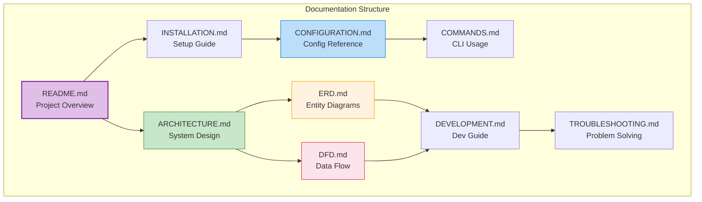

# TelemetryFlow Python MCP Server Documentation

- **Version:** 1.1.2
- **MCP Protocol:** 2024-11-05
- **Last Updated:** January 2025
- **Status:** Production Ready

---

## Documentation Index

| Document                                 | Description                                           |
| ---------------------------------------- | ----------------------------------------------------- |
| [ARCHITECTURE.md](ARCHITECTURE.md)       | System architecture, DDD patterns, component overview |
| [ERD.md](ERD.md)                         | Entity Relationship Diagrams, domain models           |
| [DFD.md](DFD.md)                         | Data Flow Diagrams, state machines, sequence diagrams |
| [CONFIGURATION.md](CONFIGURATION.md)     | Complete configuration reference                      |
| [COMMANDS.md](COMMANDS.md)               | CLI commands and MCP protocol usage                   |
| [DEVELOPMENT.md](DEVELOPMENT.md)         | Development guide, coding standards, testing          |
| [INSTALLATION.md](INSTALLATION.md)       | Installation and deployment guide                     |
| [TROUBLESHOOTING.md](TROUBLESHOOTING.md) | Common issues and solutions                           |
| [GIT-WORKFLOW.md](GIT-WORKFLOW.md)       | Git workflow and branching strategy                   |

---

## Quick Links

### Getting Started

- [Installation Guide](INSTALLATION.md)
- [Configuration Reference](CONFIGURATION.md)
- [CLI Commands](COMMANDS.md)

### Architecture

- [System Architecture](ARCHITECTURE.md#system-architecture)
- [DDD Patterns](ARCHITECTURE.md#domain-driven-design)
- [CQRS Implementation](ARCHITECTURE.md#cqrs-pattern)
- [MCP Protocol Flow](ARCHITECTURE.md#mcp-protocol-flow)

### Diagrams

- [Entity Relationship Diagrams](ERD.md)
- [Data Flow Diagrams](DFD.md)
- [State Machines](DFD.md#state-diagrams)
- [Sequence Diagrams](DFD.md#sequence-diagrams)

### Development

- [Development Setup](DEVELOPMENT.md#setup)
- [Coding Standards](DEVELOPMENT.md#coding-standards)
- [Testing Guide](DEVELOPMENT.md#testing)
- [Contributing](DEVELOPMENT.md#contributing)

---

## Component Overview

---

## Version History

| Version | Date         | Changes                                            |
| ------- | ------------ | -------------------------------------------------- |
| 1.1.2   | January 2025 | Initial release with TelemetryFlow SDK integration |

---

## Additional Resources

- **Main README**: [../README.md](../README.md)
- **GitHub Repository**: [devopscorner/telemetryflow-python-mcp](https://github.com/devopscorner/telemetryflow-python-mcp)
- **TelemetryFlow Python SDK**: [devopscorner/telemetryflow-python-sdk](https://github.com/devopscorner/telemetryflow-python-sdk)
- **MCP Specification**: [modelcontextprotocol.io](https://modelcontextprotocol.io)
- **Anthropic Claude API**: [docs.anthropic.com](https://docs.anthropic.com)
