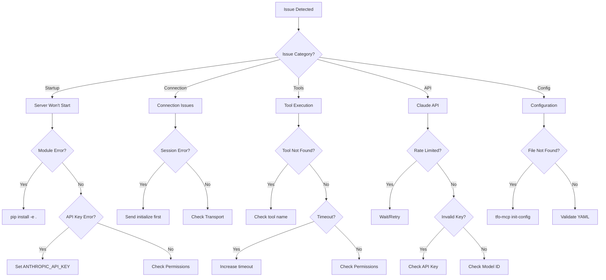
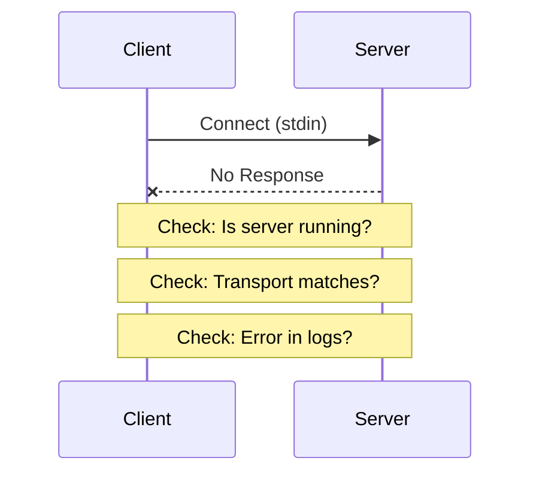
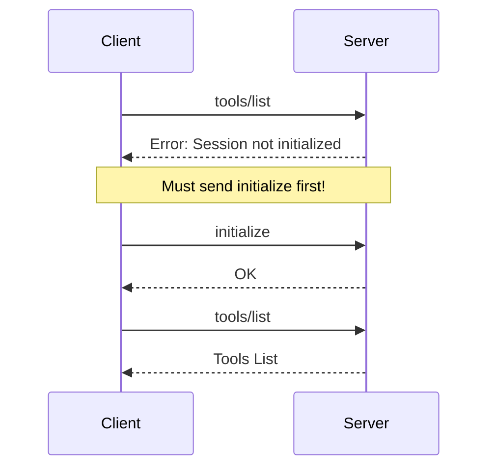
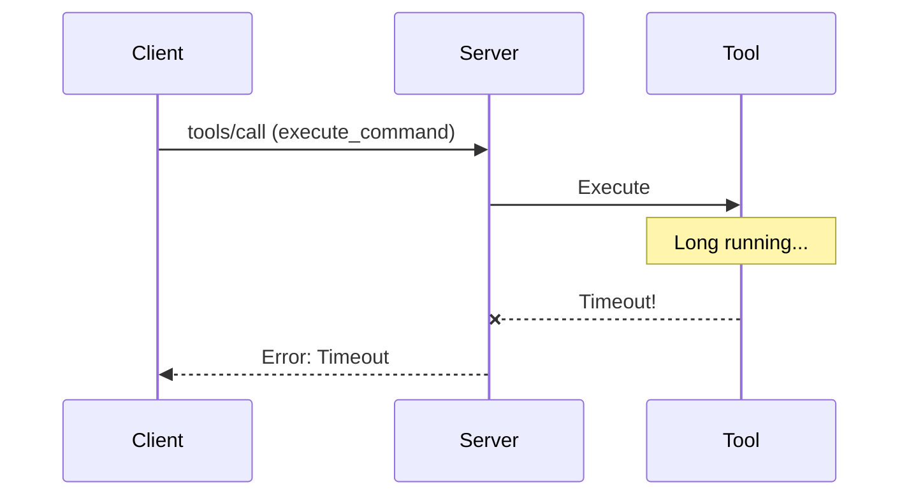
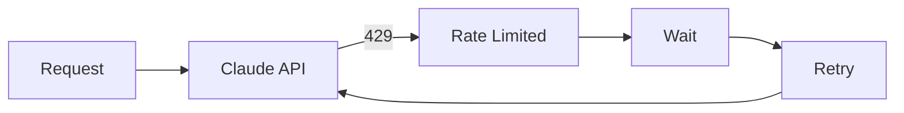
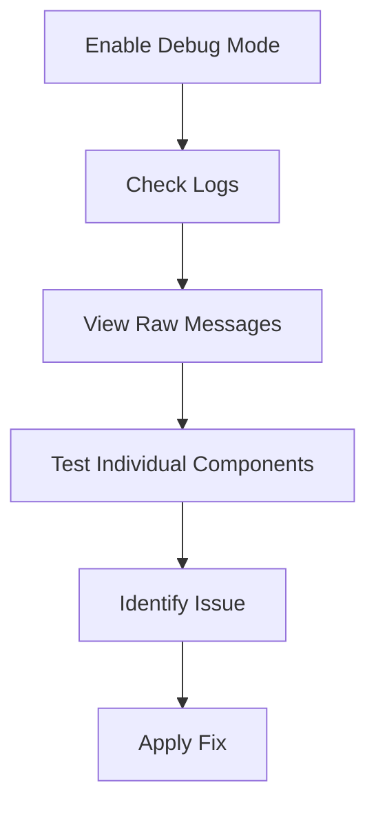
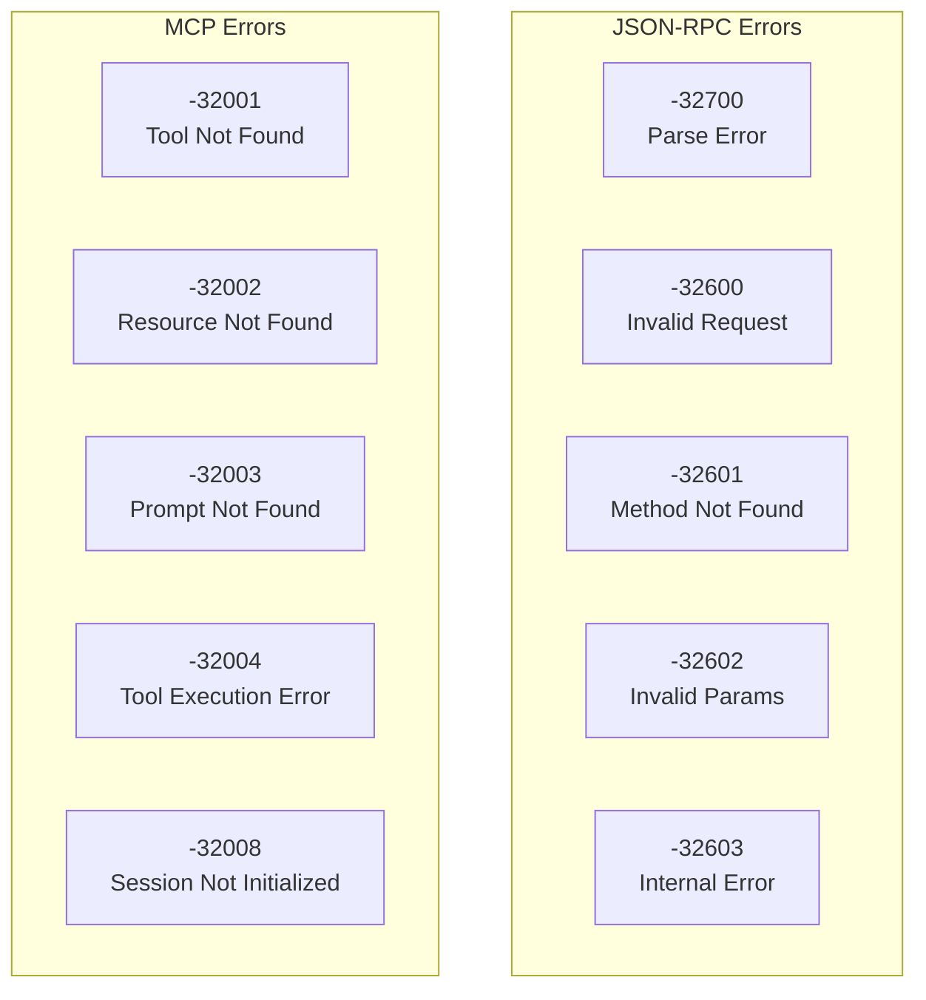

# TelemetryFlow Python MCP Server - Troubleshooting Guide

This guide helps diagnose and resolve common issues with the TelemetryFlow Python MCP Server.

## Issue Resolution Flowchart



## Common Issues

### Server Won't Start

#### Issue: "ModuleNotFoundError: No module named 'tfo_mcp'"

**Cause**: Package not installed properly.

**Solution**:

```bash
pip install -e .
```

#### Issue: "ANTHROPIC_API_KEY not set"

**Cause**: Claude API key not configured.

**Solution**:

```bash
export ANTHROPIC_API_KEY="sk-ant-..."
# or add to config file:
# claude:
#   api_key: "sk-ant-..."
```

#### Issue: "Permission denied" on startup

**Cause**: File permissions issue.

**Solution**:

```bash
chmod +x $(which tfo-mcp)
```

### Connection Issues

#### Issue: Client can't connect



**Cause**: Transport mismatch or server not running.

**Solution**:

1. Ensure server is running: `tfo-mcp serve`
2. Check transport matches client expectation (stdio)
3. Check logs for errors

#### Issue: "Session not initialized" error



**Cause**: Client didn't send `initialize` request first.

**Solution**: Client must send `initialize` request before other operations:

```json
{
  "jsonrpc": "2.0",
  "id": 1,
  "method": "initialize",
  "params": {
    "protocolVersion": "2024-11-05",
    "clientInfo": { "name": "client", "version": "1.0" }
  }
}
```

### Tool Execution Issues

#### Issue: "Tool not found: <name>"

**Cause**: Tool not registered or typo in name.

**Solution**:

1. List available tools: `tools/list`
2. Check tool name spelling (lowercase, underscores)
3. Verify tool is enabled

#### Issue: "Tool execution timed out"



**Cause**: Tool took longer than configured timeout.

**Solution**:

1. Increase tool timeout in config:
   ```yaml
   mcp:
     tool_timeout: 60.0
   ```
2. Or pass longer timeout in execute_command:
   ```json
   { "command": "long_command", "timeout": 120 }
   ```

#### Issue: "Permission denied" in file operations

**Cause**: Server doesn't have access to the file/directory.

**Solution**:

1. Check file permissions
2. Run server with appropriate user
3. Use absolute paths

### Claude API Issues

#### Issue: "Rate limit exceeded"



**Cause**: Too many API requests.

**Solution**:

1. Reduce request frequency
2. Implement client-side rate limiting
3. Increase retry settings:
   ```yaml
   claude:
     max_retries: 5
   ```

#### Issue: "Invalid API key"

**Cause**: API key is incorrect or expired.

**Solution**:

1. Verify API key at https://console.anthropic.com
2. Check for extra spaces or characters
3. Ensure key has correct permissions

#### Issue: "Model not found"

**Cause**: Invalid model ID specified.

**Solution**: Use a valid model ID:

- `claude-opus-4-20250514`
- `claude-sonnet-4-20250514`
- `claude-3-5-sonnet-20241022`
- `claude-3-5-haiku-20241022`

### Configuration Issues

#### Issue: "Configuration file not found"

**Cause**: Config file doesn't exist at expected location.

**Solution**:

1. Generate default config: `tfo-mcp init-config`
2. Or specify path: `tfo-mcp serve -c /path/to/config.yaml`

#### Issue: "Invalid configuration"

**Cause**: YAML syntax error or invalid values.

**Solution**:

1. Validate config: `tfo-mcp validate -c config.yaml`
2. Check YAML syntax
3. Review error message for specific field

### Logging Issues

#### Issue: "No logs appearing"

**Cause**: Log level too high or output misconfigured.

**Solution**:

1. Lower log level:
   ```yaml
   logging:
     level: "debug"
   ```
2. Check output destination:
   ```yaml
   logging:
     output: "stderr" # or "stdout" or file path
   ```

#### Issue: "Logs not in JSON format"

**Cause**: Format set to text.

**Solution**:

```yaml
logging:
  format: "json"
```

## Debugging

### Debug Flow



### Enable Debug Mode

```bash
# Via CLI
tfo-mcp serve --debug

# Via environment
TELEMETRYFLOW_MCP_SERVER_DEBUG=true tfo-mcp serve

# Via config
server:
  debug: true
logging:
  level: "debug"
```

### View Raw Messages

Run server with debug logging to see JSON-RPC messages:

```bash
TELEMETRYFLOW_MCP_LOG_LEVEL=debug tfo-mcp serve 2>debug.log
```

### Test Individual Tools

```python
import asyncio
from tfo_mcp.presentation.tools.builtin_tools import _read_file_handler

async def test():
    result = await _read_file_handler({"path": "/tmp/test.txt"})
    print(result)

asyncio.run(test())
```

### Check Server Status

Send a ping request:

```json
{ "jsonrpc": "2.0", "id": 1, "method": "ping", "params": {} }
```

Expected response:

```json
{ "jsonrpc": "2.0", "id": 1, "result": {} }
```

## Error Codes



| Code   | Name                    | Description                       |
| ------ | ----------------------- | --------------------------------- |
| -32700 | Parse error             | Invalid JSON received             |
| -32600 | Invalid Request         | Not a valid JSON-RPC request      |
| -32601 | Method not found        | Method does not exist             |
| -32602 | Invalid params          | Invalid method parameters         |
| -32603 | Internal error          | Internal server error             |
| -32001 | Tool not found          | Requested tool not registered     |
| -32002 | Resource not found      | Requested resource not available  |
| -32003 | Prompt not found        | Requested prompt not registered   |
| -32004 | Tool execution error    | Tool failed to execute            |
| -32008 | Session not initialized | Session must be initialized first |

## Getting Help

### Collect Diagnostic Information

When reporting issues, include:

1. **Server version**:

   ```bash
   tfo-mcp --version
   ```

2. **Python version**:

   ```bash
   python --version
   ```

3. **Configuration** (remove sensitive data):

   ```bash
   tfo-mcp validate 2>&1
   ```

4. **Debug logs**:

   ```bash
   tfo-mcp serve --debug 2>debug.log
   ```

5. **Error message** (full stack trace if available)

### Support Channels

- GitHub Issues: https://github.com/telemetryflow/telemetryflow-python-mcp/issues
- Documentation: https://docs.telemetryflow.io/mcp
