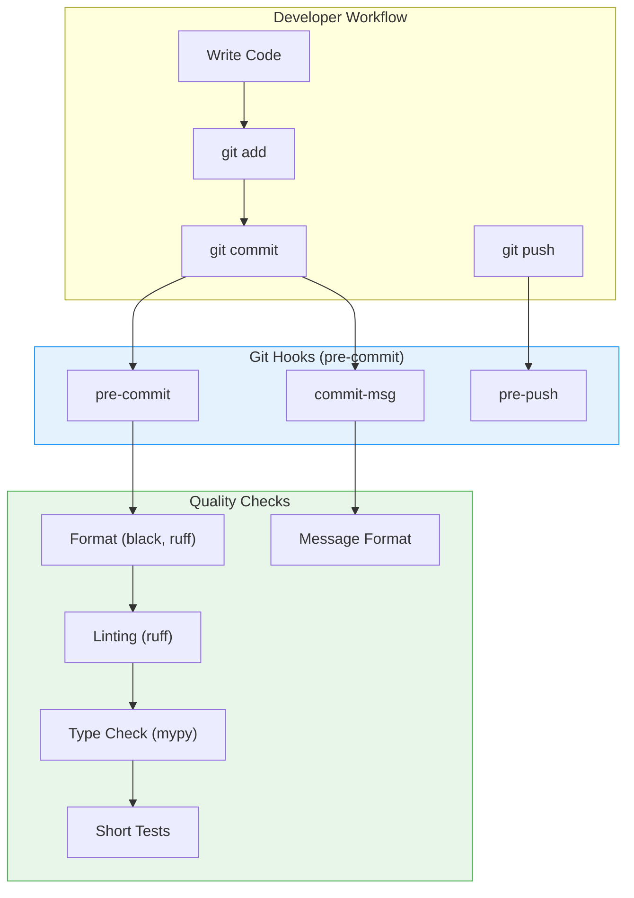
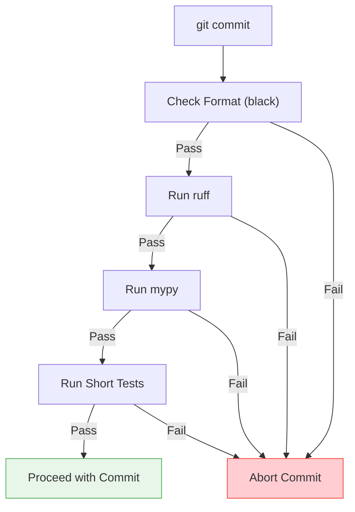
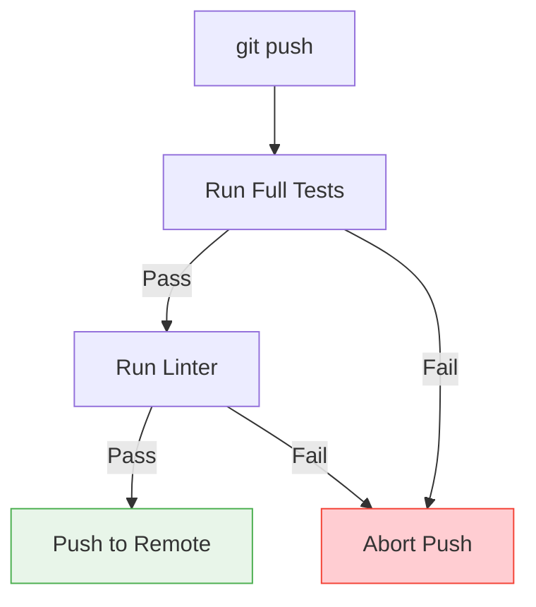

# TFO-Python-MCP Git Hooks

> Git hooks documentation for TelemetryFlow Python MCP Server

---

## Table of Contents

- [Overview](#overview)
- [Available Hooks](#available-hooks)
- [Installation](#installation)
- [Hook Details](#hook-details)
- [Customization](#customization)
- [Troubleshooting](#troubleshooting)

---

## Overview

Git hooks are scripts that run automatically when certain Git events occur. TFO-Python-MCP uses pre-commit for managing hooks to ensure code quality and consistency.

### Hook Architecture



---

## Available Hooks

| Hook         | Trigger              | Purpose                        |
| ------------ | -------------------- | ------------------------------ |
| `pre-commit` | Before commit        | Format check, lint, type check |
| `commit-msg` | After commit message | Validate message format        |
| `pre-push`   | Before push          | Full tests                     |

---

## Installation

### Using pre-commit (Recommended)

```bash
# Install pre-commit
pip install pre-commit

# Or with Poetry
poetry add --group dev pre-commit

# Install hooks
pre-commit install
pre-commit install --hook-type commit-msg
```

### Manual Installation

```bash
# Copy hooks to Git hooks directory
cp docs/githooks/pre-commit .git/hooks/
cp docs/githooks/commit-msg .git/hooks/
cp docs/githooks/pre-push .git/hooks/

# Make them executable
chmod +x .git/hooks/pre-commit
chmod +x .git/hooks/commit-msg
chmod +x .git/hooks/pre-push
```

### Verify Installation

```bash
# List installed hooks
ls -la .git/hooks/

# Test pre-commit hook
pre-commit run --all-files

# Or manually
.git/hooks/pre-commit
```

---

## Hook Details

### pre-commit

Runs before each commit to ensure code quality.



**Checks performed:**

1. **Format Check (black)**: Ensures all Python files are properly formatted
2. **Linting (ruff)**: Static analysis for common errors and style issues
3. **Type Check (mypy)**: Type checking for type annotations
4. **Short Tests**: Quick unit tests

**pre-commit-config.yaml:**

```yaml
repos:
  - repo: https://github.com/pre-commit/pre-commit-hooks
    rev: v4.5.0
    hooks:
      - id: trailing-whitespace
      - id: end-of-file-fixer
      - id: check-yaml
      - id: check-added-large-files

  - repo: https://github.com/psf/black
    rev: 24.1.1
    hooks:
      - id: black
        language_version: python3.11

  - repo: https://github.com/astral-sh/ruff-pre-commit
    rev: v0.1.14
    hooks:
      - id: ruff
        args: [--fix]

  - repo: https://github.com/pre-commit/mirrors-mypy
    rev: v1.8.0
    hooks:
      - id: mypy
        additional_dependencies:
          - pydantic
          - structlog
```

### commit-msg

Validates commit message format follows Conventional Commits.

**Format:**

```
<type>(<scope>): <subject>

[optional body]

[optional footer]
```

**Valid types:**

- `feat`: New feature
- `fix`: Bug fix
- `docs`: Documentation
- `style`: Formatting
- `refactor`: Code restructuring
- `test`: Tests
- `chore`: Maintenance
- `perf`: Performance
- `ci`: CI/CD
- `build`: Build system
- `revert`: Revert commit

**Examples:**

```
feat(tools): add file search tool

fix(session): resolve timeout issue

docs: update README
```

**Script:**

```bash
#!/usr/bin/env bash

COMMIT_MSG_FILE=$1
COMMIT_MSG=$(cat "$COMMIT_MSG_FILE")

# Check commit message format
PATTERN="^(feat|fix|docs|style|refactor|test|chore|perf|ci|build|revert)(\(.+\))?: .+"

if ! echo "$COMMIT_MSG" | grep -qE "$PATTERN"; then
    echo "Error: Invalid commit message format"
    echo ""
    echo "Expected: <type>(<scope>): <subject>"
    echo ""
    echo "Types: feat, fix, docs, style, refactor, test, chore, perf, ci, build, revert"
    echo ""
    echo "Examples:"
    echo "  feat(tools): add new search tool"
    echo "  fix(session): resolve timeout issue"
    exit 1
fi

echo "Commit message format valid"
```

### pre-push

Runs before pushing to remote to ensure all tests pass.



**Checks performed:**

1. **Full Test Suite**: All tests with coverage
2. **Linting**: Full ruff check

**Script:**

```bash
#!/usr/bin/env bash
set -e

echo "Running pre-push checks..."

# Run full tests
echo "Running full test suite..."
poetry run pytest tests/ -v

# Run linter
echo "Running linter..."
poetry run ruff check src/

echo "Pre-push checks passed!"
```

---

## Customization

### Skipping Hooks

```bash
# Skip pre-commit hook
git commit --no-verify -m "feat: urgent fix"

# Skip pre-push hook
git push --no-verify

# Skip specific hook in pre-commit
SKIP=mypy git commit -m "feat: skip type check"
```

> **Warning**: Use `--no-verify` sparingly. CI will still run checks.

### Modifying Hooks

1. Edit `.pre-commit-config.yaml` for pre-commit hooks
2. Run `pre-commit install` to update

### Adding New Hooks

```yaml
# Add to .pre-commit-config.yaml
repos:
  - repo: local
    hooks:
      - id: custom-check
        name: Custom Check
        entry: ./scripts/custom-check.sh
        language: script
        types: [python]
```

---

## Troubleshooting

### Hook Not Running

```bash
# Check if hook is executable
ls -la .git/hooks/pre-commit

# Reinstall hooks
pre-commit install --force

# Check pre-commit version
pre-commit --version
```

### Hook Failing

```bash
# Run hook manually to see output
pre-commit run --all-files

# Run specific hook
pre-commit run black --all-files
pre-commit run ruff --all-files

# Run with verbose output
pre-commit run --verbose
```

### Common Issues

| Issue                | Solution                     |
| -------------------- | ---------------------------- |
| Permission denied    | `chmod +x .git/hooks/*`      |
| Command not found    | Activate virtual environment |
| Tests failing        | Fix tests before committing  |
| Format check failing | Run `make fmt`               |
| Type errors          | Fix type annotations         |

### Resetting Hooks

```bash
# Uninstall hooks
pre-commit uninstall

# Clean cache
pre-commit clean

# Reinstall
pre-commit install
pre-commit install --hook-type commit-msg
```

---

## Makefile Integration

```bash
# Run all pre-commit hooks
make pre-commit

# Run formatting
make fmt

# Run linting
make lint

# Run tests
make test
```

---

## Related Documentation

- [Development Guide](../DEVELOPMENT.md)
- [Git Workflow](../GIT-WORKFLOW.md)
- [Contributing Guide](../../CONTRIBUTING.md)

---

<div align="center">

**[Back to Documentation Index](../README.md)**

</div>
